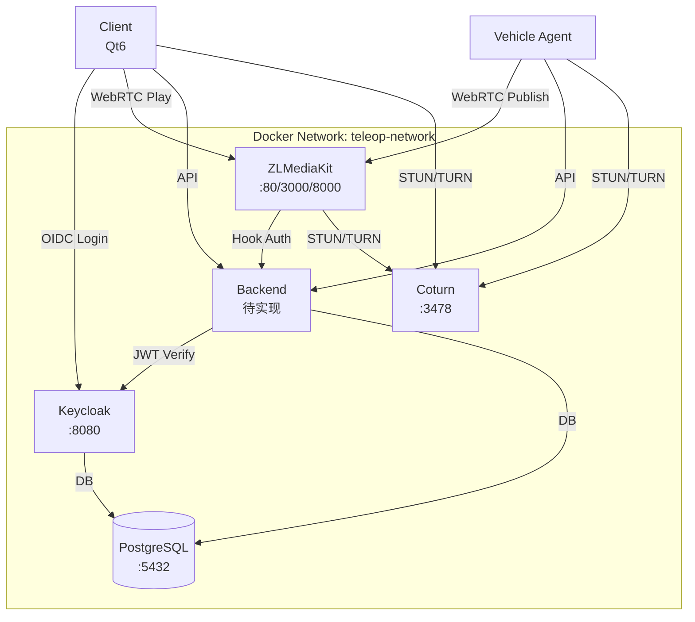

# M0 阶段完成总结

## Executive Summary

**状态**: ✅ M0 阶段已完成

**交付内容**:
- ✅ Docker Compose 编排配置（Keycloak + PostgreSQL + ZLMediaKit + Coturn）
- ✅ Keycloak Realm 配置（包含 5 个角色：admin/owner/operator/observer/maintenance）
- ✅ Keycloak 自动导入脚本
- ✅ PostgreSQL 初始化脚本
- ✅ ZLMediaKit WebRTC 配置文件（低延迟优化）
- ✅ Coturn STUN/TURN 配置文件
- ✅ 一键部署脚本
- ✅ 完整部署文档

**客户端开发环境**: ✅ 已配置 Qt6 开发镜像（docker.1ms.run/stateoftheartio/qt6:6.8-gcc-aqt）

---

## 1. 已创建文件清单

### Docker Compose 配置
- ✅ `docker-compose.yml` - 主编排文件（根目录）
- ✅ `deploy/.env.example` - 环境变量模板

### Keycloak 配置
- ✅ `deploy/keycloak/realm-export.json` - Realm 配置（含角色和客户端）
- ✅ `deploy/keycloak/import-realm.sh` - 自动导入脚本

### PostgreSQL 配置
- ✅ `deploy/postgres/init.sql` - 数据库初始化脚本

### ZLMediaKit 配置
- ✅ `deploy/zlm/config.ini` - WebRTC 优化配置

### Coturn 配置
- ✅ `deploy/coturn/turnserver.conf` - STUN/TURN 服务器配置

### 脚本
- ✅ `scripts/setup.sh` - 一键部署脚本

### 文档
- ✅ `deploy/README.md` - 部署快速指南
- ✅ `docs/M0_DEPLOYMENT.md` - 完整部署文档
- ✅ `PROJECT_STRUCTURE.md` - 项目结构说明

---

## 2. 服务配置详情

### 2.1 Keycloak

**Realm**: `teleop`

**角色定义**:
| 角色 | 权限范围 | 说明 |
|------|----------|------|
| `admin` | 全部 | 管理用户、车辆、策略、审计、录制 |
| `owner` | VIN 绑定/授权 | 账号拥有者，管理自己账号下 VIN 的绑定、授权 |
| `operator` | VIN 控制 | 可申请控制指定 VIN（需被授权） |
| `observer` | VIN 查看 | 仅拉流查看指定 VIN（需被授权） |
| `maintenance` | 故障诊断 | 查看故障/诊断，可进行受限操作 |

**客户端**:
- `teleop-backend` (Confidential) - 后端服务认证
- `teleop-client` (Public) - 客户端应用认证

**自动导入**: Keycloak 启动时自动导入 Realm（`--import-realm` 参数）

### 2.2 ZLMediaKit

**WebRTC 配置**:
- 信令端口: 3000 (HTTP), 3001 (HTTPS)
- RTC 端口: 8000 (UDP/TCP)
- STUN/TURN: 使用外部 Coturn（端口 3478）

**低延迟优化**:
- `mergeWriteMS=0` - 关闭合并写
- `paced_sender_ms=0` - 关闭平滑发送
- `nackMaxMS=2000` - 减小 NACK 保留时间
- `bfilter=1` - 过滤 B 帧

**Hook 鉴权**:
- `on_play` - 播放鉴权
- `on_publish` - 推流鉴权
- 其他事件 Hook（需后端服务实现）

### 2.3 Coturn

**配置**:
- STUN/TURN 端口: 3478 (UDP/TCP)
- 中继端口范围: 49152-65535 (UDP)
- Realm: teleop.local
- 认证: 通过环境变量配置

### 2.4 PostgreSQL

**数据库**:
- `teleop_db` - 业务数据库（用户: teleop_user）
- `keycloak_db` - Keycloak 数据库（用户: keycloak_user）

---

## 3. 快速开始

### 3.1 一键部署

```bash
# 1. 准备环境变量
cd deploy
cp .env.example .env
# 编辑 .env，修改密码（生产环境必须）

# 2. 启动服务
cd ../scripts
./setup.sh

# 或手动启动
cd ../deploy
docker-compose up -d
```

### 3.2 验证服务

```bash
# 检查服务状态
docker-compose ps

# 访问 Keycloak
open http://localhost:8080/admin
# 默认账号: admin / admin

# 检查 ZLMediaKit
curl http://localhost/index/api/getServerConfig
```

### 3.3 客户端开发环境

```bash
# 启动 Qt6 开发容器
docker-compose --profile dev up -d client-dev

# 进入容器
docker-compose exec client-dev bash

# 在容器内构建客户端
cd /workspace/client
mkdir -p build && cd build
cmake ..
make
```

---

## 4. 架构图



---

## 5. 端口映射表

| 服务 | 容器端口 | 主机端口 | 协议 | 说明 |
|------|----------|----------|------|------|
| PostgreSQL | 5432 | 5432 | TCP | 数据库 |
| Keycloak | 8080 | 8080 | HTTP | 身份认证 |
| ZLMediaKit HTTP | 80 | 80 | HTTP | Web 服务 |
| ZLMediaKit HTTPS | 443 | 443 | HTTPS | Web 服务（TLS） |
| ZLMediaKit RTMP | 1935 | 1935 | TCP | RTMP 推拉流 |
| ZLMediaKit RTSP | 554 | 554 | TCP | RTSP 推拉流 |
| ZLMediaKit WebRTC Signaling | 3000 | 3000 | HTTP | WebRTC 信令 |
| ZLMediaKit WebRTC Signaling SSL | 3001 | 3001 | HTTPS | WebRTC 信令（TLS） |
| ZLMediaKit WebRTC RTC | 8000 | 8000 | UDP/TCP | WebRTC 媒体传输 |
| Coturn STUN/TURN | 3478 | 3478 | UDP/TCP | NAT 穿透 |
| Coturn Relay | 49152-65535 | 49152-65535 | UDP | TURN 中继端口 |

---

## 6. 环境变量配置

### 必需配置（生产环境）

```bash
# PostgreSQL
POSTGRES_PASSWORD=<strong_password>

# Keycloak
KEYCLOAK_ADMIN_PASSWORD=<strong_password>
KEYCLOAK_DB_PASSWORD=<strong_password>

# Coturn
COTURN_PASSWORD=<strong_password>
COTURN_EXTERNAL_IP=<your_public_ip>  # NAT 环境必需

# Client Secrets
TELEOP_BACKEND_CLIENT_SECRET=<strong_secret>
TELEOP_CLIENT_CLIENT_SECRET=<strong_secret>
```

---

## 7. 数据持久化

所有数据存储在 Docker 卷中：

| 卷名 | 用途 | 数据持久化 |
|------|------|------------|
| `postgres_data` | PostgreSQL 数据 | ✅ |
| `keycloak_data` | Keycloak 数据 | ✅ |
| `zlm_recordings` | ZLMediaKit 录制文件 | ✅ |
| `zlm_snapshots` | ZLMediaKit 截图 | ✅ |
| `client_build` | 客户端构建缓存 | ⚠️ 开发环境 |

---

## 8. 下一步（M1 阶段）

### 8.1 后端服务
- [ ] 创建 `backend/` 目录结构
- [ ] 实现 REST API（参考 `project_spec.md` §10）
- [ ] 集成 Keycloak JWT 验证
- [ ] 实现 ZLMediaKit Hook 接口

### 8.2 数据库迁移
- [ ] 创建表结构（accounts, users, vehicles, vin_grants, sessions 等）
- [ ] 初始化数据

### 8.3 客户端集成
- [ ] 集成 Keycloak OIDC 登录
- [ ] WebRTC 推拉流测试
- [ ] 控制通道测试

### 8.4 端到端测试
- [ ] 登录流程测试
- [ ] VIN 授权测试
- [ ] 推拉流测试
- [ ] 控制指令测试

---

## 9. 故障排查

### Keycloak 无法启动
```bash
# 检查日志
docker-compose logs keycloak

# 检查 PostgreSQL
docker-compose ps postgres
docker-compose logs postgres
```

### ZLMediaKit WebRTC 连接失败
```bash
# 检查 Coturn
docker-compose logs coturn

# 检查端口
netstat -tulpn | grep -E '3478|8000'
```

### Realm 未自动导入
```bash
# 手动导入
cd deploy/keycloak
./import-realm.sh
```

---

## 10. 参考文档

- [deploy/README.md](./deploy/README.md) - 部署快速指南
- [docs/M0_DEPLOYMENT.md](./docs/M0_DEPLOYMENT.md) - 完整部署文档
- [PROJECT_STRUCTURE.md](./PROJECT_STRUCTURE.md) - 项目结构说明
- [project_spec.md](./project_spec.md) - 项目规格说明

---

## 11. 验收标准

### M0 阶段验收清单

- [x] Docker Compose 配置完整
- [x] Keycloak Realm 配置包含所有角色
- [x] Keycloak 自动导入脚本可用
- [x] PostgreSQL 初始化脚本可用
- [x] ZLMediaKit WebRTC 配置正确
- [x] Coturn STUN/TURN 配置正确
- [x] 一键部署脚本可用
- [x] 文档完整

### 验证步骤

```bash
# 1. 启动服务
cd scripts && ./setup.sh

# 2. 验证 Keycloak
curl http://localhost:8080/health/ready
# 访问 http://localhost:8080/admin，登录后检查 Realm 'teleop' 是否存在

# 3. 验证 ZLMediaKit
curl http://localhost/index/api/getServerConfig

# 4. 验证 Coturn
docker-compose exec coturn turnserver -c /etc/turnserver.conf --listening-port 3478
```

---

**完成时间**: 2026-02-04  
**版本**: 1.0
