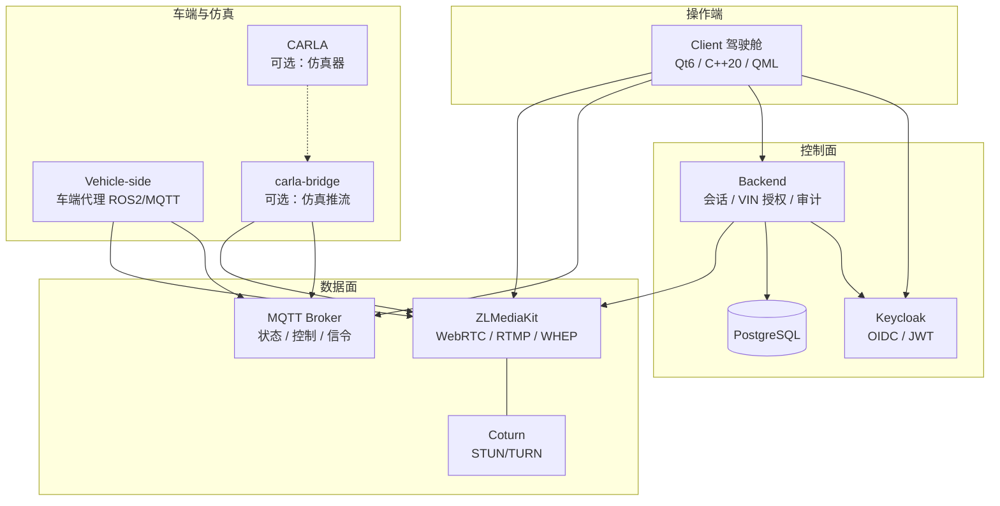
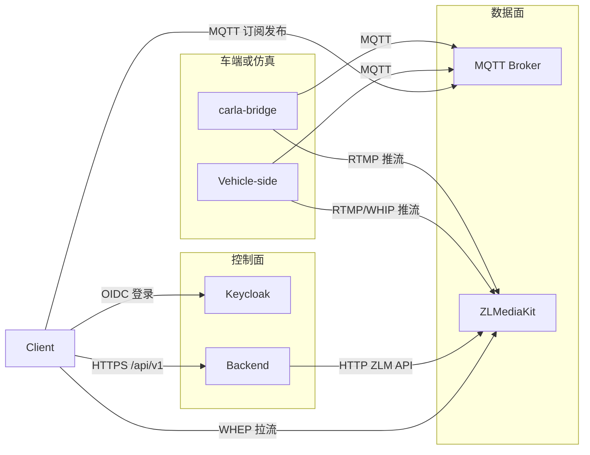
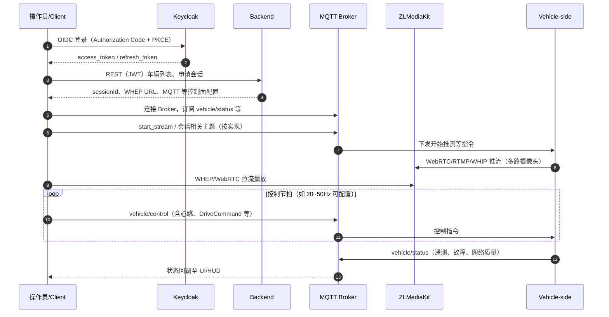
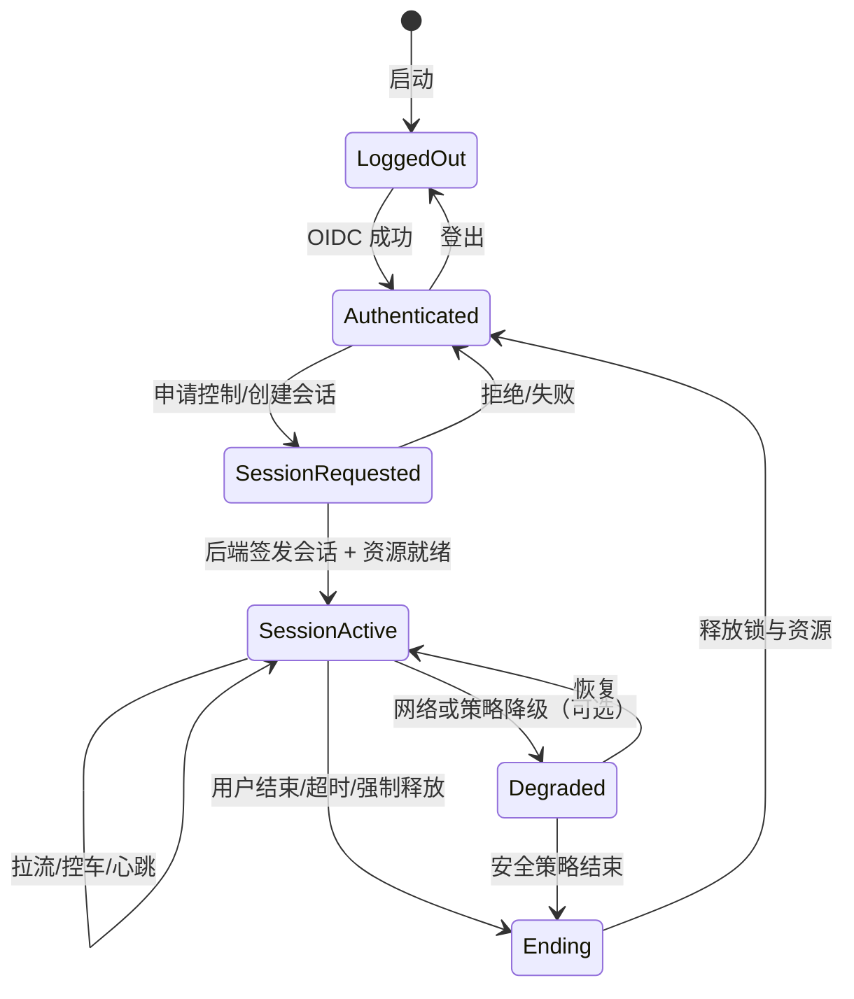
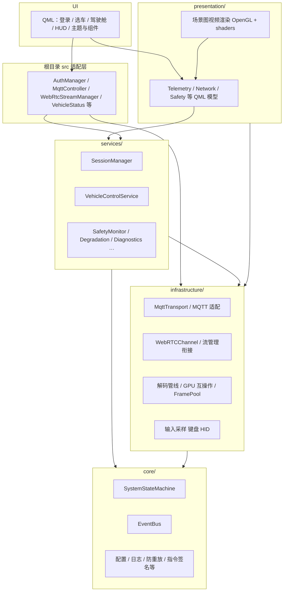
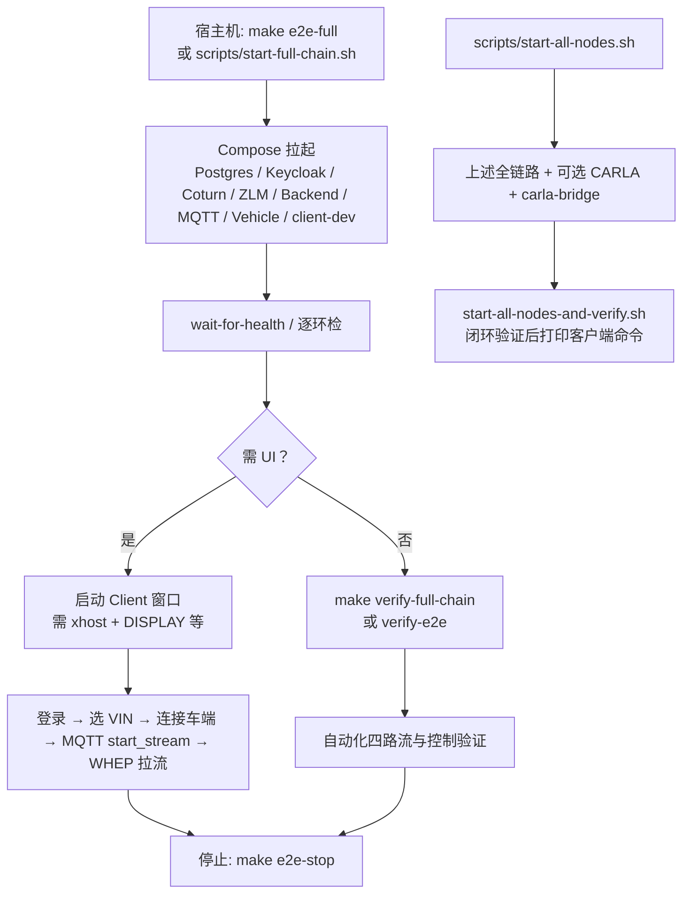

# 远程驾驶系统

完整的远程驾驶系统，包含**客户端、媒体服务器、车辆端、业务后端**等独立工程；可选 **CARLA 仿真** 与 **carla-bridge** 接入同一控制面与数据面。

**策略：所有节点均在 Docker 容器中编译与运行，禁止在宿主机上编译/运行。** 详见 [docs/BUILD_AND_RUN_POLICY.md](docs/BUILD_AND_RUN_POLICY.md)。

**client-dev 镜像**：默认使用已打 tag 的完备镜像 `remote-driving-client-dev:full`。首次需在宿主机拉取并编译 libdatachannel，挂载进容器后提交并打 tag：

```bash
bash scripts/build-client-dev-full-image.sh
# 可选指定 tag：bash scripts/build-client-dev-full-image.sh remote-driving-client-dev:full-20250202
```

之后直接 `make e2e-full` 或 `docker compose up -d client-dev` 即可。若希望完全在 Docker 内构建镜像（需网络拉取 GitHub），可使用：`docker compose -f docker-compose.yml -f docker-compose.client-dev.yml build client-dev`。

---

## 架构与流程可视化

以下图表与 [project_spec.md](project_spec.md)（规格优先）、[docs/DISTRIBUTED_DEPLOYMENT.md](docs/DISTRIBUTED_DEPLOYMENT.md)（五模块连接）及 [client/docs/CALLCHAIN_AND_ARCHITECTURE.md](client/docs/CALLCHAIN_AND_ARCHITECTURE.md)（客户端调用链）对齐，便于一眼看清工程边界与数据流。

### 1. 系统模块与部署总览



**读图说明**：实线为主干数据/控制路径；CARLA 与 carla-bridge 为可选仿真链路；跨 NAT 时 WebRTC 依赖 Coturn。

### 2. 跨模块连接与协议（逻辑视图）

箭头表示**主动发起连接的一方**；地址与端口均应由配置提供，而非硬编码（详见分布式部署文档）。



### 3. 端到端远驾时序（登录 → 会话 → 推流 → 控车）



**说明**：具体主题名与载荷以 [mqtt/schemas/](mqtt/schemas/) 及后端实现为准；车端**默认不自动推流**，需在客户端选车并触发连接后由 MQTT 通知车端推流（与 `make e2e-full` 行为一致）。

### 4. 会话与控制权状态（概要）



与规格一致的核心约束：**同一 VIN 同一时刻单一控制者**；心跳/看门狗超时触发 **SAFE_STOP** 等策略由车端与后端策略共同保证。

### 5. 客户端内部分层（与仓库目录对应）



### 6. 开发环境：全链路启动与验证流程



---

### 一行命令：启动全链路并在客户端上操作验证

```bash
make e2e-full
```

或：

```bash
bash scripts/start-full-chain.sh
```

会依次：启动 Postgres / Keycloak / Coturn / ZLMediaKit / Backend / MQTT / 车辆端 / client-dev → 做逐环体验证 → **从登录页**启动客户端窗口（默认不再先跑「跳过登录」的 18s 自动连视频；需要该自动化时加参数 `auto-connect`）。**车端不自动推流**，仅在客户端登录、选车并点击「**连接车端**」后发送 MQTT `start_stream`，车端收到后才执行推流脚本（默认测试图案；可配置为边读数据集边推流，见 `docker-compose.vehicle.dev.yml`）。停止全链路：`make e2e-stop`。

**一键用脚本直接验证整个链路**（缺镜像会自动构建）：`make verify-full-chain`（确保 client-dev 镜像 → 启动全链路 → 逐环验 + 四路流 E2E；连接功能脚本化验证为可选，见文档）。**节点已起时**仅做自动化验证：`make verify-e2e`。详见 [docs/VERIFY_FULL_CHAIN.md](docs/VERIFY_FULL_CHAIN.md)。

### 一个脚本启动所有节点（含 CARLA 仿真与场景）

```bash
./scripts/start-all-nodes.sh
```

会依次启动：Compose 全链路（Postgres / Keycloak / ZLM / Backend / MQTT / Vehicle / Client-dev）、**CARLA 仿真**（默认场景 **Town01**）、**CARLA Bridge**（后台）。可选：`CARLA_MAP=Town02` 换场景；`SKIP_CARLA=1` 不启动 CARLA；`SKIP_BRIDGE=1` 只启动 CARLA 不启动 Bridge。详见 [docs/CARLA_CLIENT_STREAM_GUIDE.md](docs/CARLA_CLIENT_STREAM_GUIDE.md)。

**启动所有节点并做闭环测试（推荐）：**

```bash
./scripts/start-all-nodes-and-verify.sh
```

先执行上述「一键启动所有节点」，再等待 CARLA/Bridge 就绪后自动运行 **闭环验证**（车端路径 E2ETESTVIN0000001 + CARLA 仿真路径 carla-sim-001），通过后打印客户端启动命令供人工验证。

**运行环境（首次或客户端无界面时）**：宿主机需允许 Docker 显示 GUI，执行一次 `bash scripts/setup-host-for-client.sh`（脚本会执行 `xhost +local:docker` 等）。`start-all-nodes-and-verify.sh` 启动客户端前会自动调用该脚本。详见 [docs/RUN_ENVIRONMENT.md](docs/RUN_ENVIRONMENT.md)。

### 工程化与产品化（稳定性、维护性、分布式、问题分析）

- **修改代码后必跑验证**：`./scripts/build-and-verify.sh` 或 `./scripts/check.sh`；涉及 API/集成时加跑 `./scripts/e2e.sh`。
- **等待服务就绪再启动依赖**：`./scripts/wait-for-health.sh`（可配置 `BACKEND_URL`、`ZLM_URL`、`KEYCLOAK_URL`、`WAIT_TIMEOUT`）。
- **问题分析工具链**：收集日志 `./scripts/analyze.sh` → 查看 `diags/<timestamp>/diagnosis.txt` → [docs/TROUBLESHOOTING_RUNBOOK.md](docs/TROUBLESHOOTING_RUNBOOK.md) 与 [docs/ERROR_CODES.md](docs/ERROR_CODES.md)。
- **日志与观测**：[docs/LOGGING_BEST_PRACTICES.md](docs/LOGGING_BEST_PRACTICES.md)；各模块日志带 `[Backend]` / `[Vehicle-side]` / `[carla-bridge:...]` 等前缀便于 grep。
- **分布式部署**：backend / carla-bridge / client / media / Vehicle-side 五模块可独立部署；端点全部可配置，见 [docs/DISTRIBUTED_DEPLOYMENT.md](docs/DISTRIBUTED_DEPLOYMENT.md) 与其中「部署前配置检查清单」。

## 项目结构

```
Remote-Driving/
├── client/                    # Qt6 远驾驾驶舱（C++20 + QML）
│   ├── CMakeLists.txt         # CMake 3.21+；可选 FFmpeg / VA-API / EGL DMA-BUF / NVDEC / libdatachannel / Paho
│   ├── conanfile.py           # 可选：Conan 拉取 FFmpeg、Paho 等（Qt 仍由系统/镜像提供）
│   ├── src/
│   │   ├── core/              # EventBus、SystemStateMachine、配置/日志、防重放与指令签名等
│   │   ├── infrastructure/    # MQTT/WebRTC/UDP 传输、解码管线、GPU 互操作、输入采样
│   │   ├── services/          # 会话、控车、安全（含死手）、降级、时延补偿、诊断等
│   │   ├── presentation/      # 场景图视频渲染（OpenGL + shaders）、遥测/网络/安全 QML 模型
│   │   └── …                  # 遗留入口适配：webrtc*、mqttcontroller、authmanager 等
│   ├── qml/                   # 界面：main、登录/选车、驾驶舱、HUD、组件与主题
│   ├── shaders/               # 视频渲染 GLSL（与 presentation 层配合）
│   ├── tests/                 # Qt Test：状态机与 unit/（启用 Qt6::Test 时）
│   ├── docs/                  # 调用链、GATE A、风险评审（与《客户端架构设计.md》对齐）
│   ├── build.sh / run.sh      # 主构建与运行（宿主机执行 build.sh 会按策略拒绝）
│   └── scripts/               # 备选 build/run 脚本
│
├── media/                     # ZLMediaKit 等媒体侧配置与镜像
├── Vehicle-side/              # 车端代理（ROS2/MQTT 等，容器内构建）
├── backend/                   # 业务后端
├── carla-bridge/              # 可选：CARLA 与 MQTT/ZLM 桥接
├── docs/                      # 全仓接口、部署、排障
├── scripts/                   # 全链路启动、验证、镜像构建
├── BUILD_GUIDE.md             # 编译与运行说明（与 Docker 策略一致部分为准）
└── project_spec.md            # 产品/技术规格（冲突时以 spec 为准）
```

## 快速开始

所有编译与运行均在 Docker 容器内进行，宿主机仅执行 `make` 或 `docker compose` 命令。

### 使用 Makefile（推荐）

```bash
# 查看所有命令
make help

# 在 client-dev 容器内编译客户端
make build-client

# 在 client-dev 容器内运行客户端
make run
# 或
make run-client

# 启动车辆端容器（需 docker-compose.vehicle.dev.yml）
make build-vehicle
make run-vehicle

# 启动 ZLMediaKit 容器
make run-media

# 在容器内编译所有工程
make build-all
```

### 禁止的用法

请勿在宿主机执行各子目录下的 `./build.sh` 或 `./run.sh`，否则将报错并提示使用 `make` 目标。

## 部署位置

| 工程 | 部署位置 | 说明 |
|------|---------|------|
| **client** | 客户端台式机 | Qt6/QML 客户端应用 |
| **media** | 流媒体服务器 | ZLMediaKit 媒体服务器 |
| **Vehicle-side** | 车辆端（Jetson Orin） | ROS2/MQTT 车辆控制器 |
| **backend** | 机房/云 | 控制面与持久化 |
| **carla-bridge** | 仿真工作站/云 | 可选，与 CARLA 同机或可达 |

## 详细文档

- [docs/BUILD_AND_RUN_POLICY.md](docs/BUILD_AND_RUN_POLICY.md) - **默认在容器内编译/运行**（客户端用 `client-dev` 镜像）
- [BUILD_GUIDE.md](./BUILD_GUIDE.md) - 编译和运行指南（客户端章节已与 CMake/QML 分层对齐）
- [docs/RUN_ENVIRONMENT.md](docs/RUN_ENVIRONMENT.md) - **运行环境与一次性设置**（xhost、DISPLAY、客户端无界面排查）
- [client/README.md](./client/README.md) - **客户端模块说明**（依赖、目录、环境变量、验证）
- [client/docs/CALLCHAIN_AND_ARCHITECTURE.md](client/docs/CALLCHAIN_AND_ARCHITECTURE.md) - 关键路径调用链
- [Vehicle-side/README.md](./Vehicle-side/README.md) - 车辆端说明

## 一键操作

### 编译所有工程

```bash
make build-all
# 或
task build
```

### 清理所有构建文件

```bash
make clean-all
# 或
task clean
```

## 开发工作流

1. **修改代码** → 2. **编译** → 3. **运行** → 4. **调试**

```bash
# 1. 修改代码
vim client/src/main.cpp

# 2. 编译
make build-client

# 3. 运行
make run-client

# 4. 调试
make debug-client
```

## 参考

详细的使用说明请参考 [BUILD_GUIDE.md](./BUILD_GUIDE.md)。
