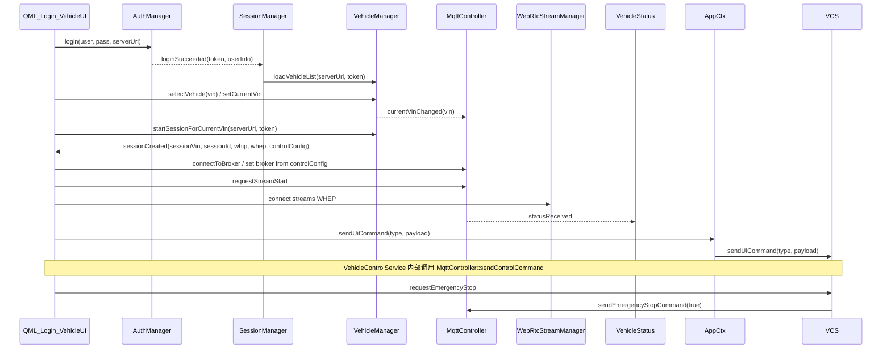

# 客户端关键路径调用链与架构对齐说明

本文档对应《客户端架构设计.md》中的「可观测调用链」基线，便于评审与排障。

## 1. 会话建立 → 拉流 → 控车 → 急停（当前实现）

## 2. 与架构文档的映射

| 文档模块 | 代码落地 |
|---------|---------|
| EventBus | [`src/core/eventbus.*`](../src/core/eventbus.cpp) |
| SystemStateMachine | [`src/core/systemstatemachine.*`](../src/core/systemstatemachine.cpp) |
| SessionManager | [`src/services/sessionmanager.*`](../src/services/sessionmanager.cpp) |
| VehicleControlService | [`src/services/vehiclecontrolservice.*`](../src/services/vehiclecontrolservice.cpp) |
| SafetyMonitorService（含 Deadman） | [`src/services/safetymonitorservice.*`](../src/services/safetymonitorservice.cpp) |
| DegradationManager | [`src/services/degradationmanager.*`](../src/services/degradationmanager.cpp) |
| 网络质量占位 | [`src/core/networkqualityaggregator.*`](../src/core/networkqualityaggregator.cpp) |
| ITransportManager | [`src/infrastructure/itransportmanager.h`](../src/infrastructure/itransportmanager.h) + MQTT 适配 |
| 场景图视频渲染 | [`src/presentation/renderers/VideoRenderer.*`](../src/presentation/renderers/VideoRenderer.cpp) + [`VideoMaterial`](../src/presentation/renderers/VideoMaterial.cpp) / [`VideoSGNode`](../src/presentation/renderers/VideoSGNode.cpp) + [`shaders/`](../shaders/) |
| QML 侧模型 | [`TelemetryModel`](../src/presentation/models/TelemetryModel.cpp)、[`NetworkStatusModel`](../src/presentation/models/NetworkStatusModel.cpp)、[`SafetyStatusModel`](../src/presentation/models/SafetyStatusModel.cpp) |

## 3. 环境变量（调试 / Deadman / 安全）

| 变量 | 说明 | 默认 |
|------|------|------|
| `CLIENT_DEADMAN_ENABLED` | 是否启用死手超时（远驾模式下无操作则急停） | `1` |
| `CLIENT_DEADMAN_TIMEOUT_MS` | 无操作超时（毫秒） | `3000` |
| ~~`CLIENT_LEGACY_CONTROL_ONLY`~~ | 已移除；契约见 `scripts/verify-client-contract.sh` | — |
| `CLIENT_ENABLE_CONTROL_TICKER` | 启用同线程控制节拍占位 | `0` |
| `CLIENT_AUTO_CONNECT_VIDEO` | 置 `1` 时自动连接视频（自动化/调试） | 未设置 |
| `CLIENT_LAYOUT_DEBUG` | 置 `1` 开启布局调试 | 未设置 |
| `CLIENT_MEDIA_HEALTH_RECOVERY_MS` | 每槽位呈现惩罚持续时间（ms） | `20000`（范围 3000–120000） |
| `CLIENT_MEDIA_HEALTH_AGGREGATE` | `weighted` / `min`：多路呈现因子聚合策略 | `weighted` |
| `CLIENT_MEDIA_HEALTH_WEIGHT_FRONT` | weighted 模式下主路权重 | `2` |
| `DEFAULT_SERVER_URL` / `REMOTE_DRIVING_SERVER` | 默认 Backend URL（`main.cpp` 注入 QML） | 可回落到 `BACKEND_URL` |

## 4. 日志前缀

- `[Client][Session]` — SessionManager  
- `[Client][Control]` — VehicleControlService  
- `[Client][Safety]` — SafetyMonitorService  
- `[Client][FSM]` — SystemStateMachine  
- `[Client][EventBus]` — EventBus  
- `[Client][Degrade]` — DegradationManager  
