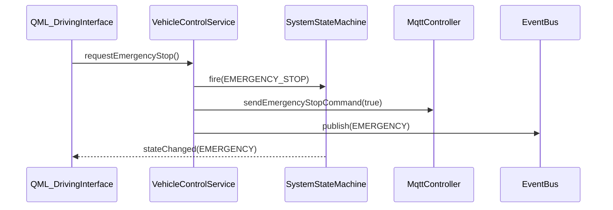
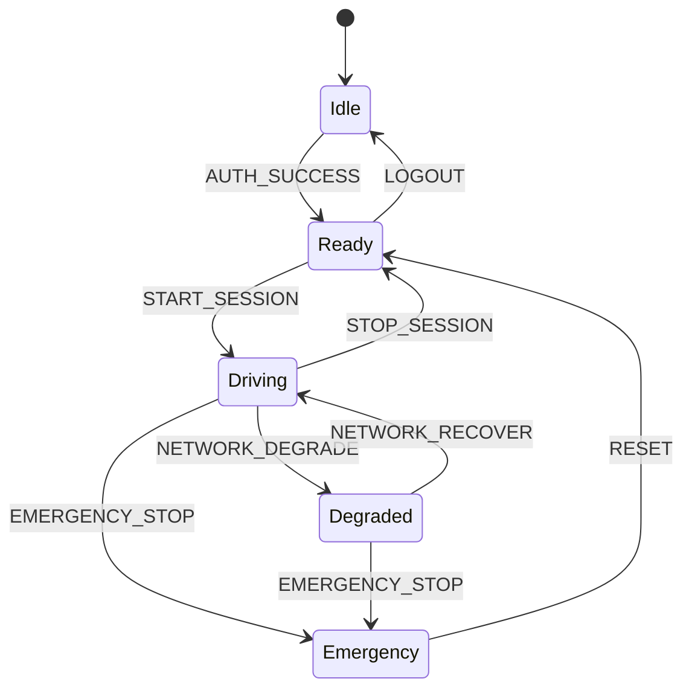

# GATE A — 客户端控制与安全（状态机 + 急停 + Deadman）

## 1. 问题与范围

在引入 `SystemStateMachine`、`VehicleControlService`、`SafetyMonitorService` 后，需保证：

- 急停与 Deadman 仅通过统一服务下发，避免 QML 与 C++ 双路径不一致。
- 状态转换可观测、非法转换可记录。
- 与车端/Backend 看门狗语义一致：客户端 Deadman 为**补充层**，不替代车端 SAFE_STOP。

## 2. 序列图（急停）

## 3. 状态图（子集）

## 4. 回滚

- 环境变量 `CLIENT_LEGACY_CONTROL_ONLY=1` 时，QML 可回退为直接调用 `mqttController`（仅排障；默认关闭）。

## 5. 观测

- 检索 `[Client][Control]`、`[Client][Safety]`、`[Client][FSM]`。
- Deadman 触发时必打 `[Client][Safety] deadman triggered`。
