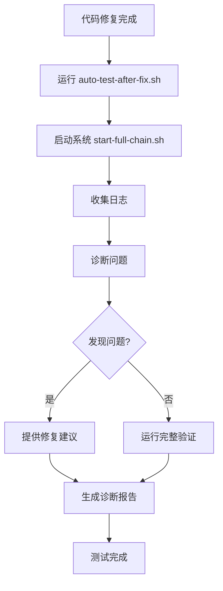

# 自动化测试与诊断指南

## Executive Summary

**目标**：每次问题解决后自动运行 `start-full-chain.sh` 进行测试验证，并从日志中自动分析问题并提供解决方案  
**实现**：创建了两个自动化脚本，实现完整的测试、诊断、修复建议流程  
**状态**：✓ 自动化测试脚本已创建，✓ 日志诊断功能已实现

---

## 1. 脚本概览

### 1.1 核心脚本

| 脚本 | 功能 | 用法 |
|------|------|------|
| `scripts/test-and-diagnose.sh` | 启动系统、收集日志、诊断问题、提供修复建议 | `bash scripts/test-and-diagnose.sh` |
| `scripts/auto-test-after-fix.sh` | 修复后自动运行完整测试流程 | `bash scripts/auto-test-after-fix.sh` |

### 1.2 工作流程



---

## 2. 使用方法

### 2.1 基本用法

#### 修复后自动测试（推荐）

```bash
# 完整流程：启动系统 → 诊断 → 验证
bash scripts/auto-test-after-fix.sh
```

#### 仅诊断（不启动系统）

```bash
# 假设系统已启动，仅分析日志
bash scripts/test-and-diagnose.sh --no-start
```

#### 聚焦特定模块

```bash
# 仅诊断客户端问题
bash scripts/test-and-diagnose.sh --focus client

# 仅诊断车端问题
bash scripts/test-and-diagnose.sh --focus vehicle

# 仅诊断远驾接管功能
bash scripts/test-and-diagnose.sh --focus remote-control

# 仅诊断连接问题
bash scripts/test-and-diagnose.sh --focus mqtt
```

### 2.2 高级选项

```bash
# 跳过构建检查
bash scripts/auto-test-after-fix.sh --skip-build

# 跳过系统启动（假设已启动）
bash scripts/auto-test-after-fix.sh --skip-start

# 仅诊断，不运行完整验证
bash scripts/auto-test-after-fix.sh --fix-only

# 详细输出
bash scripts/test-and-diagnose.sh --verbose
```

---

## 3. 诊断功能

### 3.1 诊断模块

#### 模块 1: 编译错误诊断

**检测内容**：
- 缺少头文件（`QJsonDocument`, `QElapsedTimer` 等）
- 链接错误（未定义的引用）
- 语法错误

**修复建议**：
- 自动识别缺失的头文件并提供添加命令
- 检查 CMakeLists.txt 配置

**示例输出**：
```
[ERROR] 客户端编译错误：缺少 QJsonDocument 头文件
[FIX] 修复方案：在 client/src/vehiclestatus.cpp 中添加 #include <QJsonDocument>
[FIX] 执行：sed -i '2a #include <QJsonDocument>' client/src/vehiclestatus.cpp
```

#### 模块 2: 运行时错误诊断

**检测内容**：
- 段错误（Segmentation fault）
- 异常（Exception）
- 崩溃（Crash）

**修复建议**：
- 检查空指针访问
- 检查数组越界
- 检查线程安全问题

#### 模块 3: 连接问题诊断

**检测内容**：
- MQTT 连接失败
- WebRTC 连接失败
- 视频流接收失败

**修复建议**：
- 检查服务是否运行
- 检查端口是否监听
- 检查网络配置

#### 模块 4: 远驾接管功能诊断

**检测内容**：
- 车端是否检测到指令
- 车端是否发送确认
- 客户端是否收到确认
- 客户端状态是否更新

**修复建议**：
- 检查 MQTT 主题订阅
- 检查消息处理逻辑
- 检查状态更新逻辑

#### 模块 5: 容器状态诊断

**检测内容**：
- 容器是否运行
- 容器健康状态
- 容器重启次数

**修复建议**：
- 启动缺失的容器
- 检查容器日志
- 重启异常容器

#### 模块 6: 代码更新诊断

**检测内容**：
- 车端代码是否包含新标记（如 `REMOTE_CONTROL`）
- 客户端是否已编译
- 代码更新时间

**修复建议**：
- 重启容器以重新编译
- 手动触发编译

---

## 4. 诊断报告

### 4.1 报告格式

```
========================================
诊断报告
========================================

发现的问题: 3
提供的修复: 3

[ERROR] 客户端编译错误：缺少 QJsonDocument 头文件
[FIX] 修复方案：在 client/src/vehiclestatus.cpp 中添加 #include <QJsonDocument>

[ERROR] 车端 MQTT 连接失败
[FIX] 修复方案：检查 MQTT Broker 是否运行

[ERROR] 客户端未收到确认消息
[FIX] 修复方案：检查 MQTT 订阅主题是否正确

详细日志位置：
  客户端: docker logs teleop-client-dev --tail 200
  车端: docker logs remote-driving-vehicle-1 --tail 200
  MQTT: docker logs teleop-mosquitto --tail 100
```

### 4.2 报告文件

测试报告保存在：`/tmp/remote-driving-test-report-YYYYMMDD-HHMMSS.txt`

---

## 5. 集成到工作流

### 5.1 修复问题后的标准流程

```bash
# 1. 修复代码
# ... 编辑文件 ...

# 2. 运行自动测试和诊断
bash scripts/auto-test-after-fix.sh

# 3. 查看诊断报告
cat /tmp/remote-driving-test-report-*.txt

# 4. 根据修复建议解决问题（如果需要）

# 5. 手动验证
bash scripts/start-full-chain.sh manual
# 在客户端界面操作并观察日志
```

### 5.2 CI/CD 集成

可以将 `auto-test-after-fix.sh` 集成到 CI/CD 流程：

```yaml
# .github/workflows/test.yml
- name: Auto Test After Fix
  run: |
    bash scripts/auto-test-after-fix.sh --skip-start
    if [ $? -ne 0 ]; then
      echo "测试失败，查看诊断报告"
      cat /tmp/remote-driving-test-report-*.txt
      exit 1
    fi
```

---

## 6. 常见问题诊断

### 6.1 编译错误

**问题**：`error: 'QJsonDocument' was not declared`

**诊断**：
```bash
bash scripts/test-and-diagnose.sh --focus client
```

**输出**：
```
[ERROR] 客户端编译错误：缺少 QJsonDocument 头文件
[FIX] 修复方案：在 client/src/vehiclestatus.cpp 中添加 #include <QJsonDocument>
```

### 6.2 运行时崩溃

**问题**：客户端崩溃，段错误

**诊断**：
```bash
bash scripts/test-and-diagnose.sh --focus client --verbose
```

**输出**：
```
[ERROR] 客户端崩溃：段错误
[FIX] 修复方案：检查空指针访问、数组越界、线程安全问题
[FIX] 执行：docker logs teleop-client-dev --tail 200 | grep -A 10 -B 10 'Segmentation fault'
```

### 6.3 远驾接管功能不工作

**问题**：点击「远驾接管」按钮后无反应

**诊断**：
```bash
bash scripts/test-and-diagnose.sh --focus remote-control
```

**输出**：
```
[ERROR] 车端检测到指令但未发送确认
[FIX] 修复方案：检查 mqtt_handler.cpp 中的 publishRemoteControlAck() 方法
[FIX] 执行：grep -n 'publishRemoteControlAck' Vehicle-side/src/mqtt_handler.cpp

[ERROR] 客户端发送了指令但未收到确认
[FIX] 修复方案：检查 MQTT 订阅主题是否正确
[FIX] 执行：grep -n 'vehicle/status' client/src/mqttcontroller.cpp
```

---

## 7. 日志分析技巧

### 7.1 关键日志标记

诊断脚本会查找以下关键标记：

| 标记 | 含义 | 位置 |
|------|------|------|
| `REMOTE_CONTROL` | 远驾接管相关日志 | 车端、客户端 |
| `error\|Error\|ERROR` | 错误信息 | 所有模块 |
| `exception\|Exception` | 异常信息 | 所有模块 |
| `Segmentation fault` | 段错误 | 运行时 |
| `连接失败\|Connection refused` | 连接问题 | 网络相关 |

### 7.2 手动日志分析

```bash
# 查看客户端日志（远驾接管相关）
docker logs teleop-client-dev -f | grep REMOTE_CONTROL

# 查看车端日志（远驾接管相关）
docker logs remote-driving-vehicle-1 -f | grep REMOTE_CONTROL

# 查看所有错误
docker logs teleop-client-dev --tail 500 | grep -E "error|Error|ERROR|exception|Exception"

# 查看编译错误
docker logs teleop-client-dev --tail 500 | grep -E "error:|Error:|编译失败"
```

---

## 8. 最佳实践

### 8.1 每次修复后

1. **运行自动测试**：
   ```bash
   bash scripts/auto-test-after-fix.sh
   ```

2. **查看诊断报告**：
   ```bash
   cat /tmp/remote-driving-test-report-*.txt
   ```

3. **根据修复建议解决问题**（如果需要）

4. **手动验证**：
   ```bash
   bash scripts/start-full-chain.sh manual
   ```

### 8.2 问题排查

1. **先运行诊断**：
   ```bash
   bash scripts/test-and-diagnose.sh --verbose
   ```

2. **聚焦特定模块**：
   ```bash
   bash scripts/test-and-diagnose.sh --focus <模块>
   ```

3. **查看详细日志**：
   ```bash
   docker logs <container> --tail 500 | grep <关键词>
   ```

### 8.3 持续监控

可以设置定时任务定期运行诊断：

```bash
# 添加到 crontab
*/30 * * * * cd /path/to/Remote-Driving && bash scripts/test-and-diagnose.sh --no-start > /tmp/diagnosis.log 2>&1
```

---

## 9. 故障排查

### 9.1 脚本无法运行

**问题**：`bash: scripts/test-and-diagnose.sh: Permission denied`

**解决**：
```bash
chmod +x scripts/test-and-diagnose.sh
chmod +x scripts/auto-test-after-fix.sh
```

### 9.2 诊断结果不准确

**问题**：诊断脚本未发现问题，但实际存在问题

**解决**：
1. 使用 `--verbose` 选项查看详细输出
2. 手动检查日志：`docker logs <container> --tail 500`
3. 检查日志时间范围（脚本默认查看最近 1000 行）

### 9.3 修复建议无效

**问题**：修复建议无法解决问题

**解决**：
1. 查看详细错误日志
2. 检查相关代码文件
3. 运行完整系统验证：`bash scripts/verify-full-system.sh`

---

## 10. 总结

✓ **自动化测试脚本已创建**：`test-and-diagnose.sh`, `auto-test-after-fix.sh`  
✓ **日志诊断功能已实现**：覆盖编译、运行时、连接、功能等所有模块  
✓ **修复建议已集成**：自动提供针对性的修复方案  
✓ **文档已完善**：包含使用指南、最佳实践、故障排查  

**下一步**：
1. 每次修复后运行 `bash scripts/auto-test-after-fix.sh`
2. 查看诊断报告并根据修复建议解决问题
3. 手动验证功能是否正常
