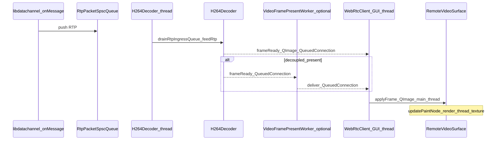

# 视频编解码与 UI 呈现热点路径审计（对照 Google C++ 指南「工程质量」维度）

| 字段 | 值 |
|------|-----|
| 文档版本 | 1.0 |
| 关联 | [CLIENT_GOOGLE_ENGINEERING_ALIGNMENT.md](CLIENT_GOOGLE_ENGINEERING_ALIGNMENT.md) |
| 分析深度 | L4（跨模块：WebRTC → 解码线程 → 呈现 → Scene Graph） |

本审计**不**评价花括号风格是否等于 Google Format，而对照 [Google C++ Style Guide](https://google.github.io/styleguide/cppguide.html) 中与**并发、资源、可维护性**相关的工程要求，结合本仓库实现做证据链说明。

---

## 1. 数据流（简图）

---

## 2. `H264Decoder`（FFmpeg / RTP）

**证据文件**：[`client/src/h264decoder.cpp`](../client/src/h264decoder.cpp)、[`client/src/h264decoder.h`](../client/src/h264decoder.h)

| 维度 | 观察 | 与 Google 指南精神的关系 |
|------|------|---------------------------|
| **资源管理** | `avcodec_free_context`、`sws_freeContext`、`av_malloc` 与 `extradata` 路径需在 `reset`/析构中配对释放；实现中含 `closeDecoder`、`reset` 等（见 `~H264Decoder`、`openDecoderWithExtradata` 附近）。 | 符合「显式资源生命周期」；评审时应持续检查**异常/早退路径**是否泄漏。 |
| **线程** | 解码逻辑运行在专用线程（`WebRtcClient::moveToThread(m_decodeThread)`）；`frameReady` 以 `Qt::QueuedConnection` 出线程。 | 符合「在文档中固定线程模型」；避免在 GUI 线程做重解码。 |
| **并发与原子** | `currentLifecycleId`、`lastFrameReadyEmitWallMs` 等使用 `std::atomic` + `memory_order`（头文件声明）。 | 应对照注释验证「仅诊断读」假设未被误用于同步复杂不变式。 |
| **实时 / 正确性** | `thread_count` 默认 1，文档注释说明多 slice + 多线程易导致条纹伪影（FFmpeg 行为），与 `CLIENT_FFMPEG_DECODE_THREADS` 可配置。 | 属于**领域特定**正确性优先于吞吐；与 Google「先正确再快」一致。 |
| **IWYU / 包含** | `extern "C"` 块隔离 FFmpeg 头；Qt 与项目内 `media/*` 分区清晰。 | 建议用 `clang-tidy` `misc-include-cleaner` 持续收紧。 |

---

## 3. `WebRtcClient`（绑定、队列、BlockingQueuedConnection）

**证据文件**：[`client/src/webrtcclient.cpp`](../client/src/webrtcclient.cpp)（检索 `H264Decoder`、`RemoteVideoSurface`、`BlockingQueuedConnection`、`moveToThread`）

| 维度 | 观察 | 备注 |
|------|------|------|
| **线程迁移** | `m_h264Decoder->moveToThread(m_decodeThread)`；`frameReady` → `VideoFramePresentWorker::ingestDecoderFrame` 或 `onVideoFrameFromDecoder`，均为 `QueuedConnection`。 | 线程边界与日志中的 `frameReadyReceivers` 诊断一致。 |
| **阻塞连接** | 存在 `Qt::BlockingQueuedConnection`（如 teardown / `resetState`）。 | Google 指南强调避免持锁等待；此处为**生命周期收缩**场景，应保证**无嵌套阻塞**与**超时外无死锁**（需评审调用图）。 |
| **背压** | RTP → SPSC → `drainRtpIngressQueue`；避免每包 `invokeMethod`。 | 符合有界队列 + 批量 drain 的实时系统惯例。 |

---

## 4. `RemoteVideoSurface`（主线程提交 + Scene Graph 纹理）

**证据文件**：[`client/src/ui/RemoteVideoSurface.cpp`](../client/src/ui/RemoteVideoSurface.cpp)、[`client/src/ui/RemoteVideoSurface.h`](../client/src/ui/RemoteVideoSurface.h)

| 维度 | 观察 | 与 Google 指南精神的关系 |
|------|------|---------------------------|
| **线程模型** | 头文件注明：解码 → 呈现线程（可选）→ 主线程 `applyFrame` + `update()`；纹理上传常在 `updatePaintNode`。 | 意图是减轻主线程 `setVideoFrame` 压力；**实现与注释一致**为持续评审点。 |
| **共享状态** | `applyFrame` 与 `updatePaintNode` 用 `QMutex` 保护 `m_frame` / `m_hasPendingFrame`。 | 锁粒度覆盖「写一帧 / 读一帧上传」；需避免在锁内调用可能重入的 Qt API（当前路径主要为 `QImage` 赋值与标志位）。 |
| **失败与观测** | `imageUsableForTexture` 拒绝超大图；`try/catch` 包裹 `applyFrame` 主体；纹理失败日志带环境变量门控与上限（`std::atomic` 计数）。 | 符合「可诊断、可配置、避免日志风暴」。 |
| **资源** | `updatePaintNode` 注释强调：若创建 node 却 `return nullptr` 须 `delete`，避免泄漏；`setOwnsTexture(true)`。 | 与 Google「明确所有权」一致。 |

---

## 5. 结论与后续

- **热点路径**在线程划分、队列背压、纹理所有权上有**清晰设计陈述与实现对应**；持续风险在 **BlockingQueuedConnection 死锁**、**FFmpeg 错误路径泄漏**、**clang-tidy 报告的 IWYU/重复包含** 等「工程卫生」项。
- **建议**：将 `./scripts/run-client-clang-tidy-baseline.sh` 纳入周期性 CI 或发布前手动执行，并对 `h264decoder.cpp`、`webrtcclient.cpp`、`RemoteVideoSurface.cpp` 做 **PR 必审**。

---

## 6. 验证

- 契约与 UI 模块：`./scripts/verify-client-ui-module-contract.sh`
- 静态分析基线：`./scripts/run-client-clang-tidy-baseline.sh`
- 视频管线脚本：仓库内 `scripts/verify-client-video-pipeline.sh` 等（按环境执行）
