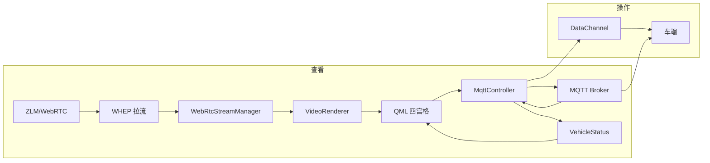

# Client 模块深度分析与模块化方案

## 0. Executive Summary

| 项目 | 结论 |
|------|------|
| **目标** | 将 client 模块功能模块化，保证「操作与查看」运行流畅。 |
| **收益** | 职责清晰、绑定范围缩小、加载与重绘更轻量，便于维护与扩展。 |
| **影响** | 新增/拆分 QML 与 C++ 小改，不改变对外 API 与行为。 |
| **风险** | 拆分后需保证 build-and-verify 与手工操作/查看流程通过。 |

---

## 1. 现状架构概览

### 1.1 目录与职责

```
client/
├── src/                    # C++ 逻辑层
│   ├── main.cpp            # 入口、对象创建、信号连接、QML 路径解析、上下文注册（职责过多）
│   ├── authmanager.*       # 认证（登录/Token/服务器 URL）
│   ├── vehiclemanager.*    # 车辆列表、VIN、会话创建
│   ├── vehiclestatus.*     # 车端状态聚合（速度/档位/连接/遥测）
│   ├── webrtcclient.*      # 单路 WebRTC 拉流
│   ├── webrtcstreammanager.* # 四路流管理（前/后/左/右）
│   ├── mqttcontroller.*    # 控制通道（DataChannel 优先 + MQTT 降级）
│   ├── presentation/renderers/VideoRenderer.* # GPU 加速视频渲染（QQuickItem + QSG）
│   ├── nodehealthchecker.* # 节点健康检查
│   └── h264decoder.*       # H.264 解码（RTP → FFmpeg → QImage）
├── qml/                    # UI 层
│   ├── main.qml            # 根窗口、登录/选车/驾驶主界面切换
│   ├── LoginPage.qml       # 登录页
│   ├── VehicleSelectionDialog.qml / VehicleSelectionPage.qml
│   ├── DrivingInterface.qml # 驾驶主界面（约 2878 行，单文件过大）
│   ├── StatusBar.qml       # 顶部状态栏
│   ├── VideoView.qml       # 单路视频占位（与 DrivingInterface 内 VideoPanel 并存）
│   ├── ControlPanel.qml    # 控制面板（部分场景使用）
│   ├── SteeringWheel.qml   # 方向盘
│   └── ConnectionsDialog.qml
└── CMakeLists.txt
```

### 1.2 数据流（查看 + 操作）



- **查看**：视频来自 WebRtcStreamManager → VideoRenderer → DrivingInterface 内 VideoPanel；状态来自 MqttController.statusReceived → VehicleStatus → QML 绑定。
- **操作**：QML 调用 mqttController / webrtcStreamManager.frontClient()，控制指令经 DataChannel 或 MQTT 到车端。

### 1.3 存在的问题

| 问题 | 说明 | 对流畅性的影响 |
|------|------|----------------|
| main.cpp 职责过重 | 对象创建、信号连接、QML 路径解析、DrivingInterface 内容校验、上下文注册全在一处 | 维护难，易在改 UI 时误动启动逻辑 |
| DrivingInterface 单文件过大 | 约 2878 行，布局常量/主题/逻辑/顶部栏/三列布局/控件全在一起 | 单次解析与绑定范围大，任何属性变化易触发整文件重算 |
| 布局日志常开 | logLayoutFull 定时执行 8 次 | 控制台与 I/O 开销，不利于流畅 |
| VehicleStatus 缺字段 | 水箱/垃圾箱/清扫进度仅在 QML 用 undefined 兜底 | 遥测无法从后端统一更新，且 QML 多处 typeof 判断 |
| 控制发送路径重复 | sendControlCommand 内 DataChannel/MQTT 分支与 mqttController 内部逻辑部分重叠 | 易漏改、不利于单一职责 |

---

## 2. 模块化设计原则

- **单一职责**：一个 QML 文件/一个 C++ 类只做一类事。
- **缩小绑定范围**：把「仅局部使用的」常量与子 UI 拆成独立文件，减少根组件绑定依赖。
- **操作与查看分离**：查看层（视频 + 状态展示）与操作层（按钮/指令发送）在结构上可分，通过 vehicleStatus / mqttController 等单例通信。
- **流畅性优先**：避免在 onWidthChanged/onHeightChanged 中做重逻辑；布局诊断仅在调试开启；大块 UI 可用 Loader 按需加载。

---

## 3. 模块化方案

### 3.1 C++ 层

| 模块 | 调整 | 说明 |
|------|------|------|
| main.cpp | 抽取 `resolveQmlMainUrl()`、`registerContextProperties()` | 保留对象创建与信号连接在 main，仅拆分 QML 路径解析与上下文注册，便于单测与阅读 |
| VehicleStatus | 新增 `waterTankLevel`, `trashBinLevel`, `cleaningCurrent`, `cleaningTotal` | 与 QML 展示一致，并在 `updateStatus()` 中解析车端/后端 JSON |
| MqttController / WebRtcStreamManager | 不改接口 | 已具备模块边界，发送逻辑保持「DataChannel 优先、MQTT 降级」 |

### 3.2 QML 层（驾驶界面）

| 文件 | 职责 | 与流畅性的关系 |
|------|------|----------------|
| **DrivingConstants.qml**（新建） | 仅定义只读常量：颜色、比例、间距、字体名 | 主题/布局变更集中，DrivingInterface 及子组件引用即可，减少大文件内重复字面量 |
| **DrivingTopBar.qml**（新建） | 顶部栏：连接车端、远驾接管、驾驶模式/清扫/刹车状态、延迟拉流 Timer | 顶部区域与主三列解耦，仅顶部相关状态变化时重算该块 |
| **DrivingInterface.qml**（保留并瘦身） | 根布局、左/中/右列、sendControlCommand、档位/灯光/清扫等信号与状态 | 通过引用 Constants + TopBar 子组件，行数显著减少；左/中/右列仍可在后续再拆为 LeftColumn/CenterColumn/RightColumn |

可选后续拆分（不强制本次）：

- **DrivingLeftColumn.qml**：左列（前/后视频面板）。
- **DrivingCenterColumn.qml**：中列（主摄像头、控制区、仪表盘）。
- **DrivingRightColumn.qml**：右列（右视图、高精地图、水箱/垃圾箱/清扫进度）。

### 3.3 流畅性专项

| 项 | 做法 |
|----|------|
| 布局诊断 | 仅在环境变量 `CLIENT_LAYOUT_DEBUG=1` 时开启 layoutLogTimer 与 logLayoutFull，默认关闭 |
| 绑定粒度 | 子组件（TopBar、后续 Left/Center/Right）各自依赖最小属性集，避免整页根属性一变就全量重算 |
| 控制发送 | 保持 sendControlCommand 单入口，内部仅做 channel 选择与一次 JSON 序列化，不增加额外计算 |
| 视频帧 | 保持现有 VideoRenderer + signal 机制，不在此次改动中引入新线程或复杂缓冲 |

---

## 4. 实施清单（本次）

1. **文档**：本文档（CLIENT_MODULE_ANALYSIS.md）。
2. **VehicleStatus**：新增 4 个属性及 `updateStatus` 解析；QML 继续使用 vehicleStatus.xxx，去掉对 undefined 的兜底判断（可选保留兼容）。
3. **DrivingConstants.qml**：新建，导出主题与布局常量。
4. **DrivingTopBar.qml**：新建，从 DrivingInterface 迁出顶部栏与相关 Timer/Connections。
5. **DrivingInterface.qml**：引用 Constants 与 TopBar，删除已迁出代码；布局诊断改为按 CLIENT_LAYOUT_DEBUG 开启。
6. **main.cpp**：抽取 `resolveQmlMainUrl()`、`registerContextProperties()`，保持行为不变。
7. **验证**：执行 `./scripts/build-and-verify.sh`，并手工验证登录 → 选车 → 连接车端 → 查看视频/状态与操作（档位、远驾接管等）流畅。

---

## 5. 后续演进（V1/V2）

- **V1**：左/中/右列拆为独立 QML，进一步缩小绑定范围；ControlPanel/SteeringWheel 与 DrivingInterface 统一使用 DrivingConstants。
- **V2**：可选「控制命令门面」单例（QML 只调门面，由门面内部选 DataChannel/MQTT），便于测试与扩展多通道策略。

---

## 6. 风险与回滚

- **风险**：QML 拆分后若引用名或作用域有误，会出现运行时未定义或空白区域。
- **缓解**：先做 Constants + TopBar 拆分并关闭布局日志，再跑完整流程；左/中/右列可后续逐步拆。
- **回滚**：保留原 DrivingInterface.qml 备份或通过 Git 回退；main.cpp 与 VehicleStatus 的修改为增量式，可单独 revert。
