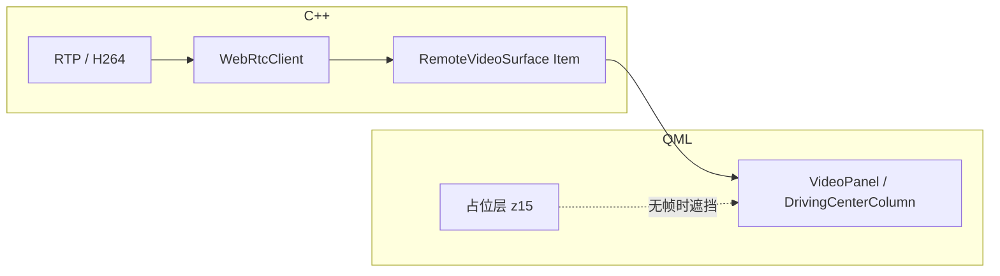

# 客户端 UI 功能项与视频显示 — 覆盖矩阵（审计 / 发布）

| 字段 | 值 |
|------|-----|
| 文档版本 | 1.0 |
| 关联契约 | `docs/CLIENT_UI_MODULE_CONTRACT.md`（远驾主界面模块边界） |
| C++ 单测映射 | `docs/CLIENT_UNIT_TEST_SOURCE_MAP.md`（**不**替代 UI / 真视频路径） |

---

## 1. Executive Summary

- **「每个 UI 功能项都要覆盖」**在工程上必须分层：**L1 静态与契约**、**L2 短跑可执行文件（日志断言）**、**L3 带栈集成（真实 WebRTC/视频）**、**L4 人工目视 / 设计稿对照**。本表逐项标注当前可达层级与脚本入口。
- **视频流显示**同时涉及：**C++**（RTP/H264、`WebRtcClient`、`RemoteVideoSurface`）、**QML**（`VideoPanel` / `DrivingCenterColumn` 内 `RemoteVideoSurface`、占位层 z-order）、**运行时**（需解码帧与 `onVideoFrameReady` / `[Client][UI][Video][FrameReady]` 日志）。
- **一键自动化（L1 + 部分 L2）**：`./scripts/verify-client-ui-and-video-coverage.sh`（串联契约、驾驶布局、视频管线结构检查与四路视频静态清点）。

---

## 2. 覆盖层级定义

| 层级 | 含义 | 典型手段 |
|------|------|----------|
| **L1** | 源码/结构存在，契约不破坏 | `grep`、`verify-*-layout.sh`、`verify-client-contract.sh` |
| **L2** | 进程短跑、关键日志 | `timeout 5 ./RemoteDrivingClient`、`verify-login-ui-features.sh` |
| **L3** | 依赖 Broker/Backend/ZLM 或 CARLA 的集成 | `verify-stream-e2e.sh`、`verify-full-chain-*.sh` 等 |
| **L4** | 像素/交互/延迟体验 | 人工按检查单 + 设计图；可选 Squish / 录屏回归（未默认接入 CI） |

---

## 3. 会话壳与阶段（`client/qml/shell/*`）

| 功能项 | 说明 | L1 | L2 | L3/L4 |
|--------|------|----|----|-------|
| 三阶段状态机 | 登录 → 选车 → 驾驶；`SessionConstants` / `sessionStage` | `SessionWorkspace.qml` 存在；脚本清点 | `[Client][UI][LoginStage] ready` 等日志 | 完整登录→进驾驶 |
| `LoginStage` | `LoginPage` 容器 | 文件 + `LoginStage` 关键字 | 同登录 L2 | 输入校验、错误提示目视 |
| `VehiclePickStage` | 「请选择车辆」、打开车辆选择 | 文件 + 文案 grep | `[Client][UI][VehiclePickStage] visible` | Popup 选车、会话创建 |
| `DrivingStageHost` | 驾驶界面 Loader | 文件存在 | 进入驾驶后加载 | 与 `DrivingInterface` 联调 |
| 顶栏 `StatusBar` | 驾驶壳内显示 | `SessionWorkspace` 内 `drivingShellActive` 关联 | 短跑 + 目视 | 状态与数据刷新 |

**自动化**：`verify-client-ui-and-video-coverage.sh` 内 **壳层文件与阶段常量** 清点；登录专项见 `scripts/verify-login-ui-features.sh`。

---

## 4. 登录与账号（`LoginPage` / `AppContext.authManager`）

| 功能项 | L1 | L2 | 备注 |
|--------|----|----|------|
| 用户名 / 密码 / 服务器地址 | QML 存在性（契约脚本不逐项列） | `verify-login-ui-features.sh` | 依赖 client-dev + 已编译客户端 |
| 账户名历史（最多 10 条） | — | 日志 `[Client][Auth]` / `usernameHistory` | |
| 密码显示/隐藏 | — | `[Client][UI]` 密码可见相关日志 | |
| 登录提交与失败分支 | — | 人工或扩展自动化 | |

---

## 5. 车辆选择（`VehicleSelectionDialog` / `VehicleSelectionPage`）

| 功能项 | L1 | L2/L3 |
|--------|----|-------|
| 列表展示、创建会话、进入驾驶 | `grep` / 架构脚本 `verify-client-architecture.sh` 可选 | 人工或 `verify-vins-e2e.sh` 等 API 向脚本 |
| 与 `VehicleManager` 绑定 | 契约不重复描述 | 实车栈或 Mock |

---

## 6. 远驾主界面 — 布局与模块（`components/driving/*`）

与 **CLIENT_UI_MODULE_CONTRACT** 对齐；下列为**功能可见性**覆盖表。

| 模块 / 区域 | 功能项 | L1 |
|-------------|--------|-----|
| `DrivingLayoutShell` | 顶栏 + 三列栅格 | `verify-driving-layout.sh` |
| `DrivingTopChrome` | 连接、远驾状态、时间等 | 契约 §3 + QML 存在 |
| `DrivingLeftRail` | 左视 + 后视视频槽 | 布局脚本 + 本节 **§7** |
| `DrivingCenterColumn` | 主视 + 控制 + 仪表盘 | 布局脚本 + **§7** + `verify-layout-widths.sh` |
| `DrivingRightRail` | 右视 + 高精地图占位 | 布局脚本 + **§7** |
| `facade` / `facade.teleop` | 统一属性与方法 | 契约；改 API 需 bump 版本 |

**控制与仪表盘（节选）**：档位、速度、转向显示、水箱/垃圾箱、清扫进度、灯光与作业按钮、急停、`sendControlCommand` 路径 —— **L1** 以「关键 `readonly property` / 绑定存在」为主（`DrivingInterface.qml`）；**L4** 为操作与车端回显目视。远驾接管按钮与视频联动见 `scripts/verify-remote-control-button-logic.sh`（Docker 内 grep）等。

---

## 7. 视频流显示（四路 + 主视 / 侧视）

### 7.1 呈现链（用于审计话术）

### 7.2 功能项矩阵

| 功能项 | 生产路径 | L1 | L2 日志关键字（示例） | L3/L4 |
|--------|----------|----|------------------------|-------|
| 主视图 `RemoteVideoSurface` | `DrivingCenterColumn.qml` | 脚本 grep `RemoteVideoSurface` + `主视图` | `[Client][UI][Video][FrameReady] 主视图` | 实流全屏、倒车 overlay |
| 左视图 `VideoPanel` | `DrivingLeftRail.qml` | `title: "左视图"` | `VideoPanel[左视图]` | 实流 |
| 后视图 `VideoPanel` | `DrivingLeftRail.qml` | `title: "后视图"` | `VideoPanel[后视图]` | 实流 |
| 右视图 `VideoPanel` | `DrivingRightRail.qml` | `title: "右视图"` | `VideoPanel[右视图]` | 实流 |
| 占位 / 无帧垫片 | `VideoPanel.qml`、中列主视 | z-order / `Placeholder` 日志 | `[Client][UI][Video][Placeholder]` | 无推流时目视无「洞穿」 |
| 几何 / RHI | 同上 | `VideoOutputGeom` 函数存在 | `[Client][UI][Video][VideoOutputGeom]` | 拉伸、黑边 |
| C++ 解码与 QVideoSink | `webrtcclient.*`、`h264decoder.*` | `verify-client-video-pipeline.sh` | C++ `[VideoSink]` / 客户端日志 | 端到端延迟 |
| **四路同时有帧（自动化）** | `WebRtcStreamManager` 1Hz 汇总 | — | **`[Client][VideoPresent][1Hz]`** 中 `Fr`/`Re`/`Le`/`Ri` 的 **`n>0` 或 `dE>0`**（同一行） | `./scripts/verify-client-four-view-video.sh` |

**单元测试**：抖动缓冲、预算、RTCP 等见 `CLIENT_UNIT_TEST_SOURCE_MAP.md`；**不**等价于「屏上看见视频」。**四路视频是否正常（数据面）**以 `verify-client-four-view-video.sh` + 日志解析为准；像素目视仍属 L4。

---

## 7.3 服务层与 WHEP base 解析（L2 CTest，无屏）

与远驾 **降级 / 错误恢复 / 诊断快照 / 拉流 base URL** 相关的确定性逻辑；**不替代**四路视频 L3/L4，但与「误降级、连错媒体入口」强相关。

| 能力 | 生产源码 | CTest | L1 门禁（CMake 注册） |
|------|-----------|-------|----------------------|
| 网络分→降级等级 + IDLE 不误触发 | `degradationmanager.cpp`、`DegradationMapping` | `test_degradationmanager` | `verify-client-ui-and-video-coverage.sh` 步骤 1/6 |
| 自动重试→升级→`safeStopRequired` | `errorrecoverymanager.cpp` | `test_errorrecoverymanager` | 同上 |
| 诊断 JSON 快照 / `collect` | `diagnosticsservice.cpp`、`performancemonitor.cpp` | `test_diagnosticsservice` | 同上 |
| `whep://`→`http` base、空 whep 用 `ZLM_VIDEO_URL` | `WebRtcUrlResolve.cpp`（`WebRtcStreamManager` 委托） | `test_webrtcurlresolve` | 同上 |

---

## 8. 脚本与命令速查

| 目的 | 命令 |
|------|------|
| **一键 L1：CMake L2 服务层四目标注册 + 契约 + 布局 + 视频结构 + 壳层/四路清点** | `./scripts/verify-client-ui-and-video-coverage.sh` |
| QML 控制路径契约 | `./scripts/verify-client-contract.sh` |
| 驾驶区布局静态 | `./scripts/verify-driving-layout.sh` |
| 视频管线 CMake/源码结构 | `./scripts/verify-client-video-pipeline.sh` |
| 登录页短跑 + 日志 | `./scripts/verify-login-ui-features.sh`（需 compose + client-dev） |
| 仪表盘宽度等 | `./scripts/verify-layout-widths.sh` |
| 人工完整 UI 检查单（非自动） | `scripts/verify-ui-complete.sh`（提示词 + 可选启动客户端） |
| **四路视频有数据（需 ZLM 四路在推 + client-dev）** | `./scripts/verify-client-four-view-video.sh`（解析 `[Client][VideoPresent][1Hz]`） |
| **一键全量（栈+L1+CTest+连接+可选 CARLA 四路，对齐 start-full-chain）** | `./scripts/run-client-oneclick-all-tests.sh` |
| 模块化总入口（含 CTest） | `./scripts/verify-all-client-modules.sh` |
| 模块化总入口 + 四路视频 | `WITH_FOUR_VIEW_VERIFY=1 ./scripts/verify-all-client-modules.sh` |

---

## 9. 缺口与演进（诚实清单）

| 缺口 | 风险 | 建议 |
|------|------|------|
| 无默认 **L4** 自动化 | 回归依赖人眼 | 录屏基线 / Squish 关键路径；发布前固定检查单签字 |
| 四路同时 **有帧** 未在 CI 默认断言 | 合成/图层问题仅现场发现 | 夜间 job：`verify-stream-e2e.sh` + **`verify-client-four-view-video.sh`**（或 `WITH_FOUR_VIEW_VERIFY=1`） |
| 控件逐个点击未脚本化 | 交互回归慢 | 按优先级对「急停、远驾接管、档位」做 Qt Test GUI 或 CLI 驱动 |

---

## 10. 维护约定

- 新增 **可见功能项** 或 **视频相关 QML/C++**：更新本表 **§3–§7** 与 `verify-client-ui-and-video-coverage.sh` 内清点规则（若适用）。
- 新增 **L2 服务层 CTest 目标**：登记于 `client/CMakeLists.txt` 后，**同步** `verify-client-ui-and-video-coverage.sh` 步骤 1/6 的 `_ensure_ctest_service_l2` 列表与本表 **§7.3**。
- 破坏性变更 `facade` / `facade.teleop` / `facade.appServices`：按 `CLIENT_UI_MODULE_CONTRACT.md` bump 版本并更新本表引用。
