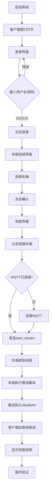

# 客户端界面操作指南

## Executive Summary

**目标**：通过客户端界面手动操作，完成登录、选车、连接车端、查看视频流的完整流程。

**操作流程**：
```
登录 → 选择车辆 → 进入驾驶界面 → 点击「连接车端」 → 查看四路视频
```

---

## 1. 启动系统

### 1.1 一键启动（推荐）

```bash
# 方式 1：使用 Makefile
make e2e-full

# 方式 2：使用脚本（手动模式，跳过自动测试）
bash scripts/start-full-chain.sh manual
```

**功能**：
- ✅ 启动所有 8 个节点
- ✅ 逐环体验证
- ✅ 启动客户端界面（供手动操作）

### 1.2 检查启动状态

```bash
# 查看所有节点状态
make e2e-status

# 或
docker compose -f docker-compose.yml -f docker-compose.vehicle.dev.yml ps
```

**预期结果**：所有节点状态为 `Up`

---

## 2. 客户端界面操作流程

### 2.1 登录界面

**界面元素**：
- 用户名输入框
- 密码输入框
- 「登录」按钮

**操作步骤**：
1. 在用户名输入框输入：`123`
2. 在密码输入框输入：`123`
3. 点击「登录」按钮

**预期结果**：
- ✅ 登录成功提示
- ✅ 自动跳转到车辆选择界面

**故障排查**：
- 如果登录失败，检查：
  - Keycloak 是否正常运行：`curl http://127.0.0.1:8080/health/ready`
  - 后端是否正常运行：`curl http://127.0.0.1:8081/health`
  - 查看后端日志：`docker logs teleop-backend`

---

### 2.2 车辆选择界面

**界面元素**：
- 车辆列表（显示 VIN、名称、状态）
- 「确认」按钮
- 「取消」按钮

**操作步骤**：
1. **查看车辆列表**：界面显示可用车辆
2. **选择车辆**：点击要连接的车辆（高亮显示）
3. **确认选择**：点击「确认」按钮

**预期结果**：
- ✅ 车辆选择成功
- ✅ 自动跳转到驾驶界面

**故障排查**：
- 如果车辆列表为空，检查：
  - 后端 API 是否正常：`curl http://127.0.0.1:8081/api/vehicles`
  - 数据库是否有测试数据
  - 查看后端日志：`docker logs teleop-backend`

---

### 2.3 驾驶界面

**界面布局**：
```
┌─────────────────────────────────────────────────┐
│  状态栏（灯光、警告等）                          │
├──────────┬──────────────┬───────────────────────┤
│          │              │                       │
│  左侧    │   中央主视    │   右侧                │
│  视频    │   频窗口      │   视频                │
│          │              │                       │
│  地图    │              │   告警                │
│          │              │                       │
├──────────┴──────────────┴───────────────────────┤
│  控制面板（方向盘、油门、刹车等）                │
│  仪表盘（速度、档位、状态等）                     │
└─────────────────────────────────────────────────┘
```

**关键按钮**：
- **「连接车端」按钮**：位于顶部状态栏或控制面板
  - 位置：通常在界面顶部右侧
  - 状态显示：
    - `连接车端`：未连接状态
    - `MQTT已连接`：MQTT 已连接，等待视频流
    - `连接中...`：正在连接
    - `已连接`：视频流已连接

---

### 2.4 连接车端操作

**操作步骤**：
1. **点击「连接车端」按钮**
   - 位置：驾驶界面顶部状态栏或控制面板
   - 按钮文本：`连接车端` 或 `MQTT已连接`

2. **等待连接过程**
   - MQTT 连接（如果未连接）
   - 发送 `start_stream` 消息到车端
   - 车端收到消息后开始推流
   - 客户端拉取四路视频流
   - 等待时间：约 2-5 秒

3. **验证连接结果**
   - 按钮文本变为：`已连接`
   - 四路视频窗口显示画面
   - 视频窗口显示「视频已连接」状态

**预期结果**：
- ✅ 按钮状态变为「已连接」
- ✅ 四路视频窗口显示画面：
  - **cam_front**：前视摄像头（中央主窗口）
  - **cam_rear**：后视摄像头（左侧或右侧）
  - **cam_left**：左侧摄像头（左侧）
  - **cam_right**：右侧摄像头（右侧）
- ✅ 画面流畅，无花屏、卡顿

---

## 3. 视频流验证

### 3.1 检查视频窗口

**四路视频位置**：
- **cam_front**：中央主窗口（最大）
- **cam_rear**：左侧或右侧窗口
- **cam_left**：左侧窗口
- **cam_right**：右侧窗口

**视频状态指示**：
- **「视频已连接」**：绿色文字，表示连接成功
- **「连接中...」**：灰色文字，表示正在连接
- **「等待连接」**：灰色文字，表示未连接

### 3.2 验证视频质量

**检查项**：
- ✅ 画面清晰度：可看清画面内容
- ✅ 画面流畅度：无明显卡顿
- ✅ 无花屏：无马赛克、撕裂
- ✅ 无黑屏：视频窗口有画面

**如果出现问题**：
- 查看客户端终端日志（查找 `[H264]` 相关日志）
- 检查车端推流日志：`docker logs $(docker ps --format '{{.Names}}' | grep vehicle | head -1)`
- 检查 ZLMediaKit 流列表：`curl "http://127.0.0.1:80/index/api/getMediaList?app=teleop"`

---

## 4. 控制操作（可选）

### 4.1 方向盘控制

**操作方式**：
- 鼠标拖动方向盘
- 键盘方向键（如已实现）

**预期结果**：
- 方向盘角度变化
- MQTT 控制指令发送（查看日志）

### 4.2 油门/刹车控制

**操作方式**：
- 键盘按键（如已实现）
- 界面按钮（如已实现）

**预期结果**：
- 油门/刹车值变化
- MQTT 控制指令发送

### 4.3 档位切换

**操作方式**：
- 界面档位按钮
- 键盘按键（如已实现）

**预期结果**：
- 档位显示更新
- MQTT 控制指令发送

---

## 5. 操作流程图



---

## 6. 故障排查

### 6.1 客户端窗口未打开

**问题**：启动后没有客户端窗口

**排查**：
```bash
# 检查 DISPLAY 环境变量
echo $DISPLAY

# 检查 X11 权限
xhost +local:docker

# 检查客户端容器状态
docker ps | grep client-dev
```

**解决**：
```bash
# 设置 DISPLAY
export DISPLAY=:0

# 允许 Docker 访问 X11
xhost +local:docker

# 手动启动客户端
bash scripts/run-e2e.sh client
```

---

### 6.2 登录失败

**问题**：输入用户名/密码后无法登录

**排查**：
```bash
# 检查 Keycloak
curl http://127.0.0.1:8080/health/ready

# 检查后端
curl http://127.0.0.1:8081/health

# 查看后端日志
docker logs teleop-backend | tail -50
```

**解决**：
- 等待 Keycloak 完全启动（首次启动需 30-60 秒）
- 确认用户名/密码正确（测试账号：123/123）
- 检查网络连接

---

### 6.3 车辆列表为空

**问题**：车辆选择界面没有车辆

**排查**：
```bash
# 检查后端 API
curl -H "Authorization: Bearer <token>" http://127.0.0.1:8081/api/vehicles

# 检查数据库
docker exec -it teleop-postgres psql -U teleop_user -d teleop_db -c "SELECT * FROM vehicles;"
```

**解决**：
- 检查数据库是否有测试数据
- 检查后端 API 是否正常
- 查看后端日志

---

### 6.4 点击「连接车端」无反应

**问题**：点击按钮后没有变化

**排查**：
```bash
# 检查 MQTT 连接
docker logs teleop-mqtt | tail -20

# 检查车端是否收到消息
docker logs $(docker ps --format '{{.Names}}' | grep vehicle | head -1) | grep start_stream

# 查看客户端日志（终端输出）
# 查找 "MQTT: requested vehicle to start stream"
```

**解决**：
- 检查 MQTT Broker 是否运行
- 检查车端是否已连接 MQTT
- 查看客户端终端日志

---

### 6.5 视频无画面

**问题**：点击「连接车端」后视频窗口无画面

**排查步骤**：

1. **检查车端是否收到 start_stream**
   ```bash
   docker logs $(docker ps --format '{{.Names}}' | grep vehicle | head -1) | grep start_stream
   ```

2. **检查推流进程是否启动**
   ```bash
   docker exec $(docker ps --format '{{.Names}}' | grep vehicle | head -1) ps aux | grep ffmpeg
   ```

3. **检查 ZLMediaKit 流列表**
   ```bash
   curl "http://127.0.0.1:80/index/api/getMediaList?app=teleop"
   ```

4. **检查客户端 WebRTC 连接**
   - 查看客户端终端日志
   - 查找 `[WebRTC]` 相关日志
   - 查找 `[H264]` 相关日志

**解决**：
- 等待车端推流启动（约 2-5 秒）
- 检查数据集路径（如使用 NuScenes）
- 检查网络连接
- 查看详细日志

---

### 6.6 视频花屏/卡顿

**问题**：视频画面有花屏或卡顿

**排查**：
```bash
# 检查推流码率
docker exec $(docker ps --format '{{.Names}}' | grep vehicle | head -1) ps aux | grep ffmpeg

# 检查客户端日志（查找 [H264] 日志）
# 查看是否有 "帧不完整"、"丢包恢复" 等消息
```

**解决**：
- 检查推流脚本 GOP 配置（应为 1 秒）
- 检查网络带宽
- 降低码率（如需要）
- 参考 `docs/CLIENT_VIDEO_ERROR_FIX.md`

---

## 7. 操作检查清单

### 7.1 启动前

- [ ] Docker 已安装并运行
- [ ] 端口未被占用
- [ ] 数据集路径已配置（如使用 NuScenes）
- [ ] 有图形界面（DISPLAY 环境变量）

### 7.2 启动后

- [ ] 所有节点状态为 `Up`
- [ ] 客户端窗口已打开
- [ ] 登录界面正常显示

### 7.3 操作过程

- [ ] 能成功登录
- [ ] 能选择车辆
- [ ] 能进入驾驶界面
- [ ] 能点击「连接车端」
- [ ] 车端收到 start_stream 消息
- [ ] 车端开始推流
- [ ] 客户端显示四路视频画面

### 7.4 验证结果

- [ ] 四路视频窗口都有画面
- [ ] 画面清晰，无花屏
- [ ] 画面流畅，无卡顿
- [ ] 视频延迟可接受（< 500ms）

---

## 8. 预期界面截图说明

### 8.1 登录界面

- 用户名输入框
- 密码输入框
- 「登录」按钮
- 背景：深色主题

### 8.2 车辆选择界面

- 车辆列表（卡片式或列表式）
- 每个车辆显示：VIN、名称、状态
- 「确认」和「取消」按钮

### 8.3 驾驶界面

**布局**：
- **顶部**：状态栏（灯光、警告图标）
- **中央**：主视频窗口（cam_front）
- **左侧**：左侧视频（cam_left）+ 地图
- **右侧**：右侧视频（cam_right）+ 告警
- **底部**：控制面板 + 仪表盘

**关键元素**：
- 「连接车端」按钮（顶部右侧）
- 四路视频窗口
- 方向盘控制
- 油门/刹车控制
- 档位显示

---

## 9. 日志查看

### 9.1 客户端日志

**位置**：启动客户端的终端窗口

**关键日志**：
```
[WebRTC] play Offer 已生成 stream= "cam_front"
[WebRTC] PeerConnection state stream= "cam_front" state= Connected
[H264] 出帧 # 1 w= 640 h= 480
MQTT: requested vehicle to start stream (start_stream)
```

### 9.2 车端日志

**查看命令**：
```bash
docker logs -f $(docker ps --format '{{.Names}}' | grep vehicle | head -1)
```

**关键日志**：
```
[Control] 收到 start_stream，启动数据集推流
[Control] 执行推流脚本 script=...
```

### 9.3 后端日志

**查看命令**：
```bash
docker logs -f teleop-backend
```

**关键日志**：
```
POST /api/auth/login
GET /api/vehicles
```

---

## 10. 常用操作命令

### 10.1 启动/停止

```bash
# 启动全链路（含客户端）
make e2e-full

# 仅启动节点
make e2e-start-no-client

# 停止所有
make e2e-stop

# 查看状态
make e2e-status
```

### 10.2 日志查看

```bash
# 查看所有日志
docker compose -f docker-compose.yml -f docker-compose.vehicle.dev.yml logs -f

# 查看特定节点日志
docker logs -f teleop-backend
docker logs -f teleop-zlmediakit
docker logs -f $(docker ps --format '{{.Names}}' | grep vehicle | head -1)
```

### 10.3 手动触发推流

```bash
# 发送 start_stream 消息
mosquitto_pub -h 127.0.0.1 -p 1883 -t vehicle/control -m '{"type":"start_stream","vin":"123456789","timestampMs":0}'
```

---

## 11. 相关文档

- `docs/START_FULL_SYSTEM_GUIDE.md` - 系统启动指南
- `docs/VERIFY_FULL_CHAIN.md` - 全链路验证说明
- `docs/CLIENT_VIDEO_ERROR_FIX.md` - 视频错误修复
- `scripts/start-full-chain.sh` - 启动脚本

---

## 12. 总结

**一键启动**：
```bash
make e2e-full
```

**操作流程**：
1. 登录（123/123）
2. 选择车辆
3. 进入驾驶界面
4. 点击「连接车端」
5. 等待视频流显示
6. 验证四路视频画面

**关键按钮**：
- 「连接车端」：位于驾驶界面顶部状态栏或控制面板

**预期结果**：
- ✅ 四路视频窗口显示画面
- ✅ 画面清晰流畅
- ✅ 无花屏、卡顿
