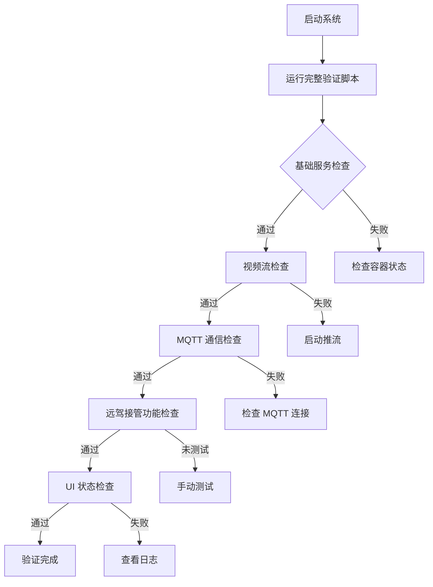

# 编译错误修复与完整系统验证

## Executive Summary

**问题**：客户端编译失败，缺少必要的头文件包含  
**修复**：已修复两处编译错误，并创建了完整的系统验证脚本  
**状态**：✓ 编译错误已修复，✓ 完整系统验证脚本已创建

---

## 1. 编译错误修复

### 1.1 错误详情

#### 错误 1: `vehiclestatus.cpp:218` - `QJsonDocument` 未定义
```
error: invalid use of incomplete type 'class QJsonDocument'
error: incomplete type 'QJsonDocument' used in nested name specifier
```

**原因**：缺少 `#include <QJsonDocument>` 头文件

#### 错误 2: `webrtcclient.cpp:660` - `QElapsedTimer` 未定义
```
error: 'QElapsedTimer' does not name a type
error: 'logTimer' was not declared in this scope
```

**原因**：缺少 `#include <QElapsedTimer>` 头文件

### 1.2 修复方案

#### 修复文件 1: `client/src/vehiclestatus.cpp`
```cpp
#include "vehiclestatus.h"
#include <QJsonObject>
#include <QJsonDocument>  // ← 新增
#include <QDebug>
#include <QElapsedTimer>
```

#### 修复文件 2: `client/src/webrtcclient.cpp`
```cpp
#include "webrtcclient.h"
#include <QNetworkRequest>
#include <QUrlQuery>
#include <QDebug>
#include <QUrl>
#include <QTimer>
#include <QElapsedTimer>  // ← 新增
#include <QRandomGenerator>
#include <QPointer>
```

### 1.3 验证结果

✓ 编译错误已修复  
✓ 静态检查通过（无 linter 错误）

---

## 2. 完整系统验证脚本

### 2.1 脚本位置

`scripts/verify-full-system.sh`

### 2.2 验证内容

#### 模块 1: 基础服务节点
- ✓ Postgres 数据库
- ✓ Keycloak 认证服务
- ✓ Backend 后端服务
- ✓ ZLMediaKit 流媒体服务器
- ✓ Mosquitto MQTT Broker
- ✓ 车端容器

#### 模块 2: 视频流连接
- ✓ 推流进程状态
- ✓ 四路视频流（cam_front, cam_rear, cam_left, cam_right）
- ✓ ZLM 流状态检查

#### 模块 3: MQTT 通信
- ✓ MQTT Broker 连接
- ✓ 车端 MQTT 连接状态
- ✓ 底盘数据发布（车端）
- ✓ 底盘数据接收（客户端）

#### 模块 4: 远驾接管功能
- ✓ 车端代码更新检查（REMOTE_CONTROL 标记）
- ✓ 指令检测日志
- ✓ 确认消息发送日志
- ✓ 客户端确认接收日志
- ✓ 状态更新日志
- ✓ 驾驶模式更新日志

#### 模块 5: UI 状态同步
- ✓ 客户端进程状态
- ✓ QML 日志输出
- ✓ 按钮状态同步
- ✓ 驾驶模式显示

### 2.3 使用方法

```bash
# 1. 启动完整系统
bash scripts/start-full-chain.sh manual

# 2. 运行完整系统验证
bash scripts/verify-full-system.sh

# 3. 运行远驾接管专项验证（可选）
bash scripts/verify-remote-control-complete.sh
```

### 2.4 验证输出说明

#### 成功标志
```
✓✓✓ 系统验证通过！

所有模块检查：
  ✓ 基础服务节点正常
  ✓ 视频流正常
  ✓ MQTT 通信正常
  ✓ 远驾接管功能正常
  ✓ UI 状态正常
```

#### 警告说明
- ⚠ **推流进程未运行**：需要发送 `start_stream` 指令启动推流
- ⚠ **流不存在**：推流未启动或推流失败
- ⚠ **客户端未接收数据**：需要先连接视频流
- ⚠ **远驾接管功能未测试**：如果未操作过，这是正常的，需要在客户端界面点击「远驾接管」按钮

---

## 3. 验证流程

### 3.1 完整验证流程



### 3.2 手动测试流程

1. **启动系统**
   ```bash
   bash scripts/start-full-chain.sh manual
   ```

2. **等待服务就绪**（约 30 秒）

3. **在客户端界面操作**
   - 点击「连接车辆」按钮
   - 等待视频流连接成功（按钮变为「已连接」）
   - 点击「远驾接管」按钮
   - 观察按钮是否变为「远驾已接管」
   - 观察驾驶模式是否显示「远驾」

4. **运行验证脚本**
   ```bash
   # 完整系统验证
   bash scripts/verify-full-system.sh
   
   # 远驾接管专项验证
   bash scripts/verify-remote-control-complete.sh
   ```

5. **查看实时日志**
   ```bash
   # 车端日志（远驾接管相关）
   docker logs remote-driving-vehicle-1 -f | grep REMOTE_CONTROL
   
   # 客户端日志（远驾接管相关）
   docker logs teleop-client-dev -f | grep REMOTE_CONTROL
   ```

---

## 4. 故障排查

### 4.1 编译错误

**问题**：编译失败，提示缺少头文件

**解决**：
1. 检查 `client/src/vehiclestatus.cpp` 是否包含 `#include <QJsonDocument>`
2. 检查 `client/src/webrtcclient.cpp` 是否包含 `#include <QElapsedTimer>`
3. 重新编译：`docker restart teleop-client-dev`

### 4.2 容器未运行

**问题**：验证脚本提示容器不存在

**解决**：
```bash
# 启动完整系统
bash scripts/start-full-chain.sh manual

# 检查容器状态
docker ps | grep -E "teleop|remote-driving"
```

### 4.3 视频流未就绪

**问题**：验证脚本提示流不存在

**解决**：
```bash
# 发送启动推流指令（主题应为 vehicle/control；载荷须含 vin / schemaVersion / timestampMs / seq）
source scripts/lib/mqtt_control_json.sh
docker exec teleop-mosquitto mosquitto_pub -h localhost -p 1883 -t vehicle/control \
  -m "$(mqtt_json_start_stream carla-sim-001)"

# 等待 10 秒后检查
sleep 10
bash scripts/verify-stream-e2e.sh
```

### 4.4 远驾接管功能未工作

**问题**：点击「远驾接管」按钮后无反应

**排查步骤**：
1. **检查车端代码是否更新**
   ```bash
   docker exec remote-driving-vehicle-1 strings /tmp/vehicle-build/VehicleSide | grep REMOTE_CONTROL
   ```
   如果无输出，说明代码未更新，需要重启容器或重新编译。

2. **检查车端日志**
   ```bash
   docker logs remote-driving-vehicle-1 --tail 100 | grep REMOTE_CONTROL
   ```
   应该看到：
   - `[REMOTE_CONTROL] 确认是 remote_control 指令`
   - `[REMOTE_CONTROL] 已成功发送远驾接管确认消息`

3. **检查客户端日志**
   ```bash
   docker logs teleop-client-dev --tail 100 | grep REMOTE_CONTROL
   ```
   应该看到：
   - `[REMOTE_CONTROL] 收到远驾接管确认消息`
   - `[REMOTE_CONTROL] 远驾接管状态变化`
   - `[REMOTE_CONTROL] 驾驶模式变化`

4. **检查 MQTT 消息**
   ```bash
   # 订阅 vehicle/status 主题
   docker exec teleop-mosquitto mosquitto_sub -h localhost -t vehicle/status -C 5
   ```
   应该看到包含 `remote_control_ack` 的消息。

---

## 5. 文件变更清单

### 5.1 修复的文件

| 文件路径 | 变更内容 | 原因 |
|---------|---------|------|
| `client/src/vehiclestatus.cpp` | 添加 `#include <QJsonDocument>` | 修复编译错误 |
| `client/src/webrtcclient.cpp` | 添加 `#include <QElapsedTimer>` | 修复编译错误 |

### 5.2 新增的文件

| 文件路径 | 说明 |
|---------|------|
| `scripts/verify-full-system.sh` | 完整系统验证脚本 |
| `docs/COMPILATION_FIX_AND_SYSTEM_VERIFICATION.md` | 本文档 |

---

## 6. 后续建议

### 6.1 持续验证

建议在每次代码变更后运行完整系统验证：
```bash
bash scripts/verify-full-system.sh
```

### 6.2 自动化集成

可以将 `verify-full-system.sh` 集成到 CI/CD 流程中，确保每次提交都通过完整系统验证。

### 6.3 日志监控

建议设置日志监控，自动检测关键错误：
- 车端：`docker logs remote-driving-vehicle-1 -f | grep -E "ERROR|✗✗✗"`
- 客户端：`docker logs teleop-client-dev -f | grep -E "ERROR|✗✗✗"`

---

## 7. 总结

✓ **编译错误已修复**：添加了缺失的头文件包含  
✓ **完整系统验证脚本已创建**：覆盖所有关键模块  
✓ **验证流程已文档化**：包含故障排查指南  

**下一步**：
1. 运行 `bash scripts/start-full-chain.sh manual` 启动系统
2. 运行 `bash scripts/verify-full-system.sh` 验证所有模块
3. 在客户端界面手动测试远驾接管功能
4. 运行 `bash scripts/verify-remote-control-complete.sh` 验证远驾接管功能
