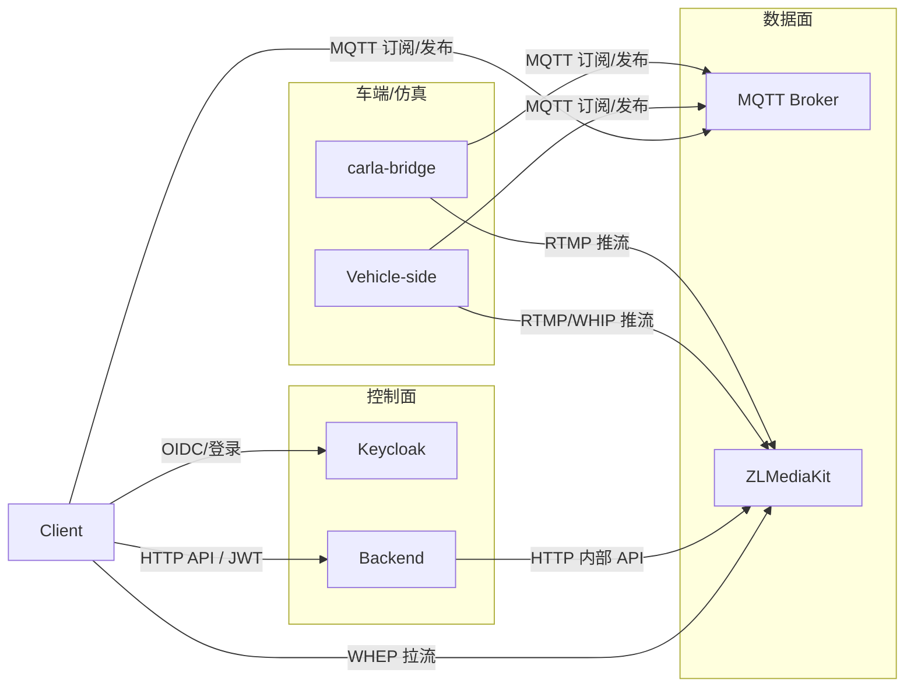

# 分布式部署：五模块跨设备、非同一局域网部署指南

## 1. Executive Summary

- **目标**：backend、carla-bridge、client、media（ZLM）、Vehicle-side 五模块可部署在不同物理/虚拟设备上，且不必处于同一局域网；**只要协议对接（端点可达），即可通信**。
- **原则**：所有“谁连谁、连到哪里”均通过**可配置端点**（环境变量或配置文件）指定，无硬编码 IP/域名；协议格式（MQTT 主题、HTTP API、WHEP/WHIP、RTMP）保持不变，仅改地址。
- **结果**：同一套协议与实现，既可单机/同 LAN 部署，也可跨公网/多机房/车在野外、端在云上等分布式部署。

---

## 2. 连接关系与协议（对接即通）

下图为**逻辑连接关系**：箭头表示“谁主动连谁”，协议与主题/路径固定，仅端点可配置。



**协议与对接要点**（不改协议即可跨网）：

| 链路 | 协议 | 主题/路径/格式 | 对接要求 |
|------|------|----------------|----------|
| Client ↔ Keycloak | OIDC / HTTP | 登录、JWKS | Client 配置 Keycloak 地址；Backend 配置 iss/aud |
| Client ↔ Backend | HTTPS | `/api/v1/me`, `/api/v1/vins`, `/api/v1/vins/{vin}/sessions` 等 | Client 配置 Backend 根 URL（登录页填的 serverUrl） |
| Client ↔ MQTT | MQTT 3.1.1 | 订阅 `vehicle/status`，发布 `vehicle/control` | 双方配置同一 Broker URL（可由 Backend 在 session 中下发给 Client） |
| Client ↔ ZLM | WHEP (WebRTC) | `/index/api/webrtc?app=teleop&stream=...&type=play` | Backend 返回的 WHEP URL 必须是 Client 可访问的地址 |
| Vehicle/carla-bridge ↔ MQTT | MQTT 3.1.1 | 订阅 `vehicle/control`，发布 `vehicle/status` | 与 Client 同一 Broker URL |
| Vehicle/carla-bridge ↔ ZLM | RTMP / WHIP | RTMP: `rtmp://host/app/stream`；WHIP 同 ZLM 约定 | 车端/桥接配置的 ZLM 地址必须能从该设备访问 |
| Backend ↔ ZLM | HTTP | `ZLM_API_URL` 调用 open/close 等 | Backend 侧 ZLM 仅需 Backend 可访问（可与给 Client 的地址不同） |

**结论**：只要各模块的“对方地址”配置正确且网络可达，协议无需改动即可通信。

---

## 3. 各模块端点配置矩阵

以下为**最小必要配置**，用于分布式部署时“只改配置、不改代码”即可对接。

### 3.1 Client（驾驶舱）

| 配置项 | 含义 | 来源/示例 | 说明 |
|--------|------|-----------|------|
| Backend 根 URL（serverUrl） | 登录页填写，用于 `/api/v1/*`、创建会话 | 用户输入或预设，如 `https://backend.example.com` | 必须可从 Client 所在网络访问 |
| Keycloak | 由 Backend/Realm 配置间接使用，或 Client 单独配置 issuer | 通常与 Backend 同域或单独域名 | 用于 OIDC 登录、JWT |
| MQTT Broker URL | 连接车端状态/控制 | 会话创建响应 `control.mqtt_broker_url` 或连接设置界面 | 必须 Client 与车端/Bridge **都能访问** |
| WHEP URL | 拉流地址 | 会话创建响应 `media.whep` | 必须为 **Client 可访问** 的 ZLM 地址（公网或 VPN） |

### 3.2 Backend

| 配置项 | 含义 | 环境变量/示例 | 说明 |
|--------|------|----------------|------|
| DATABASE_URL | PostgreSQL | 已有 | 仅 Backend 可访问即可 |
| Keycloak issuer / JWKS | JWT 校验 | KEYCLOAK_ISSUER、JWKS_URL 等 | 仅 Backend 可访问即可 |
| ZLM_API_URL | Backend 调用 ZLM 内部 API | `http://zlmediakit/index/api` | Backend 所在网段能访问即可 |
| **ZLM_PUBLIC_BASE** | 返回给 Client/车端的 WHEP/WHIP 基地址 | `https://media.example.com` 或 `https://media.example.com:443` | **分布式必配**：Client/车端用此地址连 ZLM |
| MQTT_BROKER_URL | 下发给 Client 的 MQTT 地址 | `mqtt://mqtt.example.com:1883` | Client 与车端都能访问的 Broker |

### 3.3 carla-bridge / Vehicle-side（车端）

| 配置项 | 含义 | 环境变量/示例 | 说明 |
|--------|------|----------------|------|
| MQTT Broker | 收控、发状态 | MQTT_BROKER / MQTT_BROKER_URL | 与 Client、Backend 下发的为同一 Broker |
| ZLM 推流地址 | RTMP 或 WHIP | ZLM_HOST + ZLM_RTMP_PORT / WHIP_URL | 车端/Bridge 所在网络能访问 ZLM 的**推流端点** |
| VIN | 车辆标识 | VIN / VEHICLE_VIN | 协议内字段，与部署无关 |

### 3.4 Media（ZLMediaKit）

| 配置项 | 含义 | 说明 |
|--------|------|------|
| 对外 HTTP/HTTPS 端口 | WHEP/WHIP、API | 需在 ZLM 与 Coturn 上配置**公网 IP 或域名**（跨网时） |
| RTMP 端口 | 车端推流 | 车端能访问的 host:1935 |
| Coturn (STUN/TURN) | WebRTC 穿透 | 跨 NAT 时需 TURN；配置 COTURN_EXTERNAL_IP 等 |

### 3.5 小结：分布式关键点

- **MQTT**：Broker 部署在 Client 与车端都能到达的位置（公网 Broker、或 VPN 内网地址），Backend 通过 `MQTT_BROKER_URL` 下发给 Client，车端/Bridge 配置同一 URL。
- **WHEP/WHIP**：Backend 返回给 Client（及车端）的 URL 必须使用 **ZLM 的对外可访问基地址**（即 `ZLM_PUBLIC_BASE`），而不是 Backend 访问 ZLM 时使用的内网 `ZLM_API_URL`。
- **Backend / Keycloak / DB**：只要 Client 能访问 Backend、Backend 能访问 DB 与 Keycloak 即可，可全部在机房或云上。

---

## 4. 非同一局域网时的注意点

| 问题 | 建议 |
|------|------|
| MQTT 跨公网 | 使用 TLS：`mqtts://broker.example.com:8883`；Broker 侧配置证书与认证 |
| Client/车端 NAT 穿透 | WebRTC 依赖 Coturn；配置 TURN 的 `COTURN_EXTERNAL_IP` 与端口范围，确保可从公网访问 |
| ZLM 被 Nginx 反向代理 | WHEP/WHIP 的 host 填代理的域名，ZLM 配置中 extern_ip 等与代理一致 |
| 时延与抖动 | 控制与状态走 MQTT，尽量选就近 Broker；视频走 ZLM，可考虑区域化部署 ZLM |
| 防火墙 | 开放：Backend 的 HTTPS、MQTT 端口、ZLM HTTP(S)/RTMP、Coturn UDP/TCP |

---

## 5. 配置模板（分布式示例）

以下为**按设备拆分**的示例，仅展示端点如何改，不改变协议。

**设备 A（机房/云）：Backend + Keycloak + PostgreSQL + MQTT Broker + ZLM + Coturn**

```env
# Backend
DATABASE_URL=postgresql://postgres:5432/teleop_db
ZLM_API_URL=http://zlmediakit/index/api
ZLM_PUBLIC_BASE=https://media.yourcompany.com
MQTT_BROKER_URL=mqtts://mqtt.yourcompany.com:8883
```

**设备 B（驾驶舱）：Client**

- 登录页 serverUrl：`https://backend.yourcompany.com`
- MQTT、WHEP 由会话接口返回（来自 Backend 的 `ZLM_PUBLIC_BASE` 与 `MQTT_BROKER_URL`），无需手填（若手填则与上一致）

**设备 C（车/仿真）：Vehicle-side 或 carla-bridge**

```env
MQTT_BROKER_URL=mqtts://mqtt.yourcompany.com:8883
ZLM_HOST=media.yourcompany.com
ZLM_RTMP_PORT=1935
# 若 ZLM 仅暴露 HTTPS，则车端用 WHIP URL（需实现处支持）
```

---

## 6. Backend 支持“客户端可见的 ZLM 地址”

当前 Backend 用 `ZLM_API_URL` 解析 host/port 生成 `media.whep` / `media.whip`，在分布式下若 Backend 与 ZLM 同内网而 Client/车端在公网，则需使用**另一套“对外”基地址**。

- **新增环境变量**：`ZLM_PUBLIC_BASE`（可选）。
- **语义**：若设置，则用其解析出的 host:port 生成 WHEP/WHIP URL；未设置则沿用 `ZLM_API_URL` 解析结果（与当前行为一致）。
- **示例**：`ZLM_API_URL=http://zlmediakit/index/api`，`ZLM_PUBLIC_BASE=https://media.example.com` → 返回给 Client 的为 `whep://media.example.com:443/...`。

实现见下节；部署时在 Backend 所在环境配置 `ZLM_PUBLIC_BASE` 即可实现“协议对接即可通信”，无需改 Client/车端协议。

---

## 7. 实现状态与后续

| 项 | 状态 |
|----|------|
| 各模块端点均通过环境变量或配置指定 | 已支持（Client 部分为 UI/会话下发） |
| Backend 支持 ZLM_PUBLIC_BASE 区分内网 API 与对外 WHEP/WHIP | 已实现（backend/src/main.cpp） |
| MQTT over TLS / 公网 Broker | 需在 Broker 侧配置；Client/车端已支持 mqtts:// URL |
| 部署拓扑与 Runbook | 本文档 + 各模块 README |

---

## 8. 部署前配置检查清单（稳定性与分布式）

在启动各模块前，可按下表自检，避免“连不上、拉流黑屏、控制无响应”等因配置错误导致的问题。

| 检查项 | 负责模块 | 验证方法 |
|--------|----------|----------|
| Backend 能连上 DB | Backend | `curl -s $BACKEND_URL/health` 中 `dependencies.db` 为 `ok` |
| Backend 能连上 ZLM（若需） | Backend | `curl -s $BACKEND_URL/ready` 为 200 |
| Client 能访问 Backend | Client | 浏览器或 `curl $SERVER_URL/health` 返回 200 |
| Client 能访问 Keycloak | Client | `curl $KEYCLOAK_URL/health/ready` 返回 200 |
| MQTT Broker 地址一致 | Client + Vehicle/Bridge | Client 会话中的 broker URL 与车端 `MQTT_BROKER_URL` 一致 |
| 车端能访问 ZLM 推流地址 | Vehicle/Bridge | 从车端所在网络 `telnet $ZLM_HOST 1935` 或推流测试 |
| Client 能访问 WHEP 地址 | Client | Backend 返回的 `media.whep` 使用 **ZLM 对外可访问** 的基地址（ZLM_PUBLIC_BASE） |
| 等待服务就绪 | 编排/CI | 使用 `./scripts/wait-for-health.sh` 再启动依赖这些服务的组件 |

**一键等待就绪**：`BACKEND_URL=http://127.0.0.1:8081 ./scripts/wait-for-health.sh`（可按需设置 `ZLM_URL`、`KEYCLOAK_URL`、`WAIT_TIMEOUT`）。

---

## 9. 附录：Backend 环境变量速查

| 变量 | 用途 | 分布式场景 |
|------|------|------------|
| ZLM_API_URL | Backend 调用 ZLM 内部 API | 内网地址即可，如 `http://zlmediakit/index/api` |
| **ZLM_PUBLIC_BASE** | 返回给 Client/车端的 WHEP/WHIP 基地址 | 填 Client/车端可访问的 URL，如 `https://media.example.com` |
| MQTT_BROKER_URL | 下发给 Client 的 MQTT 地址 | 填 Client 与车端都能访问的 Broker，如 `mqtts://mqtt.example.com:8883` |
