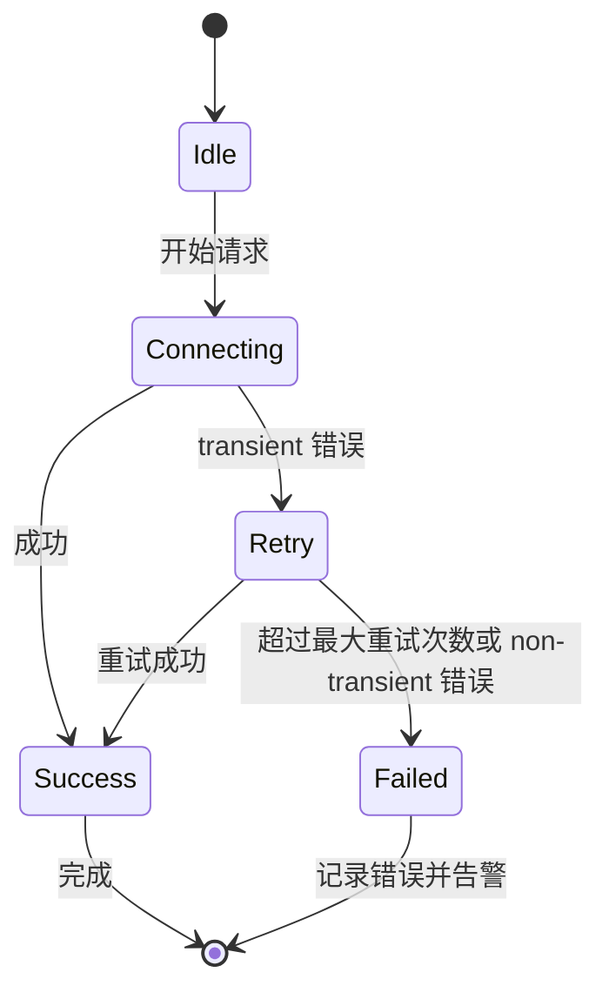
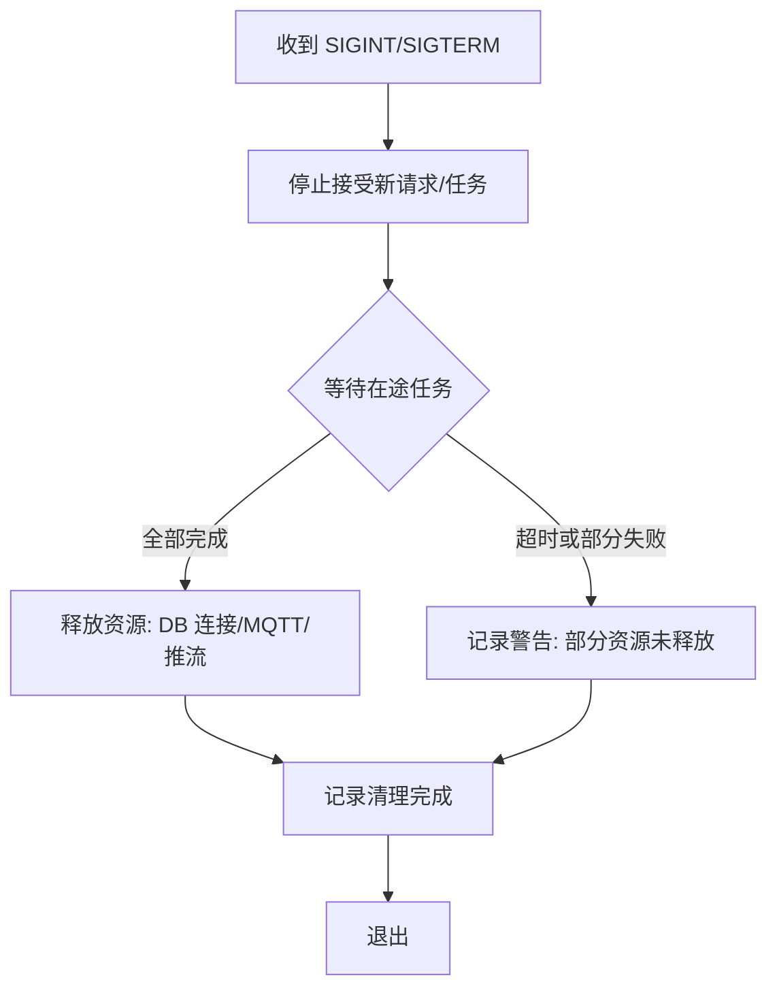

# 工程化与产品化路线图

## 1. Executive Summary

- **目标**：将项目从“开发阶段原型”提升到“可维护、可扩展、可观测的生产级系统”，强化稳定性与异常处理。
- **现状**：已有基础脚本、Docker 部署、部分重试/信号处理、日志与诊断工具，但缺乏统一的健康检查、标准化异常与重试策略、CI/CD、版本管理、全面测试覆盖。
- **收益**：降低故障率、加快问题定位、支持持续交付与灰度、提升可维护性。

---

## 2. 现状与不足

### 2.1 编译与部署

| 维度 | 现状 | 不足 |
|------|------|------|
| 编译系统 | 各模块有 CMakeLists.txt + Makefile/Taskfile，脚本多但分散 | 缺少根级统一构建文件；CI/CD 未配置 |
| 容器化 | Dockerfile 与 docker-compose 已覆盖 | 多个 compose 文件叠加（vehicle.dev、client-dev），缺少统一入口 |
| 启动顺序 | 依赖 `start-all-nodes.sh` 等脚本 | 缺少编排与依赖管理；健康检查不完整 |
| 版本管理 | 无统一版本号（无 VERSION.txt 或标签） | 回滚困难；变更追溯依赖 Git 日志 |

### 2.2 异常处理与稳定性

| 模块 | 已有机制 | 不足 |
|------|----------|------|
| carla-bridge（Python） | try/except、atexit 清理、CARLA 重连（最多 7 次）、MQTT 线程自动重连 | 异常打印但不区分错误类型；无统一重试库；首帧超时写死 8s |
| client（Qt） | MQTT 连接异常、网络错误信号、WebRTC 重试计数 | 缺少统一错误分类（网络/权限/资源）；崩溃信号仅为 SIGSEGV |
| backend（C++） | try/catch 覆盖数据库/网络调用；DB 错误打印 | 未将错误分类为 transient（重试）/non-transient；缺少熔断/限流 |
| Vehicle-side | MQTT 自动重连、看门狗 Tick | 看门狗未实现“安全停车”逻辑；信号处理仅 SIGINT |

### 2.3 可观测性

| 能力 | 现状 | 不足 |
|------|------|------|
| 日志 | 各模块 stdout/stderr；carla-bridge 有 tag；analyze.sh 收集 | 缺少统一日志格式（ISO8601 + 结构化字段）；未对接集中日志系统 |
| 交互记录 | NDJSON 记录（RECORD_INTERACTION）+ analyze_interaction_log.py | 未做结构化索引；缺少与日志的关联（session_id/vin） |
| 诊断 | auto_diagnose.py 基于关键词匹配；TROUBLESHOOTING_RUNBOOK.md | 缺少实时健康检查；未暴露 HTTP `/health`/`/ready` 端点 |

### 2.4 测试

| 类型 | 现状 | 不足 |
|------|------|------|
| 单元测试 | 几乎无（仅有 carla-bridge/tests/test_cameras.py） | 关键路径（JWT 校验、会话创建、控制协议解析）无覆盖 |
| 集成测试 | 大量 verify/test-* 脚本，覆盖 UI/链路/配置 | 未用测试框架；断言弱；缺少自动化回归 |
| 性能/压测 | 无 | 无时延/丢包/并发能力评估 |

---

## 3. 方案设计（工程化与产品化）

### 3.1 稳定性

#### 3.1.1 统一健康检查

每个模块必须提供 `/health` 与 `/ready` HTTP 端点（或定期输出的健康状态），响应示例：

```json
{ "status": "up", "dependencies": {"db":"ok","mqtt":"ok","zlm":"ok"}, "since":"2026-02-23T12:00:00Z", "version":"v1.0.1" }
```

- **/health**：仅检查进程存活与关键依赖可达（如 DB、MQTT）。
- **/ready**： additionally 检查应用就绪（如 Backend DB schema 已初始化；ZLM 流媒体服务已加载配置）。

#### 3.1.2 优雅退出与资源释放

- **统一信号处理**：SIGINT/SIGTERM → 停止接受新请求/任务 → 等待在途任务完成/超时 → 释放资源（关闭 DB 连接、MQTT 断连、停止推流）→ 退出。
- **清理确认**：记录“清理开始”与“清理结束”，带时间戳；若清理超时（如 10s）强制退出但打印告警。

#### 3.1.3 断链与重试策略

- **重试库**：封装指数退避（1s → 2s → 4s → 8s），最大重试次数（默认 5），区分 transient 与 non-transient 错误（网络/超时重试；权限/参数不重试）。
- **断链处理**：
  - MQTT：连接丢失 → 自动重连，限速重连（最少 2s 间隔），达到失败阈值时触发告警。
  - WebRTC：断开 → 记录原因（超时/出错/关闭），最多重试 N 次，超过则通知用户。
  - Backend DB：连接失败 → 快速失败（503）并记录；后台定期重连（不阻塞请求）。

#### 3.1.4 看门狗与安全停车

- **看门狗逻辑**：定期检查“控制心跳”与“推流心跳”；超时（可配置）后触发安全停车（紧急制动 → 停止推流 → 断开 MQTT）。
- **安全停车实现**（Vehicle-side）：优先使用车辆 CAN/串口紧急制动；其次在仿真中调用 CARLA 的紧急制动；最后记录事件到 DB。

### 3.2 维护性

#### 3.2.1 统一日志与错误码

- **日志格式**：见 LOGGING_BEST_PRACTICES.md（ISO8601 + 模块:Tag + key=value）。
- **错误码体系**：定义统一错误码（如 `E_MQTT_CONN_FAILED`、`E_ZLM_PUSH_TIMEOUT`），在日志中输出码与原因，便于告警规则匹配。

#### 3.2.2 配置管理与热加载

- **环境变量 + 配置文件**：优先环境变量，缺失则从配置文件读取；配置变更支持重载（如 Backend 读取 `/config/backend.json` 并监听 `SIGHUP`）。
- **热加载**：非关键配置（日志级别、阈值）可热加载；关键变更（如 Broker 地址）需重启但日志中说明原因。

#### 3.2.3 版本管理

- **VERSION.txt**：根目录维护统一版本号（语义化版本 v1.0.1）。
- **Git 标签**：每个 release 打标签（v1.0.1）。
- **镜像标签**：Docker 镜像打版本标签（如 `remote-driving-backend:v1.0.1`），方便回滚。

### 3.3 测试

#### 3.3.1 单元测试

- **框架**：C++ 用 Catch2；Python 用 pytest；Qt 用 QTest。
- **覆盖**：
  - JWT 校验与权限判定（backend）。
  - 控制协议解析与看门狗逻辑（Vehicle-side）。
  - MQTT 消息解析与状态更新（carla-bridge）。
  - 会话创建/锁定/解锁流程（backend）。
- **执行**：`make test` 或 `task test`，生成覆盖率报告。

#### 3.3.2 集成测试

- **框架**：Python pytest + docker compose 自动启动；或使用 Robot Framework。
- **场景**：
  - 登录 → 选车 → 创建会话 → 推流 → 拉流 → 发送控制 → 接收状态 → 结束会话。
  - 掉线重连（停止 MQTT/Bridge）→ 观察 client 重连与状态恢复。
  - 安全停车（停止心跳）→ 触发安全停车 → 记录到 DB。
- **执行**：`make e2e` 或现有 `scripts/e2e.sh`，但需加入断言与结果判断。

#### 3.3.3 压测与性能测试

- **工具**：k6/JMeter 或 wrk（HTTP）；模拟 MQTT 客户端（如 paho-mqtt 性能测试）。
- **场景**：
  - Backend API：100 QPS /vins、/sessions。
  - MQTT：100 并发客户端订阅/发布。
  - ZLM：20 路并发推流 + 50 路拉流。
- **指标**：时延 P99/P95、吞吐量、错误率、资源占用（CPU/内存/网络）。

### 3.4 可观测性

#### 3.4.1 指标暴露

- **格式**：Prometheus 文本格式（`/metrics` 端点）或 OpenMetrics。
- **指标示例**：
  - `mqtt_connection_total{module="carla-bridge",status="success|failed"}`。
  - `webbrtc_stream_rtt_ms{stream="cam_front",vin="xxx"}`。
  - `backend_sessions_active_total{vin="xxx"}`。
  - `watchdog_safe_stop_triggered_total{vin="xxx"}`。

#### 3.4.2 链路追踪

- **trace-id 传播**：请求入口生成 trace-id（UUID），通过 HTTP header/MQTT property 传播。
- **日志中带 trace-id**：便于跨模块追踪。

#### 3.4.3 告警规则

- **Prometheus Alertmanager**：定义告警（如 MQTT 连接失败 > 3 次/5分钟、WebRTC RTT > 1s）。
- **通知渠道**：Webhook/邮件/钉钉/企业微信（可扩展）。

### 3.5 部署与交付

#### 3.5.1 CI/CD

- **GitHub Actions**：lint → 单元测试 → 构建 → 集成测试 → 打镜像 → 打标签。
- **流程**：
  1. 推送到 main → 自动构建与测试 → 通过则发布 pre-release 标签。
  2. 推送标签（v1.0.1）→ 生成 Release Notes → 构建生产镜像。

#### 3.5.2 配置管理

- **环境**：dev/staging/prod 分离；使用不同的 docker-compose 文件或命名空间。
- **密钥管理**：使用 Vault/K8s Secrets 或 docker swarm secrets，禁止明文写入 .env。

#### 3.5.3 灰度与回滚

- **灰度**：部署新版本到部分实例（如先升级 Backend 1/2），观察 metrics。
- **回滚**：回滚到上一稳定版本（docker compose 改镜像 tag）或 rollback 脚本（自动切换版本标签）。

---

## 4. 实施计划

| 阶段 | 目标 | 交付物 |
|------|------|--------|
| **MVP（当前 – 2 周）** | 统一健康检查、日志格式、关键路径单测 | 各模块 `/health`/`/ready`；统一日志函数；JWT/控制协议单测 |
| **V1（1 个月）** | 异常处理标准化、重试库、观测性指标 | Retry 库；断链重试策略；Prometheus 指标暴露；集成测试框架与自动化 |
| **V2（2 个月）** | CI/CD、压测、告警 | GitHub Actions 工作流；压测场景；Alertmanager 规则；灰度脚本 |

---

## 5. 可视化图

### 5.1 重试与熔断状态机



### 5.2 优雅退出流程



---

## 6. 关键代码示例

### 6.1 统一健康检查（C++ 示例）

```cpp
// backend/src/health_handler.cpp
void register_health(httplib::Server& svr) {
    svr.Get("/health", [](const auto&, auto& res) {
        nlohmann::json j = {
            {"status", "up"},
            {"dependencies", {
                {"db", check_db() ? "ok" : "error"},
                {"mqtt", check_mqtt() ? "ok" : "error"}
            }},
            {"version", get_version()},
            {"since", startup_time}
        };
        res.set_content(j.dump(), "application/json");
    });
    svr.Get("/ready", [](const auto&, auto& res) {
        bool ready = check_schema_ready() && check_zlm_ready();
        res.status = ready ? 200 : 503;
        res.set_content(ready ? "ready" : "not ready", "text/plain");
    });
}
```

### 6.2 重试库（Python 示例）

```python
# common/retry.py
import time
import random
from typing import Callable, Type, Tuple

def retry(
    fn: Callable,
    max_attempts: int = 5,
    backoff_base: float = 1.0,
    retry_exceptions: Tuple[Type[Exception], ...] = (Exception,),
    on_retry: Callable[[int, Exception], None] = None,
):
    for attempt in range(1, max_attempts + 1):
        try:
            return fn()
        except retry_exceptions as e:
            if attempt == max_attempts:
                raise
            sleep_time = backoff_base * (2 ** (attempt - 1)) + random.random() * 0.5
            if on_retry:
                on_retry(attempt, e)
            time.sleep(sleep_time)
```

使用：

```python
def connect_mqtt():
    # MQTT 连接逻辑
    ...

retry(connect_mqtt, max_attempts=5, backoff_base=2.0, retry_exceptions=(ConnectionError,))
```

### 6.3 断链处理与告警（C++ 示例）

```cpp
void MqttHandler::on_connection_lost(const std::string& cause) {
    log_error("MQTT 连接丢失: %s", cause);
    increment_metric("mqtt_connection_lost_total");

    if (++m_loss_count >= 3) {
        log_error("MQTT 连接丢失次数过多，触发告警");
        // 发送告警（HTTP webhook / Prometheus 指标）
    }

    // 指数退避重连
    int delay = std::min(1 << m_loss_count, 60);  // max 60s
    std::this_thread::sleep_for(std::chrono::seconds(delay));
    reconnect();
}
```

### 6.4 看门狗与安全停车（伪代码）

```cpp
void VehicleController::watchdogTick(int timeoutMs) {
    auto now = std::chrono::steady_clock::now();
    if (now - m_last_control_time > std::chrono::milliseconds(timeoutMs)) {
        log_error("看门狗超时，触发安全停车 vin=%s", m_vin);
        increment_metric("watchdog_safe_stop_triggered_total", {{"vin", m_vin}});
        // 1. 紧急制动（CAN/串口）
        emergency_brake();
        // 2. 停止推流
        stop_streaming();
        // 3. 断开 MQTT
        mqtt_disconnect();
        // 4. 记录到 DB（若可用）
        log_safe_stop_event();
        m_safe_stop_triggered = true;
    }
}
```

---

## 7. 编译/部署/运行/验证说明

### 7.1 编译与测试

```bash
# 统一构建
make build-all      # 编译所有模块
make test           # 运行单元测试
make e2e           # 运行集成测试
make build-and-test # 构建 + 测试（CI 用）
```

### 7.2 部署

```bash
# 启动（带健康检查）
docker compose up -d

# 等待就绪
./scripts/wait-for-health.sh   # 等待 backend/vehicle/mosquitto/zlm /health
```

### 7.3 验证

```bash
# 检查健康端点
curl http://localhost:8080/health
curl http://localhost:1883/health   # 若 mosquitto 有 HTTP 健康端点

# 检查指标
curl http://localhost:8080/metrics | grep mqtt_connection_total
```

### 7.4 告警与日志

- 查看日志：`docker compose logs -f backend`。
- 查看诊断：`./scripts/analyze.sh`。
- 查看交互记录：`./scripts/analyze_interaction_log.py --dir ./recordings`。

---

## 8. 风险与回滚

| 风险 | 缓解措施 |
|------|----------|
| 引入统一健康检查后部署流程变长 | 健康检查快速返回（超时 < 2s）；`/health` 不依赖 DB/外部服务 |
| 重试库导致流量雪崩 | 限制最大重试次数；增加抖动（random）；熔断非关键路径 |
| 增加指标/追踪导致性能下降 | 采样频率控制（如每 10s 一次）；使用轻量库 |
| CI/CD 配置导致流水线失败 | 分阶段（先本地测试）；使用缓存；允许手动审批触发 |

**回滚**：
- Docker 层面：`docker compose down && docker compose up -d --force-recreate`，指定旧镜像标签。
- 代码层面：Git revert/tag 切换。

---

## 9. 后续演进

- **统一错误码与服务规范**：定义 API 错误码枚举，并在文档中维护。
- **自动化运维平台对接**：对接 Grafana/Prometheus 面板、日志聚合（ELK/Loki）。
- **故障演练（Chaos Engineering）**：模拟断网、Pod 杀死等，验证自愈能力。
- **跨机房/多云部署**：基于 K8s 做跨区域部署，基于 DNS 做就近路由。
