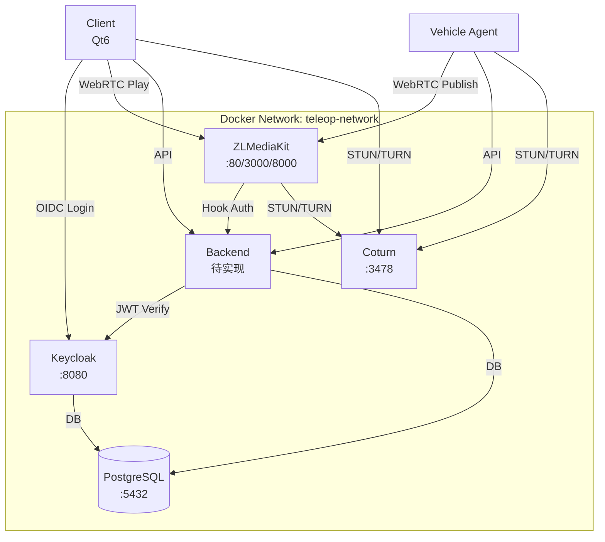

# M0 阶段部署文档

## Executive Summary

**目标**: 搭建远程驾驶系统的基础设施环境，包括身份认证、数据库、流媒体服务器和 NAT 穿透服务。

**交付物**:
- ✅ Docker Compose 编排配置
- ✅ Keycloak Realm 配置（含角色定义）
- ✅ PostgreSQL 初始化脚本
- ✅ ZLMediaKit WebRTC 配置
- ✅ Coturn STUN/TURN 配置
- ✅ 一键部署脚本

**收益**: 
- 快速搭建开发/测试环境
- 统一的服务配置管理
- 为后续 M1/M2 阶段奠定基础

**风险**: 
- 默认密码需在生产环境修改
- 公网部署需配置防火墙和 TLS

---

## 1. 背景与目标

### 1.1 M0 阶段要求

根据 `project_spec.md` §11，M0（脚手架）阶段需要：
- docker-compose：Keycloak + Postgres + ZLM + 后端 + coturn（可选）
- Keycloak realm 导入脚本与默认角色
- 基础库表迁移

### 1.2 目录结构

```
/
├── backend/          # C++（待实现）
├── Vehicle-side/     # C++，车端代理
├── client/           # Qt C++，客户端
├── media/            # ZLMediaKit 配置与 Dockerfile
├── deploy/           # docker-compose, k8s helm ✅
└── docs/             # 接口文档, 架构图 ✅
```

---

## 2. 架构设计

### 2.1 服务组件



### 2.2 端口分配

| 服务 | 端口 | 协议 | 说明 |
|------|------|------|------|
| PostgreSQL | 5432 | TCP | 数据库 |
| Keycloak | 8080 | HTTP | 身份认证 |
| ZLMediaKit HTTP | 80 | HTTP | Web 服务 |
| ZLMediaKit HTTPS | 443 | HTTPS | Web 服务（TLS） |
| ZLMediaKit RTMP | 1935 | TCP | RTMP 推拉流 |
| ZLMediaKit RTSP | 554 | TCP | RTSP 推拉流 |
| ZLMediaKit WebRTC Signaling | 3000 | HTTP | WebRTC 信令 |
| ZLMediaKit WebRTC Signaling SSL | 3001 | HTTPS | WebRTC 信令（TLS） |
| ZLMediaKit WebRTC RTC | 8000 | UDP/TCP | WebRTC 媒体传输 |
| Coturn STUN/TURN | 3478 | UDP/TCP | NAT 穿透 |
| Coturn Relay | 49152-65535 | UDP | TURN 中继端口 |

---

## 3. Keycloak Realm 配置

### 3.1 角色定义

| 角色 | 权限 | 说明 |
|------|------|------|
| `admin` | 全部 | 管理用户、车辆、策略、审计、录制 |
| `owner` | VIN 绑定/授权 | 账号拥有者，管理自己账号下 VIN 的绑定、授权 |
| `operator` | VIN 控制 | 可申请控制指定 VIN（需被授权） |
| `observer` | VIN 查看 | 仅拉流查看指定 VIN（需被授权） |
| `maintenance` | 故障诊断 | 查看故障/诊断，可进行受限操作 |

### 3.2 客户端配置

1. **teleop-backend**
   - 类型: Confidential
   - 用途: 后端服务认证
   - 认证方式: Client Secret

2. **teleop-client**
   - 类型: Public
   - 用途: 客户端应用（Qt/QML）
   - 认证方式: OIDC Authorization Code + PKCE

### 3.3 Realm 导入

```bash
# 方式1: 使用脚本（推荐）
cd deploy/keycloak
./import-realm.sh

# 方式2: 手动导入
# 访问 http://localhost:8080/admin
# Realm -> Import -> 选择 realm-export.json
```

---

## 4. ZLMediaKit WebRTC 配置

### 4.1 关键配置项

```ini
[rtc]
signalingPort=3000          # WebRTC 信令端口
port=8000                    # WebRTC RTC 端口
enableTurn=0                # 使用外部 Coturn
iceTransportPolicy=0         # 不限制传输策略
preferredCodecA=opus,...     # 优先 opus（低延迟）
preferredCodecV=H264,...     # 优先 H264（硬件编码）
datachannel_echo=0          # 关闭回显（控制通道）

[hook]
enable=1                     # 启用 Hook 鉴权
on_play=http://backend:8080/api/v1/hooks/on_play
on_publish=http://backend:8080/api/v1/hooks/on_publish
```

### 4.2 低延迟优化

- `mergeWriteMS=0`: 关闭合并写
- `paced_sender_ms=0`: 关闭平滑发送
- `nackMaxMS=2000`: 减小 NACK 保留时间
- `bfilter=1`: 过滤 B 帧

---

## 5. Coturn 配置

### 5.1 关键配置项

```conf
listening-port=3478
min-port=49152
max-port=65535
realm=teleop.local
lt-cred-mech
use-auth-secret
```

### 5.2 环境变量

- `TURN_USERNAME`: TURN 用户名
- `TURN_PASSWORD`: TURN 密码
- `COTURN_EXTERNAL_IP`: 公网 IP（NAT 环境必需）

---

## 6. 部署步骤

### 6.1 前置要求

- Docker >= 20.10
- Docker Compose >= 2.0（或 docker-compose >= 1.29）
- 至少 4GB 可用内存
- 端口 80, 443, 3000, 3478, 5432, 8080, 8000, 49152-65535 未被占用

### 6.2 一键部署

```bash
# 1. 准备环境变量
cd deploy
cp .env.example .env
# 编辑 .env，修改密码

# 2. 启动服务
docker-compose up -d

# 3. 导入 Keycloak Realm
cd keycloak
./import-realm.sh

# 或使用脚本
cd scripts
./setup.sh
```

### 6.3 验证服务

```bash
# PostgreSQL
docker-compose exec postgres psql -U teleop_user -d teleop_db -c "SELECT version();"

# Keycloak
curl http://localhost:8080/health/ready

# ZLMediaKit
curl http://localhost/index/api/getServerConfig

# Coturn
docker-compose exec coturn turnserver -c /etc/turnserver.conf --listening-port 3478
```

---

## 7. 配置说明

### 7.1 环境变量（.env）

| 变量 | 说明 | 默认值 |
|------|------|--------|
| `POSTGRES_PASSWORD` | PostgreSQL 密码 | `teleop_password_change_in_prod` |
| `KEYCLOAK_ADMIN` | Keycloak 管理员用户名 | `admin` |
| `KEYCLOAK_ADMIN_PASSWORD` | Keycloak 管理员密码 | `admin` |
| `KEYCLOAK_DB_PASSWORD` | Keycloak 数据库密码 | `keycloak_password_change_in_prod` |
| `COTURN_USERNAME` | Coturn 用户名 | `teleop` |
| `COTURN_PASSWORD` | Coturn 密码 | `teleop_turn_password_change_in_prod` |
| `COTURN_EXTERNAL_IP` | Coturn 公网 IP | （空，需配置） |

### 7.2 数据持久化

所有数据存储在 Docker 卷中：
- `postgres_data`: PostgreSQL 数据
- `keycloak_data`: Keycloak 数据
- `zlm_recordings`: ZLMediaKit 录制文件
- `zlm_snapshots`: ZLMediaKit 截图
- `client_build`: 客户端构建缓存

---

## 8. 故障排查

### 8.1 Keycloak 无法启动

**现象**: Keycloak 容器反复重启

**排查**:
```bash
docker-compose logs keycloak
```

**可能原因**:
- PostgreSQL 未就绪（等待健康检查）
- 数据库连接失败（检查密码）

**解决**:
```bash
# 检查 PostgreSQL
docker-compose ps postgres
docker-compose logs postgres

# 重启 Keycloak
docker-compose restart keycloak
```

### 8.2 ZLMediaKit WebRTC 连接失败

**现象**: WebRTC 推拉流失败

**排查**:
```bash
# 检查 ZLMediaKit 日志
docker-compose logs zlmediakit

# 检查 Coturn
docker-compose logs coturn
```

**可能原因**:
- Coturn 未启动
- 端口映射错误
- 防火墙阻止

**解决**:
```bash
# 重启 Coturn
docker-compose restart coturn

# 检查端口
netstat -tulpn | grep -E '3478|8000'
```

### 8.3 Coturn 无法穿透 NAT

**现象**: WebRTC 连接失败，日志显示 "relay" 失败

**解决**:
1. 配置 `COTURN_EXTERNAL_IP` 环境变量
2. 确保端口 3478 和 49152-65535 已开放
3. 检查防火墙规则

---

## 9. 生产环境部署

### 9.1 安全加固

1. **修改所有默认密码**
   ```bash
   # 编辑 .env
   POSTGRES_PASSWORD=<strong_password>
   KEYCLOAK_ADMIN_PASSWORD=<strong_password>
   COTURN_PASSWORD=<strong_password>
   ```

2. **启用 TLS/HTTPS**
   - 配置 SSL 证书
   - 修改 Keycloak 和 ZLMediaKit HTTPS 端口
   - 强制 HTTPS 重定向

3. **网络隔离**
   - 使用 Docker 网络隔离
   - 配置防火墙规则
   - 限制访问 IP 范围

### 9.2 性能优化

1. **资源限制**
   ```yaml
   services:
     zlmediakit:
       deploy:
         resources:
           limits:
             cpus: '4'
             memory: 8G
   ```

2. **数据库优化**
   - 配置 PostgreSQL 连接池
   - 启用查询缓存
   - 定期 VACUUM

3. **监控告警**
   - Prometheus + Grafana
   - 健康检查
   - 日志聚合（ELK/Loki）

---

## 10. 后续演进

### M1 阶段
- [ ] 后端服务集成到 docker-compose
- [ ] 数据库迁移脚本（创建表结构）
- [ ] Hook 接口实现（ZLMediaKit 鉴权）
- [ ] 端到端测试

### M2 阶段
- [ ] Kubernetes Helm Chart
- [ ] 高可用部署（主备/集群）
- [ ] 监控告警体系
- [ ] 自动化 CI/CD

---

## 11. 参考文档

- [Keycloak Documentation](https://www.keycloak.org/documentation)
- [ZLMediaKit Documentation](https://github.com/ZLMediaKit/ZLMediaKit)
- [Coturn Documentation](https://github.com/coturn/coturn)
- [Docker Compose Documentation](https://docs.docker.com/compose/)

---

## 12. 变更记录

| 日期 | 版本 | 变更内容 |
|------|------|----------|
| 2026-02-04 | 1.0 | M0 阶段初始版本 |
