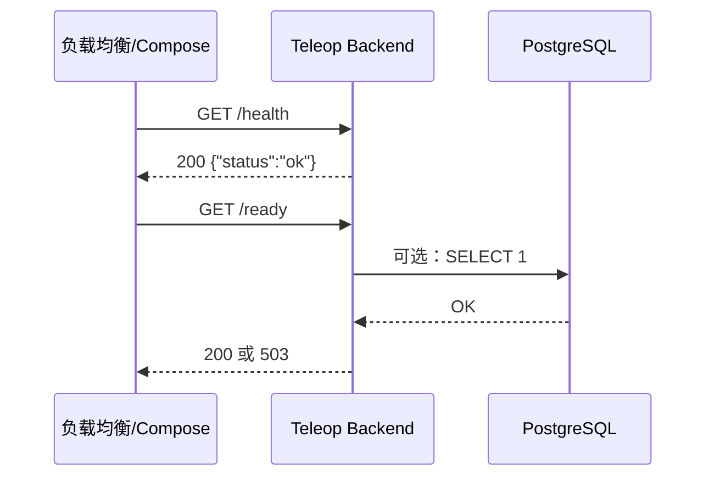

# M1 GATE A 变更提案：后端健康检查与可观测入口

**状态**: ✅ 已实施（GATE B 见 [M1_GATE_B_VERIFICATION_FIRST.md](./M1_GATE_B_VERIFICATION_FIRST.md)）  
**日期**: 2026-02-06

---

## 0. Executive Summary

- **目标**：为 Teleop Backend 提供 HTTP `/health` 健康检查接口，使 `docker compose up -d` 中的 backend 服务能通过现有 healthcheck；并增加可选的 `/ready` 就绪探针与最小依赖（仅 HTTP + 可选 DB 连通性）。
- **收益**：M0 e2e 可扩展为包含 backend 健康检查；运维与 K8s 探针可直接使用。
- **代价**：少量 C++ 代码与 CMake/依赖（如 httplib），无会话/VIN 逻辑，风险可控。
- **非目标**：本提案不实现 JWT 校验、会话管理、VIN API、Hook；仅实现“可启动、可探测”的后端入口。

---

## 1. 目标与非目标

| 目标 | 非目标 |
|------|--------|
| 实现 `GET /health` 返回 200 + 简单 JSON（如 `{"status":"ok"}`） | JWT 验证、Keycloak 集成 |
| 可选：`GET /ready` 检查 DB 连通性（可先返回 200） | 会话锁、VIN 权限、REST API 业务 |
| backend 容器通过 `curl -f http://localhost:8080/health` | ZLM Hook、录制、故障码 |
| 保持与 project_spec §3、§5.1 一致（控制面鉴权后续再做） | 客户端/车端改动 |

---

## 2. 需求检查清单（对照 project_spec）

- [x] **§3.2 远程驾驶业务后端**：后端存在且可健康探测。
- [x] **§6 可观测性**：健康端点支持 Prometheus/负载均衡探测。
- [ ] **§5.1 登录/鉴权**：本阶段不实现，由后续 GATE A 覆盖。
- [ ] **§4.2 VIN 授权**：本阶段不实现。

**假设**：当前 backend Dockerfile 与 CMake 可构建出可执行文件；若当前无 HTTP 框架，引入单一轻量库（如 cpp-httplib）仅用于 health/ready。

**待确认**：backend 当前是否已有 HTTP 服务骨架？若无，是否同意引入 cpp-httplib（header-only）？使用HTTP是最佳的方案么？需要考虑一下，给出建议

---

## 3. 架构与扩展性

- **接口**：仅两个端点，版本化通过 URL 前缀预留（如 `/api/v1/` 后续用于业务，`/health`、`/ready` 不纳入版本前缀）。
- **扩展点**：后续 JWT 中间件可对所有 `/api/v1/*` 生效，`/health`、`/ready` 保持免鉴权。
- **安全**：健康接口不返回敏感信息；deny-by-default 与 VIN 权限不在此步涉及。

---

## 4. 可视化（Mermaid）



---

## 5. 测试计划（Test-First）

| 类型 | 内容 | 定义完成 |
|------|------|----------|
| 单元 | 无（纯 HTTP 路由，可后续为 handler 加单测） | 可选 |
| 集成 | 进程内：启动 backend，`curl http://localhost:PORT/health` 得 200 与 JSON | 是 |
| e2e | 若 backend 在 compose 中启动：`scripts/check.sh` 或 e2e 中增加“Backend 健康”检查项 | 是 |

**Definition of Done**：`GET /health` 返回 200 且 body 含 `"status"`；`docker compose up -d backend` 后 healthcheck 通过；`./scripts/check.sh` 通过（若已包含 backend 检查）。

---

## 6. 运行命令列表

```bash
# 构建 backend（在 backend 目录或通过根 Makefile）
cd /home/wqs/bigdata/Remote-Driving && make build-backend
# 或
cd backend && mkdir -p build && cd build && cmake .. && make

# 本地运行（需 DATABASE_URL 等环境变量时从 .env 或 compose 取）
./backend/build/teleop_backend   # 或实际可执行文件名

# 健康检查
curl -s http://localhost:8080/health

# 验证（必须通过）
./scripts/check.sh
# 若 e2e 已扩展
./scripts/e2e.sh
```

---

## 7. 变更清单（预估）

| 路径 | 变更类型 | 说明 |
|------|----------|------|
| `backend/CMakeLists.txt` | 修改 | 增加 httplib 或现有 HTTP 依赖、health 编译目标 |
| `backend/src/main.cpp` 或新文件 | 新增/修改 | HTTP 服务入口、GET /health（及可选 /ready） |
| `backend/migrations/` | 无 | 不涉及 |
| `scripts/check.sh` 或 `scripts/e2e.sh` | 可选修改 | 增加“Backend 健康”检查（若 backend 已纳入 compose） |

---

## 8. 风险与回滚

- **风险**：引入新依赖导致构建失败。  
  **缓解**：使用 header-only 或已有 vcpkg/系统包；若不同意新依赖，可改为“仅返回固定 body 的裸 socket 或最小第三方库”。
- **回滚**：回退 backend 相关提交，compose 中临时去掉 backend 或改用 `disable_healthcheck`。

---

**请确认**：若同意按本提案实施，请回复 **CONFIRM**、**APPROVE** 或 **GO AHEAD**。若有“仅 health 不引入 httplib”等约束，请一并说明。
