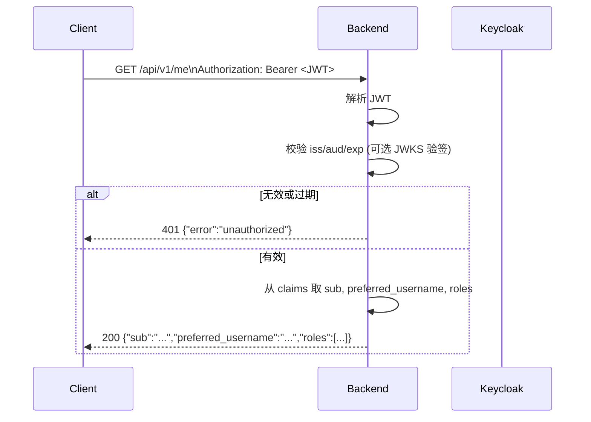

# M1 GATE A 变更提案（第二批）：JWT 校验与 GET /api/v1/me

**状态**: ✅ 已实施（GATE B 见 [M1_GATE_B_VERIFICATION_SECOND.md](./M1_GATE_B_VERIFICATION_SECOND.md)）  
**日期**: 2026-02-06

---

## 0. Executive Summary

- **目标**：在后端增加 Keycloak JWT 校验（iss/aud/exp，可选 JWKS），并实现 **GET /api/v1/me**：需 `Authorization: Bearer <access_token>`，返回当前用户信息（sub、preferred_username、realm 角色等），供客户端展示“当前登录用户”。
- **收益**：满足 project_spec §5.1“校验 JWT”与“获取当前用户”的起点；为后续 VIN 列表、会话等 API 统一鉴权打基础。
- **代价**：引入 JWT 解析库（如 jwt-cpp 或 nlohmann_json + 自研 base64/签名校验）；需配置 KEYCLOAK_URL、KEYCLOAK_REALM 等；/api/v1/* 未带有效 JWT 返回 401。
- **非目标**：本批不实现 DB 用户表、VIN 授权、会话、Hook；仅“校验 JWT + 从 token 读 claims 返回 /me”。

---

## 1. 目标与非目标

| 目标 | 非目标 |
|------|--------|
| 校验 Keycloak 颁发的 JWT（iss/aud/exp，可选 JWKS 验签） | 用户注册、自注册、DB 用户表同步 |
| **GET /api/v1/me**：需 Bearer token，返回 JSON（sub, preferred_username, realm_access.roles） | GET /api/v1/vins、会话、故障等 API |
| /health、/ready 保持免鉴权 | ZLM Hook、VIN 权限 DB 查询、会话锁 |
| 配置 KEYCLOAK_URL、KEYCLOAK_REALM、KEYCLOAK_CLIENT_ID（aud） | 前端登录流程改动（仍由 Keycloak OIDC） |

---

## 2. 需求检查清单（对照 project_spec）

- [x] **§5.1 Teleop Backend**：校验 JWT（JWKS、iss/aud/exp/nbf）。
- [x] **§5.1**：结合 DB 做 VIN 授权判定 → 本批不做，仅 JWT 校验 + /me。
- [x] **§4.1 角色**：从 JWT realm 角色可读（admin/owner/operator/observer/maintenance），/me 可返回角色列表。
- [ ] **§4.2 VIN 绑定与授权**：本批不实现，后续 API 再接入 DB。

**假设**：Keycloak Realm `teleop` 已配置，client `teleop-backend` 存在；access_token 为 JWT，含 `iss`、`aud`、`exp`、`sub`、`preferred_username`、`realm_access.roles`（或等效 claims）。  
**待确认**：验签方式优先“本地 JWKS 缓存”（从 Keycloak `/.well-known/openid-configuration` → jwks_uri 拉取），若网络受限可先仅做 iss/aud/exp 校验（不验签）并在文档中标注为“开发/测试模式”。

---

## 3. 架构与扩展性

- **路由**：`/api/v1/me` 归属同一前缀，后续 `/api/v1/vins`、`/api/v1/sessions` 等复用同一 JWT 中间件。
- **鉴权**：请求带 `Authorization: Bearer <token>` → 解析 JWT → 校验 iss/aud/exp（及可选签名）→ 将 claims 注入请求上下文；缺失或无效 → 401 JSON `{"error":"unauthorized"}`。
- **扩展**：后续在“请求上下文”中增加 DB user_id、VIN 权限列表，供各 API 使用；deny-by-default 在本批仅体现为“无 token 或无效 token 即 401”。

---

## 4. 可视化（Mermaid）



---

## 5. 测试计划（Test-First）

| 类型 | 内容 | 定义完成 |
|------|------|----------|
| 单元 | JWT 解析与过期/错误 token 返回 401 | 可选；若用第三方库可先集成再补 |
| 集成 | 无 token → GET /api/v1/me → 401；有效 Keycloak token → 200 且 body 含 sub/roles | 是 |
| e2e | 获取 Keycloak access_token 后 curl GET /api/v1/me，校验 200 与 JSON 结构 | 是 |

**Definition of Done**：GET /api/v1/me 无 token 或非法 token 返回 401；有效 Bearer token 返回 200 且 JSON 含 `sub`、`preferred_username`（或等效）、`roles`（realm 角色）；/health、/ready 仍无需 token；`docker compose build backend` 通过（镜像仍为 1ms.run 基础镜像）。

---

## 6. 运行命令列表

```bash
# 构建（Docker 内，项目根目录）
docker compose build backend

# 启动依赖（若未启动）
docker compose up -d postgres keycloak
# 等待 Keycloak 健康后
docker compose up -d backend

# 获取 Keycloak token（teleop realm，用于测试）
TOKEN=$(curl -s -X POST "http://localhost:8080/realms/teleop/protocol/openid-connect/token" \
  -H "Content-Type: application/x-www-form-urlencoded" \
  -d "username=<user>" -d "password=<pass>" \
  -d "grant_type=password" -d "client_id=teleop-client" \
  -d "client_secret=<client_secret>" | jq -r .access_token)

# 调用 /me
curl -s -H "Authorization: Bearer $TOKEN" http://localhost:8081/api/v1/me

# 验证（必须通过）
./scripts/check.sh
```

---

## 7. 变更清单（预估）

| 路径 | 变更类型 | 说明 |
|------|----------|------|
| `backend/CMakeLists.txt` | 修改 | 增加 jwt-cpp 或 nlohmann_json + OpenSSL（JWT 解码/验签） |
| `backend/src/main.cpp` | 修改 | 注册 GET /api/v1/me；从 Header 取 Bearer；调用 JWT 校验；返回 JSON |
| `backend/src/auth/jwt_validator.h` | 新增 | JWT 校验接口（校验 + 解析 claims） |
| `backend/src/auth/jwt_validator.cpp` | 新增 | 实现（iss/aud/exp，可选 JWKS） |
| `backend/Dockerfile` | 修改 | 若需 OpenSSL/nlohmann 等，增加对应安装 |
| `scripts/check.sh` 或 e2e | 可选 | 增加“/api/v1/me 无 token 返回 401”的检查 |

---

## 8. 风险与回滚

- **风险**：JWKS 拉取失败或 Keycloak URL 配置错误导致所有需鉴权 API 不可用。  
  **缓解**：启动时拉取 JWKS 或首次请求时懒加载；失败时打日志并返回 503 或 401，不崩溃。
- **回滚**：回退 backend 相关提交；compose 使用上一版 backend 镜像。

---

**请确认**：若同意按本提案实施，请回复 **CONFIRM**、**APPROVE** 或 **GO AHEAD**。若希望先做“仅 iss/aud/exp 不验签”的简化版，请说明。
