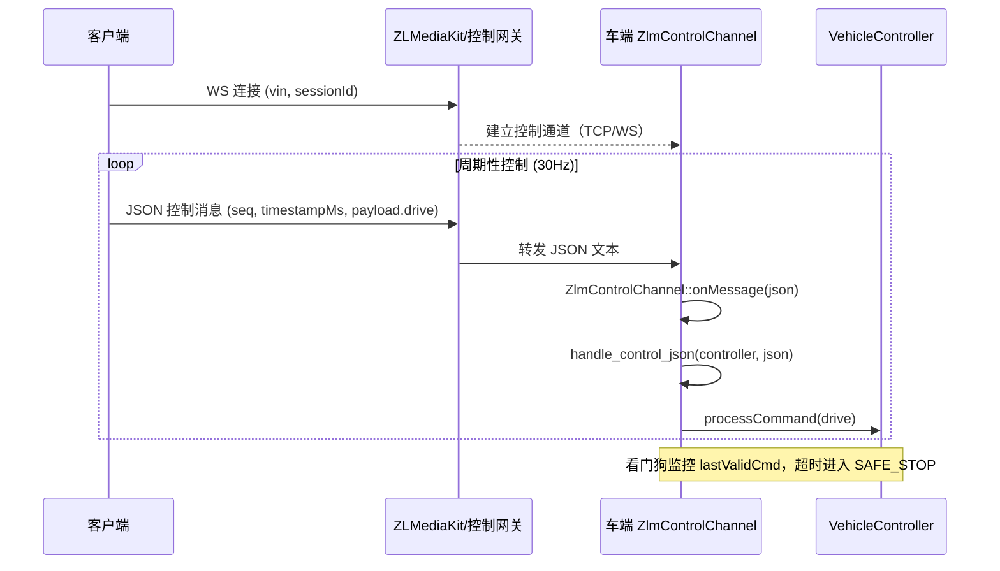

## 0) Executive Summary（经 ZLMediaKit 控制通道）

本 Gate 定义并约束一条统一的 **“客户端 → 流媒体（ZLMediaKit/控制网关） → 车端” 控制链路**，复用当前已经在车端落地的控制 JSON 协议与安全逻辑，作为未来 WebRTC DataChannel 控制的标准形态。  
在本 Gate 结束后：

- 客户端、后端、车端对控制报文格式、字段含义与安全约束有统一认知。
- 车端具备一个与传输层无关的 `handle_control_json()` 入口，以及对应的 `ZlmControlChannel` 占位类，可被 DataChannel / WebSocket 等通道复用。

---

## 1) 控制链路目标与范围

- **范围内（本 Gate）**
  - 规范控制 JSON 协议（字段、语义、版本）。
  - 车端：抽象统一控制入口 + 看门狗/SAFE_STOP 与该协议对齐。
  - 车端：提供 `ZlmControlChannel` 占位类，接收来自“经 ZLM 的控制 JSON”并调 `handle_control_json()`。
- **范围外（由后续 Gate 或其他组件实现）**
  - ZLMediaKit 内部 DataChannel 创建与消息转发。
  - ZLMediaKit WebSocket 端点或单独控制网关的实现。
  - 后端基于 session/vin 的签名、防重放和限速（对应 `project_spec.md` §8）。

---

## 2) 控制 JSON 协议（统一格式）

所有控制通道（MQTT / WebSocket / DataChannel）都应发送如下 JSON（`schemaVersion = 1`）：

```json
{
  "schemaVersion": 1,
  "vin": "VIN-XXXXXXX",
  "sessionId": "SESSION-UUID",
  "seq": 123,
  "timestampMs": 1738900000000,
  "payload": {
    "drive": {
      "steering": 0.2,
      "throttle": 0.4,
      "brake": 0.0,
      "gear": 1
    }
  }
}
```

- **字段说明**
  - `schemaVersion`：协议版本，当前固定为 `1`。
  - `vin`：车辆 VIN，必须与会话、流名及后端授权一致。
  - `sessionId`：后端 `/api/v1/vins/{vin}/sessions` 返回的会话 ID。
  - `seq`：`uint32` 单调递增，后续用于防重放（车端/后端都可检查）。
  - `timestampMs`：客户端发送时间（ms），用于时间窗与延迟统计。
  - `payload.drive`：单次控制命令（方向、油门、刹车、档位）。

> 车端当前实现：解析上述字段并输出日志，核心控制逻辑使用 `payload.drive`，`seq`/`timestampMs` 先用于观测，后续 Gate 再接入严谨的防重放策略。

---

## 3) 角色与责任边界

- **客户端（Cockpit）**
  - 按上述协议构造 JSON，并通过控制通道（MQTT / WS / DataChannel）发送。
  - 确保使用当前有效的 `sessionId` 和 `vin`，并维护本地 `seq` 单调递增。

- **ZLMediaKit / 控制网关**
  - 负责将来自客户端的控制 JSON 透明地转发给车端（文本消息，不改内容）。
  - 执行基础鉴权与路由，例如按 `vin`/`sessionId` 选择目标车端连接。

- **车端（Vehicle-side）**
  - 只认 **统一控制 JSON**，不关心底层通道类型。
  - 在 `handle_control_json()` 中解析 JSON，构造控制指令并交给 `VehicleController`。
  - 利用 `VehicleController` 内部的看门狗/SAFE_STOP 机制，保障断链/超时时车辆进入安全状态。

---

## 4) 车端接口设计

### 4.1 统一控制入口

- 签名（C++）：

```cpp
bool handle_control_json(VehicleController* controller,
                         const std::string& jsonPayload);
```

- 行为：
  - 解析上述控制 JSON 协议。
  - 打印解析结果（`schemaVersion/seq/timestampMs/vin/sessionId` + 控制值）。
  - 对控制值做范围限定并调用 `VehicleController::processCommand()`。
  - 返回 `true/false` 表示解析与处理是否成功（便于上层计数与日志）。

### 4.2 ZLMediaKit 控制通道占位类

- 签名（C++）：

```cpp
class ZlmControlChannel {
public:
    explicit ZlmControlChannel(VehicleController* controller);
    ~ZlmControlChannel();

    bool start();   // 未来：连接 ZLM 控制端点（WS/DataChannel）
    void stop();

    void onMessage(const std::string& json);  // 收到控制 JSON 时调用

private:
    VehicleController* m_controller;
};
```

- 当前 Gate 中：
  - `start()/stop()` 可以仅打印日志，占位不做真实连接。
  - `onMessage()` 会直接调用 `handle_control_json()`，使逻辑与 MQTT 保持一致。

---

## 5) 典型时序（WebSocket 方案示意）



---

## 6) 签名字段与错误上报规范（后端“大脑”）

### 6.1 签名字段（推荐）

在控制 JSON 外层新增字段（由客户端/控制网关生成）：

```json
{
  "schemaVersion": 1,
  "vin": "VIN-XXXX",
  "sessionId": "SESSION-UUID",
  "seq": 123,
  "timestampMs": 1738900000000,
  "payload": { "drive": { /* ... */ } },
  "signature": "base64url(HMAC-SHA256(control_secret, vin|sessionId|seq|timestampMs|payloadJson))"
}
```

- `control_secret`：由后端在创建 session 时生成并保存在 `sessions.control_secret` 中，仅通过内部接口 `/internal/sessions/{sessionId}/control` 向控制网关/车端下发。
- `payloadJson`：`payload` 字段的稳定序列化结果（建议使用无空格、固定 key 顺序的 JSON 编码）。

### 6.2 内部控制参数查询 API

- 路径：`GET /internal/sessions/{sessionId}/control`
- 访问控制：
  - 环境变量：`INTERNAL_CONTROL_API_TOKEN`（可选）。
  - 若设置，则调用方必须携带头：`X-Internal-Token: $INTERNAL_CONTROL_API_TOKEN`。
- 响应示例：

```json
{
  "sessionId": "SESSION-UUID",
  "vin": "VIN-XXXX",
  "controllerUserId": "USER-UUID",
  "control": {
    "algo": "HMAC-SHA256",
    "secretB64": "base64(control_secret)",
    "seqStart": 1,
    "tsWindowMs": 2000
  }
}
```

### 6.3 错误上报建议（签名/重放相关）

当控制网关或车端发现以下情况时，应：

- **签名错误**（signature 校验失败）：  
  - 丢弃该控制消息，不执行车辆动作。  
  - 调用后端内部/公开 API 记录 `fault_events`：例如 `code="SEC-7001"`, `domain="SECURITY"`, `severity="ERROR"`，`payload` 中附带 `reason="BAD_SIGNATURE"`。

- **seq 回退或重复**：  
  - 丢弃该控制消息。  
  - 计数并在达到阈值时上报 `SEC-7002`。

- **timestampMs 超出时间窗**：  
  - 视为陈旧/重放消息，丢弃，并可附带 `reason="TS_OUT_OF_WINDOW"`。

> 这些错误上报可以是后续 Gate 的实现目标，本 Gate 以协议与接口约定为主。

---

## 7) 验证建议（后续 Gate 的自动化用例）

在经 ZLMediaKit 控制通道真正实现后，建议至少覆盖：

1. **单车单 session 正常控制**：  
   客户端通过 WS/DataChannel 连通 ZLM，发送连续控制 JSON，车端日志应能看到 `seq` 递增、控制值变化。

2. **断流/超时 SAFE_STOP**：  
   停止发送控制消息后，车端在 500ms 左右打印 SAFE_STOP 日志，并强制 `throttle=0, brake=1`。

3. **跨通道一致性**：  
   同样的 JSON 通过 MQTT 与通过 WS/DataChannel 发送，车端行为（控制输出与状态机变化）应保持一致。

本 Gate 至此主要完成 **协议统一 + 车端接口抽象 + 时序与责任划分**，为后续实际接入 ZLMediaKit 控制通道（WS/DataChannel）打下基础。  
