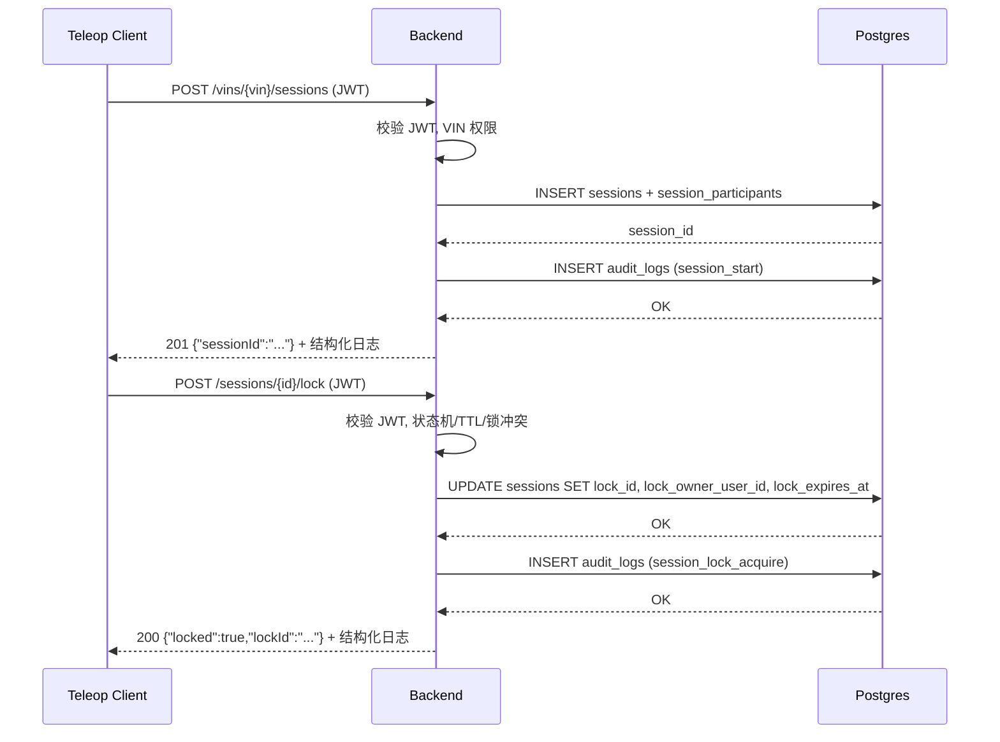

# M2 GATE A 变更提案：Session & Lock 观测性（日志 + 审计 + 指标雏形）（Option B）

**状态**: 待确认（你已选择 Option B 方向，本提案细化具体落地内容，如无异议可直接 CONFIRM 实施）  
**日期**: 2026-02-06  

---

## 0) Executive Summary

- **目标**：在已经持久化的 `sessions` / `locks` 之上，引入**可观测、可审计、可度量**的基础能力，让每一次远程接管会话与锁操作都“有日志可查、有记录可追、有数字可看”。  
- **范围（本批 MVP）**：
  - 为关键 HTTP 接口增加**结构化日志**（包括 `sub`、`vin`、`sessionId`、`lockId`、结果码、耗时等）。  
  - 在 `audit_logs` 表写入基础审计记录：`session_start`、`session_lock_acquire`。  
  - 在内存中维护简单计数指标（总会话数、当前活跃 session 数、锁获取成功/冲突次数等），通过一个只在内部使用的 JSON 诊断接口导出（例如 `/internal/metrics`），为后续接 Prometheus 做准备。  
- **非目标（留给后续批次）**：
  - 不在本批引入完整 Prometheus/OpenTelemetry 集成，仅提供**简单 JSON 指标**。  
  - 不在本批实现复杂的审计过滤/查询 API，仅写入 `audit_logs`，查询依赖 SQL。  

---

## 1) 目标与非目标

| 项目 | 说明 |
|------|------|
| ✅ 目标 1 | 为 `/vins/{vin}/sessions` 和 `/sessions/{id}/lock` 增加结构化日志（JSON 或 key=value） |
| ✅ 目标 2 | 在 `audit_logs` 表落地 `session_start` / `session_lock_acquire` 基础审计记录 |
| ✅ 目标 3 | 在内存中维护 session / lock 相关计数，并通过 `/internal/metrics` JSON 暴露 |
| ✅ 目标 4 | 保证新增观测逻辑不显著影响延迟（只做 O(1) 写入与简单计数） |
| ⚠️ 非目标 1 | 不提供通用审计查询 API（按用户/时间/车辆筛选等），仅依赖 SQL 查询 |
| ⚠️ 非目标 2 | 不接入真实 Prometheus / Grafana，仅提供 JSON 指标接口作为雏形 |
| ⚠️ 非目标 3 | 不实现完整 trace（分布式追踪），仅在日志中透传简单 `request_id` |

---

## 2) Assumptions（假设）& Open Questions（待确认）

### 2.1 默认假设

1. **日志输出形式**  
   - 后端目前使用 `std::cout` / `std::cerr` 直接写到容器日志，本批次在此基础上输出**单行 JSON 或 key=value 风格**的结构化日志。  
   - 示例（JSON）：  
     ```json
     {"ts":"2026-02-06T08:30:00Z","event":"session_start","sub":"...","vin":"E2ETESTVIN0000001","sessionId":"...","status":201,"latency_ms":12}
     ```  

2. **审计写入策略**  
   - 仅针对**成功**操作写审计：  
     - `session_start`：`POST /vins/{vin}/sessions` 返回 201。  
     - `session_lock_acquire`：`POST /sessions/{id}/lock` 返回 200。  
   - 失败（401/403/404/409/5xx）暂不写审计，以免噪声过大；后续可以在安全批次中扩展。  

3. **指标暴露方式**  
   - 暂不引入 Prometheus endpoint，仅提供 `GET /internal/metrics` 返回 JSON：  
     ```json
     {
       "sessions_total": 10,
       "sessions_active": 2,
       "locks_acquired_total": 8,
       "locks_conflict_total": 1,
       "locks_active": 2
     }
     ```  
   - 该接口默认不对公网暴露，仅作为 dev / 运维诊断使用（生产可通过反向代理做保护）。  

4. **安全与隐私**  
   - 日志与审计不记录敏感 payload（例如 token、本地 IP 全量等），只记录必要的 `sub` / `vin` / `sessionId` / `lockId` / HTTP 结果。  

### 2.2 Open Questions（可后续批次再细化）

- 是否需要记录来源 IP 与 User-Agent？  
  - 本批默认：  
    - 审计记录中 `ip` 字段**可选**，若后端能从反向代理拿到可信 IP 再写入（当前环境可先空置）。  
    - `user_agent` 暂不强制。  

---

## 3) 方案设计（含 trade-off）

### 3.1 结构化日志设计

在 `backend/src/main.cpp` 中，为下列 handler 增加结构化日志：  

- `POST /api/v1/vins/{vin}/sessions`  
- `POST /api/v1/sessions/{sessionId}/lock`  

**日志字段建议**：  

| 字段 | 说明 |
|------|------|
| `ts` | 时间戳（ISO8601，UTC） |
| `event` | `session_start` / `session_lock` 等 |
| `sub` | Keycloak `sub`（用户标识） |
| `vin` | 会话目标 VIN |
| `sessionId` | 会话 ID（来自 DB） |
| `lockId` | 锁 ID（仅 lock 事件） |
| `status` | HTTP 状态码 |
| `latency_ms` | handler 内部处理耗时（简单计算） |
| `result` | 简单字符串，如 `success` / `forbidden` / `conflict` / `internal_error` |

**Trade-off**：  
- ✅ 优点：  
  - 直接在日志中具备排障与审计所需的关键字段。  
  - 容易被 ELK / Loki 等日志系统解析。  
- ⚠️ 缺点：  
  - 相比纯文本略多一点 CPU，但对当前负载可忽略。  

### 3.2 审计日志写入设计（`audit_logs`）

利用已有 `audit_logs` 表结构：  

- `action`：`session_start` / `session_lock_acquire`。  
- `actor_user_id`：当前用户 `user_id`。  
- `vin`：目标 VIN。  
- `session_id`：会话 ID。  
- `detail_json`：存放额外信息（如锁 TTL、来源接口等），MVP 只写少量字段。  

**写入点**：  

- 在 session 创建成功后（DB 插入 `sessions` & `session_participants` 返回 201 前）：  
  ```sql
  INSERT INTO audit_logs (actor_user_id, action, vin, session_id, detail_json)
  VALUES ($user_id, 'session_start', $vin, $session_id, $detail_json::jsonb);
  ```  

- 在锁获取成功后（UPDATE sessions 返回 200 前）：  
  ```sql
  INSERT INTO audit_logs (actor_user_id, action, vin, session_id, detail_json)
  SELECT $user_id, 'session_lock_acquire', s.vin, s.session_id,
         $detail_json::jsonb
  FROM sessions s WHERE s.session_id = $session_id;
  ```  

**Trade-off**：  
- ✅ 优点：  
  - 复用现有表，无需新 schema。  
  - 关键审计事件（会话开始、锁获取）都会有 DB 记录可查。  
- ⚠️ 缺点：  
  - 每次成功操作多一次 INSERT，对 DB 有轻微额外压力（在当前规模可忽略）。  

### 3.3 内存指标设计（/internal/metrics）

在 `main.cpp` 中声明若干原子或简单整型计数器（单进程、单线程 HTTP 处理时可以用 `std::atomic<long long>` 或受限 mutex 保护）：  

- `g_sessions_total`  
- `g_sessions_active`（需要在 session 结束时扣减，当前只有 TTL 结束，先只加不减或通过查询 DB 计算——MVP 可仅提供 total）  
- `g_locks_acquired_total`  
- `g_locks_conflict_total`  

新增接口：  

- `GET /internal/metrics`：  
  - 返回 JSON，例如：  
    ```json
    {
      "sessions_total": 10,
      "locks_acquired_total": 8,
      "locks_conflict_total": 1
    }
    ```  
  - 可选：仅当设置某个环境变量（如 `ENABLE_INTERNAL_METRICS=1`）时启用，防止在生产暴露不必要的入口。  

---

## 4) 变更清单（预估）

| 路径 | 类型 | 说明 |
|------|------|------|
| `backend/src/main.cpp` | 修改 | 为 `POST /vins/{vin}/sessions` / `POST /sessions/{id}/lock` 增加结构化日志输出 |
| `backend/src/main.cpp` | 修改 | 在 session start / lock acquire 成功路径上写入 `audit_logs` 记录 |
| `backend/src/main.cpp` | 修改 | 新增全局计数器与 `GET /internal/metrics` JSON 接口 |
| `docs/M2_GATE_B_VERIFICATION_OBSERVABILITY.md` | 新增 | 本批对应的 GATE B 验证文档（日志/审计/指标检查步骤） |
| `M0_STATUS.md` | 修改 | 更新 “M2 Observability for Sessions & Locks” 状态小节 |

---

## 5) 代码与接口行为（描述级）

### 5.1 日志输出（示例）

成功创建会话一条日志可能类似：  

```json
{"ts":"2026-02-06T08:30:00Z","event":"session_start","sub":"a1b2...","vin":"E2ETESTVIN0000001","sessionId":"451c1aa9-...","status":201,"latency_ms":12,"result":"success"}
```  

锁获取成功一条日志可能类似：  

```json
{"ts":"2026-02-06T08:30:05Z","event":"session_lock","sub":"a1b2...","sessionId":"451c1aa9-...","lockId":"9f8e...","status":200,"latency_ms":5,"result":"success"}
```  

### 5.2 审计记录（示例查询）

```sql
SELECT action, vin, session_id, actor_user_id, detail_json, ts
FROM audit_logs
WHERE action IN ('session_start', 'session_lock_acquire')
ORDER BY ts DESC
LIMIT 10;
```  

---

## 6) Mermaid 图（请求链路 + 审计写入）



---

## 7) 编译 / 部署 / 运行说明（针对本批）

- **环境依赖**：沿用当前 backend + Postgres 环境，无新增外部组件。  
- **开发模式**：继续使用 `Dockerfile.dev` + `docker-compose.dev.yml` + `scripts/dev-backend.sh`，代码改动后在容器内自动编译。  
- **验证时建议步骤**：  
  1. 使用 e2e-test 创建 session & 获取锁。  
  2. `docker compose logs backend` 中检查结构化日志是否存在。  
  3. 在 Postgres 中查询 `audit_logs`。  
  4. 访问 `/internal/metrics` 确认 JSON 指标有合理数值。  

---

## 8) 验证与回归测试清单（概述）

- **新行为验证**：  
  - 创建 session / 获取锁成功后，在日志中能看到结构化事件。  
  - `audit_logs` 表中有对应的 `session_start` / `session_lock_acquire` 记录。  
  - `/internal/metrics` 返回 JSON，`sessions_total` / `locks_acquired_total` 等数值递增合理。  
- **回归**：  
  - 现有接口的 HTTP 行为与 payload 不变（仅增加日志和审计），`scripts/e2e.sh`、`scripts/verify-vins-e2e.sh` 应全部通过。  

---

## 9) 风险与回滚策略

- **风险**：  
  - 若 SQL 写审计时出错，可能导致部分成功操作返回 `503 internal`。  
  - 日志输出格式若变动频繁，会增加日志系统解析难度。  
- **回滚**：  
  - 所有改动集中在 `main.cpp` + 文档，可通过 `git revert` 单独撤销本批提交，恢复到仅有 sessions/locks 持久化的状态。  

---

## 10) 后续演进路线图

- **MVP（本批）**：结构化日志 + 基础审计 + JSON metrics。  
- **V1**：  
  - 把 `/internal/metrics` 替换为标准 Prometheus endpoint。  
  - 增强 `audit_logs` 写入，覆盖失败事件（如 lock_conflict、forbidden）并提供简单查询接口。  
- **V2**：  
  - 引入分布式 trace（如 OpenTelemetry），将 sessionId/lockId 作为 trace 维度贯穿视频流、控制链路与车辆端日志。  

---

**请确认**：若同意按本提案实施 Option B 观测性增强，请回复 **CONFIRM (Observability)** 或直接回复 **CONFIRM**。  

