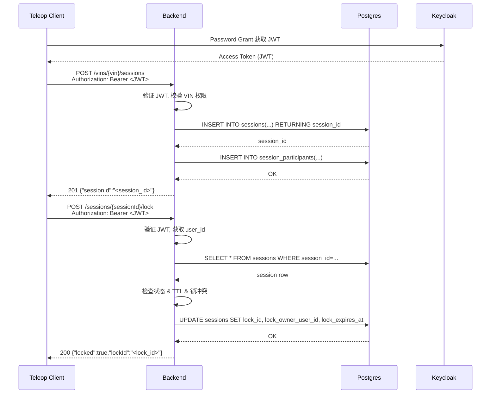
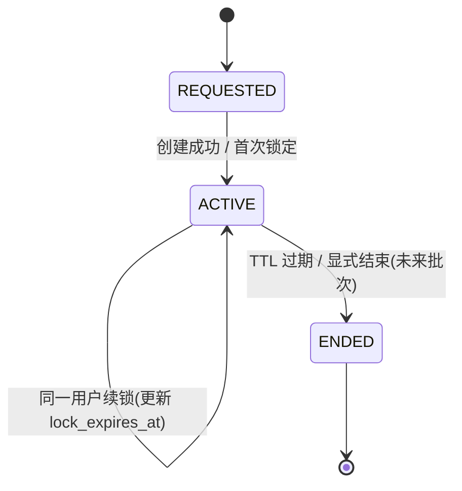

# M2 GATE A 变更提案：Sessions & Locks 持久化 + 基础状态机（Option A）

**状态**: 待确认（需回复 CONFIRM 后再实施）  
**日期**: 2026-02-06  

---

## 0) Executive Summary

- **目标**：把当前占位的 `sessionId` / `lockId` 升级为 **真正落库的会话与锁记录**，引入最小可用的会话状态机（`REQUESTED/ACTIVE/ENDED`）和**单持有者锁**，为远程驾驶的安全审计和事后追溯提供“脊梁数据”。  
- **范围（MVP）**：
  - `POST /api/v1/vins/{vin}/sessions`：从“仅生成 UUID”升级为 **插入 `sessions` + `session_participants`** 并返回 DB 生成的 `session_id`。  
  - `POST /api/v1/sessions/{sessionId}/lock`：从“只返回占位 `lockId`”升级为 **单持有者锁 + 过期时间** 的最小实现，并把锁信息落到 `sessions` 表中。  
- **默认策略（若你不另外指定）**：
  - 会话/锁默认过期时间：**30 分钟**（可通过环境变量配置）。  
  - 锁策略：**single-owner**（同一个 session 在任一时刻只能有一个锁持有者）。  
  - 审计粒度：当前批次只做 **basic**（后续在 Option B 中增强 audit_logs 与 metrics）。  

---

## 1) 目标与非目标

| 项目 | 说明 |
|------|------|
| ✅ 目标 1 | `POST /vins/{vin}/sessions`：插入 `sessions` & `session_participants`，返回 DB 中的 `session_id` |
| ✅ 目标 2 | `POST /sessions/{sessionId}/lock`：基于 DB 状态实现“单持有者锁”+ 过期时间（TTL） |
| ✅ 目标 3 | 基础会话状态机：`REQUESTED` / `ACTIVE` / `ENDED`（本批主要覆盖 `ACTIVE` 与 `ENDED`） |
| ✅ 目标 4 | 保持现有 JWT/VIN 授权模型不变（Keycloak + users/account_vehicles/vin_grants） |
| ⚠️ 非目标 1 | 本批不实现复杂锁竞争/排队/续约 API，只做“最小 usable 单持有者锁” |
| ⚠️ 非目标 2 | 不在本批中引入新的 WebRTC 鉴权 / token 签名，仅保持占位 WHEP URL 逻辑 |
| ⚠️ 非目标 3 | 不做完整 audit_logs 与 Prometheus 指标接入，只为后续 Option B 保留扩展点 |

---

## 2) Assumptions（假设）& Open Questions（待确认）

### 2.1 默认假设（若你不额外指定）

1. **会话 TTL**：  
   - `SESSION_TTL_SECONDS` 默认 = **30 * 60 = 1800 秒**。  
   - 若环境变量未设置，则使用默认；未来可以配置不同角色不同 TTL（不在本批）。  

2. **锁 TTL**：  
   - `LOCK_TTL_SECONDS` 默认 = **SESSION_TTL_SECONDS**（简化实现）。  
   - 后续可以拆分为更短的锁超时，并引入心跳刷新机制。  

3. **锁策略**：  
   - **single-owner**：`sessions` 中只允许一个当前锁持有者；第二个用户尝试加锁 → 返回 `409`（冲突）或 `423`（Locked），本批先统一用 `409`。  

4. **会话与 VIN 关系**：  
   - 一条 `sessions` 记录只绑定一个 `vin`。  
   - 同一 VIN 可以有多个 session（例如多观众/多历史回放），本批只处理**一个 controller** 的远程驾驶会话。  

### 2.2 待确认问题（可在后续小批次微调）

本 GATE A 先按上述假设推进，实现后你可以在下一轮调参（例如缩短/延长 TTL）。  

---

## 3) 方案设计（含 trade-off）

### 3.1 数据库设计（基于已有 schema）

当前 `001_initial_schema.sql` 中已有：

- `sessions` 表：含 `session_id`、`vin`、`controller_user_id`、`state`、`started_at`、`ended_at`、`last_heartbeat_at` 等字段。  
- `session_participants` 表：`session_id` + `user_id` + `role_in_session`。  

**MVP 改动（不新增新表，只增列）**：

新增一次小迁移 `backend/migrations/002_sessions_locks_mvp.sql`：

- 在 `sessions` 表增加锁相关字段：
  - `lock_id UUID`：当前锁 ID（对应 API 返回的 `lockId`）。  
  - `lock_owner_user_id UUID REFERENCES users(id)`：当前锁持有者。  
  - `lock_expires_at TIMESTAMP WITH TIME ZONE`：锁过期时间。  

并增加索引：

- `CREATE INDEX idx_sessions_lock_owner_user_id ON sessions(lock_owner_user_id);`

**Trade-off**：  
- ✅ 优点：  
  - 不额外引入 `session_locks` 新表，保持 schema 简洁。  
  - 单条 session 记录即可体现“当前锁状态”，便于查询当前锁持有者。  
- ⚠️ 缺点：  
  - 无法记录历史锁切换轨迹，需要依赖后续 Option B 中的 `audit_logs` 来做“锁历史”。  

> 若你更希望“锁为一张独立表”，可以在后续 GATE A/B 中再拆；当前批次先选**简洁 + 可落地**作为主目标。

### 3.2 会话创建流程（POST /vins/{vin}/sessions）

目标：从“仅 generate uuid”升级为“入库 + 返回 DB session_id”。  

**逻辑步骤**（高层伪代码）：  

1. 校验 JWT → 拿到 `sub`。  
2. 复用/提炼出 `get_vins_for_sub` 的逻辑，得到 `user_id` 与 `account_id`（可以新增一个 helper，例如 `get_user_and_account_for_sub`）。  
3. 校验 `vin` 在可访问列表中（逻辑与当前实现保持一致）。  
4. 在 DB 执行：  
   ```sql
   INSERT INTO sessions (session_id, vin, controller_user_id, state, started_at)
   VALUES (uuid_generate_v4(), $vin, $controller_user_id, 'ACTIVE', now())
   RETURNING session_id;
   ```  
5. 同时插入 `session_participants`：  
   ```sql
   INSERT INTO session_participants (session_id, user_id, role_in_session)
   VALUES ($session_id, $controller_user_id, 'controller');
   ```  
6. 把 `session_id::text` 返回给调用方（维持现有 JSON 结构：`{"sessionId":"<uuid>"}`）。  

### 3.3 锁获取流程（POST /sessions/{sessionId}/lock）

目标：实现**单持有者锁 + TTL**，并落库。  

**逻辑步骤**（简化描述）：  

1. 校验 JWT → `sub`。  
2. 查 `users` 表拿到 `user_id`（可与 3.2 复用 helper）。  
3. 从 `sessions` 表按 `session_id` 查询：  
   - 若不存在 → 返回 `404`（`{"error":"session_not_found"}`）。  
   - 若 `state NOT IN ('REQUESTED','ACTIVE')` 或 `ended_at IS NOT NULL` → 返回 `409`（已结束）。  
4. TTL 检查：  
   - 若 `started_at + SESSION_TTL_SECONDS < now()` → 视为过期：更新 `state='ENDED', ended_at=now()`，返回 `409`。  
   - 若 `lock_expires_at IS NOT NULL AND lock_expires_at < now()` → 视为锁过期，可重新获取锁（相当于锁已释放）。  
5. 锁冲突判断（single-owner）：  
   - 如果 `lock_owner_user_id IS NOT NULL` 且 `lock_owner_user_id != current_user_id` 且 `lock_expires_at > now()`：  
     - 返回 `409`（`{"error":"lock_conflict"}`）。  
6. 正常加锁/续锁：  
   - 生成新的 `lock_id = uuid_generate_v4()` 或复用当前持有者的锁。  
   - 设置：  
     ```sql
     UPDATE sessions
     SET lock_id = $lock_id,
         lock_owner_user_id = $current_user_id,
         lock_expires_at = now() + make_interval(secs := $LOCK_TTL_SECONDS),
         state = 'ACTIVE'
     WHERE session_id = $session_id;
     ```  
   - 返回 `200` + `{"locked":true,"lockId":"<lock_id>"}`。  

> 注：本批仅实现“加锁”接口；解锁/续约（keepalive）可以在后续批次中单独设计 GATE A。  

---

## 4) 变更清单（预估）

| 路径 | 类型 | 说明 |
|------|------|------|
| `backend/migrations/002_sessions_locks_mvp.sql` | 新增 | 为 `sessions` 表添加 `lock_id`、`lock_owner_user_id`、`lock_expires_at` 等字段与索引 |
| `backend/src/main.cpp` | 修改 | `POST /vins/{vin}/sessions` 从“纯 UUID”改为“插入 sessions & session_participants 并返回 DB session_id` |
| `backend/src/main.cpp` | 修改 | `POST /sessions/{sessionId}/lock` 从“占位锁”改为“single-owner + TTL + 持久化” |
| `backend/src/main.cpp` | 修改 | 提炼/新增 DB helper 函数：如获取 user_id/account_id、创建 session、获取/更新锁等 |
| `docs/M2_GATE_B_VERIFICATION_SESSIONS_LOCKS_PERSISTENCE.md` | 新增 | 本批对应的 GATE B 验证文档（curl 步骤 & 预期输出） |
| `M0_STATUS.md` | 修改 | 更新 “M2 Sessions & Locks 持久化” 状态小节 |

---

## 5) 代码与接口行为（描述级）

### 5.1 环境变量（新增/使用）

- `SESSION_TTL_SECONDS`（可选）：会话默认 TTL，默认 `1800`。  
- `LOCK_TTL_SECONDS`（可选）：锁默认 TTL，默认同 `SESSION_TTL_SECONDS`。  

### 5.2 HTTP 接口行为变化

- `POST /api/v1/vins/{vin}/sessions`：  
  - ✅ 仍需 JWT，仍先校验 VIN 访问权限。  
  - 🔁 `sessionId` 不再由 C++ 随机生成，而是由 Postgres `uuid_generate_v4()` 生成并落在 `sessions.session_id` 中。  

- `POST /api/v1/sessions/{sessionId}/lock`：  
  - ✅ 仍需 JWT。  
  - ✅ 仍返回 200 + `{"locked":true,"lockId":"<uuid>"}`（成功时）。  
  - 🔁 新增 DB 逻辑：  
    - 不存在的 `sessionId` → `404`。  
    - 已结束/过期会话 → `409`。  
    - 已有其他用户持有锁且未过期 → `409`。  
    - 当前用户成功加锁/续锁 → `200`。  

---

## 6) Mermaid 可视化

### 6.1 会话创建与加锁时序图



### 6.2 会话/锁状态机（简化版）



说明：  
- 本批次主要覆盖 `REQUESTED -> ACTIVE` 与 `ACTIVE -> ENDED(因 TTL)`。  
- 显式结束接口（如 `POST /sessions/{id}/end`）可在后续批次设计。  

---

## 7) 编译 / 部署 / 运行说明（针对本批改动）

### 7.1 迁移执行

新增迁移文件后，Postgres 容器会在**重建**时自动执行：  

```bash
cd /home/wqs/bigdata/Remote-Driving

# 重新创建数据库容器以应用新迁移
docker compose down -v
docker compose up -d postgres

# 可选：检查新列是否存在
docker compose exec postgres psql -U teleop_user -d teleop_db -c "\d+ sessions"
```

> 若希望保留现有数据，我们可以将 `002_sessions_locks_mvp.sql` 设计为**幂等 ALTER**，不强制重建整个 DB；上面只是最简单的全量重建路径。  

### 7.2 Backend 构建与运行（开发模式）

```bash
cd /home/wqs/bigdata/Remote-Driving

# 启动开发模式 backend
bash scripts/dev-backend.sh up

# 如有必要手动重启 backend 容器
bash scripts/dev-backend.sh restart
```

---

## 8) 验证与回归测试清单

### 8.1 新增/变更行为验证

1. **创建会话落库**  
   - 使用 e2e-test 用户调用 `POST /vins/E2ETESTVIN0000001/sessions`：  
     - 预期 HTTP 201；  
     - `sessions` 表中新增记录，`vin`、`controller_user_id`、`state='ACTIVE'`、`started_at` 非空。  

2. **加锁成功**  
   - 使用同一用户调用 `POST /sessions/{sessionId}/lock`：  
     - 预期 HTTP 200， body `{"locked":true,"lockId":"..."}`；  
     - `sessions` 表中的 `lock_id`、`lock_owner_user_id`、`lock_expires_at` 被正确更新。  

3. **锁冲突**  
   - 使用**另一用户**（后续可扩展）调用同一接口：  
     - 若前一锁未过期，预期 HTTP 409，`{"error":"lock_conflict"}`。  

4. **TTL 过期行为**（可通过临时缩短 TTL 或手动 update 模拟）：  
   - `lock_expires_at < now()` 后，再次调用锁接口应能重新获得锁。  

### 8.2 回归测试

- 运行现有脚本：  
  - `bash scripts/e2e.sh`  
  - `bash scripts/verify-vins-e2e.sh`  
- 确保已有接口（`/health`、`/ready`、`/vins`、`POST /sessions`、`GET /streams`、`POST /lock`）在新逻辑下仍全部通过。  

---

## 9) 风险与回滚策略

### 9.1 主要风险

- **DB 结构变更**：`sessions` 表新增列，若 SQL 写错可能导致迁移失败或性能问题。  
- **状态机/锁逻辑 Bug**：可能导致 session 无法加锁、误判冲突或 TTL 判断错误，从而影响远程驾驶控制权切换。  

### 9.2 回滚策略

- **代码层面**：  
  - 所有改动集中在少数文件（新迁移 + `main.cpp` 中的 handlers 和 helper）；如有问题可直接 `git revert` 本批提交。  
- **数据库层面**：  
  - 如采用新迁移文件 002，回滚方式：  
    - 临时环境可直接 `docker compose down -v && docker compose up -d postgres` 回到 001 的 schema。  
    - 若在后续正式环境中，需要通过 `ALTER TABLE sessions DROP COLUMN ...` 的脚本回退（本批仅在开发环境使用）。  

---

## 10) 后续演进路线图（MVP → V1 → V2）

- **MVP（本批）**  
  - sessions & locks 落库，基础状态机（ACTIVE/ENDED+TTL），单持有者锁。  

- **V1（下一阶段建议）**  
  - 显式结束会话接口（`POST /sessions/{id}/end`）。  
  - 锁释放接口（`POST /sessions/{id}/unlock` 或 `DELETE /sessions/{id}/lock`）。  
  - 将 session/lock 操作写入 `audit_logs`（Option B）并增加基础 Prometheus 指标。  

- **V2（远程驾驶生产级）**  
  - 多角色多参与者的复杂会话模型（controller/observer/supervisor）。  
  - 与车辆端控制链路联动：锁失效触发 MRM/安全停车。  
  - 更细粒度的锁（例如按 stream、按控制域划分）。  

---

**请确认**：若同意按本提案实施 Sessions & Locks 持久化（Option A MVP），请回复 **CONFIRM**。  
如需调整 TTL 或锁策略，可在回复中注明（例如：`CONFIRM, TTL=900, LOCK=single-owner`）。  

