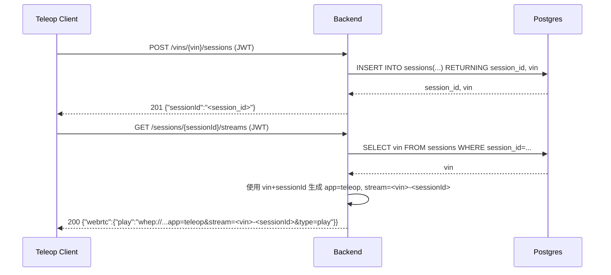

# M2 GATE A 变更提案：WebRTC/WHEP 链路绑定 ZLMediaKit（Option C）

**状态**: 待确认（你已选择 Option C 方向，本提案细化具体落地内容，如无异议可直接 CONFIRM 实施）  
**日期**: 2026-02-06  

---

## 0) Executive Summary

- **目标**：让 `GET /api/v1/sessions/{sessionId}/streams` 返回的 WebRTC WHEP 地址不再是“纯占位”，而是与 ZLMediaKit 的实际流命名规则对齐，使 Sunshine/GStreamer 等推流端与 teleop-client 播放端可以围绕统一约定进行集成。  
- **范围（本批 MVP）**：
  - 确定 ZLMediaKit 中 WebRTC 播放使用的 `app/stream` 命名规范（例如 `app=teleop`，`stream=<vin>-<sessionId>`）。  
  - 调整后端 `build_stream_url(...)` 与 `/streams` handler，使返回的 WHEP URL 完整遵循 ZLMediaKit 规范（`/index/api/webrtc?app=<app>&stream=<stream>&type=play`），并基于 `sessionId` 从 DB 中解析出关联的 VIN。  
- **非目标**：
  - 不在本批中实现 Sunshine/GStreamer 的推流逻辑或推流鉴权，仅做好“后端 URL 生成 + 命名规范”的一侧。  
  - 不在本批中实现流状态查询/重试策略，只返回播放 URL。  

---

## 1) 目标与非目标

| 项目 | 说明 |
|------|------|
| ✅ 目标 1 | 统一定义 ZLMediaKit 中 teleop 流的 `app` 与 `stream` 命名规则 |
| ✅ 目标 2 | `/api/v1/sessions/{sessionId}/streams` 基于 DB 中的 `sessions(vin, session_id)` 生成对应的 WHEP 播放 URL |
| ✅ 目标 3 | 保持 WebRTC 协议为 WHEP（HTTP(S)+WebRTC），不引入高延迟方案 |
| ⚠️ 非目标 1 | 不创建/控制 Sunshine/GStreamer 推流，只提供客户端可用的播放 URL |
| ⚠️ 非目标 2 | 不实现流状态检查、自动重试等高级逻辑 |
| ⚠️ 非目标 3 | 不调整 ZLMediaKit 配置文件（端口、证书等），仅基于已有 `ZLM_API_URL` 生成 URL |

---

## 2) Assumptions（假设）& Open Questions（待确认）

### 2.1 默认假设

1. **ZLMediaKit WebRTC 播放路径**  
   - 仍沿用当前使用的 ZLMediaKit WebRTC WHEP 规范：  
     - `http://<host>:<port>/index/api/webrtc?app=<app>&stream=<stream>&type=play`  
   - 后端返回给前端的 WHEP URL 形式为：  
     - `whep://<host>:<port>/index/api/webrtc?app=<app>&stream=<stream>&type=play`  
     - 即仅将协议前缀由 `http://` 替换为 `whep://`，以表明这是 WebRTC 播放入口。  

2. **流命名规范（初版约定）**  
   - `app` 固定为：`teleop`。  
   - `stream` 命名为：`<vin>-<sessionId>`（全部小写，连字符 `-` 连接，`sessionId` 为 UUID）。例如：  
     - `vin=E2ETESTVIN0000001`，`sessionId=451c1aa9-c5cc-4df5-907d-b7b12b77c848`  
     - 则 `stream=E2ETESTVIN0000001-451c1aa9-c5cc-4df5-907d-b7b12b77c848`  

3. **ZLM_API_URL 仍为单一来源**  
   - 通过环境变量 `ZLM_API_URL` 提供 ZLMediaKit 访问地址，例如：  
     - `http://zlmediakit/index/api` 或 `http://zlmediakit:80/index/api`  
   - 后端从该 URL 中解析 `<host>:<port>`，不修改 ZLMediaKit 配置。  

4. **sessions 表是“真源”**  
   - `sessions` 表已经写入了 `vin` 与 `session_id`：  
     - `session_id`（主键）  
     - `vin`（绑定车辆）  
   - `/streams` 接口将基于 `session_id` 查询 `sessions` 表获取对应的 `vin`，从而构造 `stream` 名称。  

### 2.2 Open Questions（可以后续小批次微调）

- 是否需要为不同类型的流（车前摄像头/环视/语音等）预留 `stream` 名字空间？  
  - 本批默认只考虑 **主远程驾驶视频流**，使用上述统一命名；  
  - 多路流命名（如 `stream=<vin>-<sessionId>-front`）可在后续媒体批次扩展。  

---

## 3) 方案设计（含 trade-off）

### 3.1 流命名与 URL 生成逻辑

当前 `build_stream_url(...)` 只是简单把 `sessionId` 拼到 `session-<id>` 上，本批将其调整为：  

1. 在 `/streams` handler 中：  
   - 从路径解析出 `sessionId`；  
   - 查询 `sessions` 表：  
     ```sql
     SELECT vin::text FROM sessions WHERE session_id = $1::uuid;
     ```  
   - 若不存在 → 返回 `404 {"error":"session_not_found"}`。  

2. 使用查询到的 `vin` 与 `sessionId`，构造 `stream` 名称：  
   - `stream = vin + "-" + sessionId`。  

3. 基于 `ZLM_API_URL` 解析 `host` 与 `port`：  
   - 已有逻辑：  
     - `http://zlmediakit/index/api` → `host=zlmediakit, port=80`  
     - `http://zlmediakit:8080/index/api` → `host=zlmediakit, port=8080`  
   - 保持不变。  

4. 生成最终 WHEP URL：  
   - `whep://<host>:<port>/index/api/webrtc?app=teleop&stream=<stream>&type=play`。  

**Trade-off**：  
- ✅ 优点：  
  - 明确、稳定的命名规则，便于 Sunshine/GStreamer 在推流侧统一实现。  
  - `stream` 同时包含 VIN 与 sessionId，有利于 ZLMediaKit 侧运维排障。  
- ⚠️ 缺点：  
  - 流名称较长（VIN + UUID），不过对 ZLMediaKit 不构成明显问题。  

### 3.2 `/streams` handler 行为调整

在 `backend/src/main.cpp` 中的 `/api/v1/sessions/.*/streams` handler 内：  

1. 保持现有 JWT 校验逻辑不变。  
2. 提取 `sessionId` 后，增加 DB 查询：  
   ```sql
   SELECT vin::text FROM sessions WHERE session_id = $1::uuid;
   ```  
   - 若查询失败（DB 错误） → `503 {"error":"internal"}`；  
   - 若无记录 → `404 {"error":"session_not_found"}`。  
3. 将 `vin` 与 `sessionId` 传入 `build_stream_url(zlm_api_url, vin, sessionId)`（函数签名将扩展）：  
   - `build_stream_url` 内负责解析 `ZLM_API_URL` 并拼接 app/stream。  
4. 返回 JSON 与当前类似，只是 `play` 字段从占位变成真实命名规则：  
   ```json
   {
     "webrtc": {
       "play": "whep://zlmediakit:80/index/api/webrtc?app=teleop&stream=E2ETESTVIN0000001-451c1aa9-...&type=play"
     }
   }
   ```  

### 3.3 后续 Sunshine/GStreamer 推流约定（非本批实现，仅给出约束）

为了保证双向一致性（推流端与播放端），本提案明确以下 **约定**，供后续媒体批次使用：  

- 推流端（Sunshine / GStreamer / 车端）在推流到 ZLMediaKit 时：  
  - 应使用相同的 `app="teleop"`；  
  - 使用从 backend 获取的 `sessionId` 与车辆 VIN 拼出 `stream` 名称；  
  - 或由 backend 另外提供一个辅助 API 返回“推流参数”（本批不实现，只在文档中锁定命名规则）。  

---

## 4) 变更清单（预估）

| 路径 | 类型 | 说明 |
|------|------|------|
| `backend/src/main.cpp` | 修改 | 扩展 `build_stream_url`，基于 `vin + sessionId` 生成 `app=teleop, stream=<vin>-<sessionId>` 的 WHEP URL |
| `backend/src/main.cpp` | 修改 | `/api/v1/sessions/{sessionId}/streams` handler：查询 `sessions` 表获取 `vin`，不存在时 404 |
| `docs/M2_GATE_B_VERIFICATION_WEBRTC_BINDING.md` | 新增 | 本批对应的 GATE B 验证文档（URL 格式检查 + DB 验证） |
| `M0_STATUS.md` | 修改 | 更新 “M2 WebRTC Binding” 状态小节 |

---

## 5) 验证与回归测试清单（概述）

### 5.1 新行为验证

1. **URL 格式正确**  
   - 使用 e2e-test 流程：  
     - 创建 session：`POST /vins/E2ETESTVIN0000001/sessions` → 得到 `sessionId`；  
     - 调用：`GET /sessions/{sessionId}/streams`。  
   - 验证返回 JSON 中：  
     - 存在 `webrtc.play` 字段；  
     - URL 形如：  
       `whep://<host>:<port>/index/api/webrtc?app=teleop&stream=E2ETESTVIN0000001-<sessionId>&type=play`。  

2. **DB 一致性**  
   - 在 Postgres 中检查：  
     ```sql
     SELECT vin::text, session_id::text
     FROM sessions
     WHERE session_id = '<sessionId>';
     ```  
   - 确认返回的 VIN 与 URL 中 `stream` 部分一致。  

3. **错误路径**  
   - 使用不存在的 `sessionId` 调用 `/streams`：  
     - 预期 `404 {"error":"session_not_found"}`。  

### 5.2 回归测试

- 确认：  
  - `/health`、`/ready`、`/me`、`/vins`、`POST /sessions`、`POST /lock` 行为未改变；  
  - 现有 e2e 脚本无回归（尤其是与 `/streams` 相关的验证）。  

---

## 6) Mermaid 时序图（Session → Streams URL）



---

## 7) 风险与回滚策略

- **风险**：  
  - 若 URL 生成逻辑写错，可能导致推流端与播放端 stream 名称不匹配，需要重新协商命名规则。  
- **回滚**：  
  - 所有改动集中在 `build_stream_url` 与 `/streams` handler，可以通过 `git revert` 快速恢复到占位实现。  

---

## 8) 后续演进（超出本批范围，仅规划）

- **后续媒体批次（建议）**：  
  - 设计 Sunshine/GStreamer 推流 API 或配置片段，让推流端按本命名规范推流到 ZLMediaKit。  
  - 引入推流鉴权（token 或白名单）与路由策略。  

---

**请确认**：若同意按本提案实施 WebRTC/WHEP 绑定（Option C MVP），请回复 **CONFIRM (WebRTC)** 或直接回复 **CONFIRM**。  

