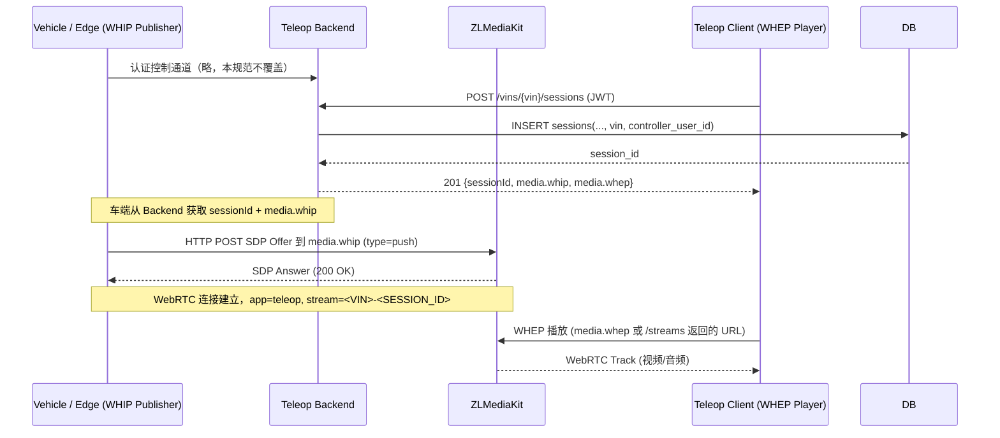

# M2 车端 WHIP 推流约定规范（Teleop Vehicle WebRTC Publisher → ZLMediaKit）

**版本**: v0.1 (MVP)  
**日期**: 2026-02-06  

---

## 0) 背景与目标

- **背景**  
  - 远程驾驶系统中，车端/边缘端负责采集视频（和后续的音频/传感器流），需要以 **WebRTC** 的形式推送到中心侧。  
  - 由于点对点 WebRTC 在复杂网络（NAT/5G/多运营商）下成功率较低，我们采用 **ZLMediaKit 作为中转 / SFU**：  
    - 车端作为 **WHIP Publisher** 推流到 ZLMediaKit；  
    - Teleop Client 作为 **WHEP Player** 从 ZLMediaKit 播放。  

- **目标**  
  - 定义一套 **车端 WHIP 推流约定**，包括：  
    - URL 命名规范；  
    - 必需 HTTP 头/SDP 形态；  
    - 与后端 `sessionId` / `VIN` 的绑定关系；  
    - 典型接入方式（以 GStreamer/webrtcbin 为例）。  
  - 让 Jetson/边缘节点的开发可以按本文档直接接入，无需再猜测 ZLMediaKit 的细节。  

---

## 1) 角色与整体链路



---

## 2) 命名与 URL 约定

### 2.1 app / stream 命名

- **app 固定**：`teleop`  
- **stream 规则**：  
  \[
  \text{stream} = \text{VIN} + "-" + \text{SESSION\_ID}
  \]
  - 例如：  
    - `VIN = E2ETESTVIN0000001`  
    - `SESSION_ID = 451c1aa9-c5cc-4df5-907d-b7b12b77c848`  
    - `stream = E2ETESTVIN0000001-451c1aa9-c5cc-4df5-907d-b7b12b77c848`

### 2.2 Backend 提供的 URL

当 Teleop Client 调用：

```http
POST /api/v1/vins/{vin}/sessions
Authorization: Bearer <JWT>
```

后端返回（示例）：

```json
{
  "sessionId": "451c1aa9-c5cc-4df5-907d-b7b12b77c848",
  "media": {
    "whip": "whip://zlmediakit:80/index/api/webrtc?app=teleop&stream=E2ETESTVIN0000001-451c1aa9-c5cc-4df5-907d-b7b12b77c848&type=push",
    "whep": "whep://zlmediakit:80/index/api/webrtc?app=teleop&stream=E2ETESTVIN0000001-451c1aa9-c5cc-4df5-907d-b7b12b77c848&type=play"
  }
}
```

- **车端使用 `media.whip`** 作为 WHIP 推流入口。  
- **Teleop Client 使用 `media.whep` 或 `/sessions/{id}/streams` 返回的 URL 播放。**

### 2.3 WHIP HTTP URL 具体形式

车端实际使用时，需将 `whip://` 换成 `http://` 或 `https://`（取决于 ZLMediaKit 部署）：

```text
http://zlmediakit:80/index/api/webrtc?app=teleop&stream=<VIN>-<SESSION_ID>&type=push
```

---

## 3) WHIP 推流 HTTP 约定

### 3.1 初次推流（Offer）

- **Method**: `POST`  
- **URL**:  

```http
POST /index/api/webrtc?app=teleop&stream=<VIN>-<SESSION_ID>&type=push HTTP/1.1
Host: zlmediakit:80
Content-Type: application/sdp
Accept: application/sdp
Content-Length: <len>

v=0
o=- 46117326 2 IN IP4 127.0.0.1
...
```

- **请求体**：本地 WebRTC 生成的 **SDP Offer**（纯文本）。  
- **响应**：  
  - `200 OK`  
  - `Content-Type: application/sdp`  
  - body 为 **SDP Answer**。  
- 车端收到 Answer 后，调用 `setRemoteDescription(answer)` 完成 WebRTC 连接建立。

### 3.2 ICE Candidate 处理策略（MVP 简化）

为降低实现复杂度，MVP 建议：

- 在创建 Offer 前，配置好 STUN/TURN；  
- 等候 ICE 候选收集完成（gathering-complete），将候选直接写入 SDP 中；  
- **一次性 POST 带候选的 SDP Offer** 到 WHIP URL，不做 trickle ICE。  

后续如需更贴近 WHIP 正式规范（PATCH/DELETE/Location），可以在新的媒体批次中扩展。

### 3.3 认证与安全（预留）

- 当前 WHIP URL 中未强制携带认证信息。  
- 未来可扩展：  
  - `Authorization: Bearer <MEDIA_TOKEN>`，由后端生成短期媒体 token。  
  - 车端在 HTTP 请求中带上该 header，ZLMediaKit 通过自定义 hook 校验。  

本规范作为 **MVP**，先假定 VPC/内网或防火墙策略已限制非法访问。

---

## 4) 典型实现示意：GStreamer + webrtcbin

> 以下为 **伪代码级别**，用于说明流程，非可直接编译工程。

### 4.1 管线结构

- 视频来源：`v4l2src` / `nvarguscamerasrc` 等。  
- 编码：`x264enc` 或 Jetson 上的硬件编码器。  
- 封包：`rtph264pay`。  
- WebRTC：`webrtcbin`。

```text
v4l2src ! videoconvert ! x264enc tune=zerolatency ! rtph264pay config-interval=1 pt=96 ! webrtcbin
```

### 4.2 关键回调逻辑

```c
// on_negotiation_needed: 创建 offer
static void on_negotiation_needed(GstElement *webrtc, gpointer user_data) {
    const char *whip_url = (const char *)user_data;
    GstPromise *promise = gst_promise_new_with_change_func(on_offer_created, (gpointer)whip_url, NULL);
    g_signal_emit_by_name(webrtc, "create-offer", NULL, promise);
}

// on_offer_created: HTTP POST SDP, 接收 Answer
static void on_offer_created(GstPromise *promise, gpointer user_data) {
    const char *whip_url = (const char *)user_data;
    GstStructure *reply = gst_promise_get_reply(promise);
    GstWebRTCSessionDescription *offer = NULL;
    gst_structure_get(reply, "offer", GST_TYPE_WEBRTC_SESSION_DESCRIPTION, &offer, NULL);
    gst_promise_unref(promise);

    gchar *sdp_text = gst_sdp_message_as_text(offer->sdp);

    // 1) HTTP POST sdp_text -> whip_url (Content-Type: application/sdp)
    std::string answer_sdp = http_post_sdp(whip_url, sdp_text);

    // 2) 把 answer_sdp 设置为 remote description
    GstSDPMessage *sdp_msg = NULL;
    gst_sdp_message_new(&sdp_msg);
    gst_sdp_message_parse(answer_sdp.c_str(), sdp_msg);
    GstWebRTCSessionDescription *answer =
        gst_webrtc_session_description_new(GST_WEBRTC_SDP_TYPE_ANSWER, sdp_msg);
    g_signal_emit_by_name(webrtc, "set-remote-description", answer, NULL);

    gst_webrtc_session_description_free(offer);
    gst_webrtc_session_description_free(answer);
    g_free(sdp_text);
}
```

`http_post_sdp` 可以用 libcurl 实现：

```c
// 伪代码：用 libcurl POST SDP，返回响应 body（Answer SDP）
std::string http_post_sdp(const std::string &url, const std::string &sdp_text) {
    // curl_easy_setopt(CURLOPT_URL, url.c_str());
    // curl_easy_setopt(CURLOPT_POST, 1L);
    // curl_easy_setopt(CURLOPT_HTTPHEADER, ["Content-Type: application/sdp"]);
    // curl_easy_setopt(CURLOPT_POSTFIELDS, sdp_text.c_str());
    // 读取响应 body 为字符串并返回。
}
```

---

## 5) 与 Backend 会话/锁的协作

- 车端在发起 WHIP 推流之前，**必须已经有一个对应的 session**：  
  - 由 Teleop Client 通过 `POST /vins/{vin}/sessions` 创建；  
  - 后端返回 `sessionId` 与 `media.whip`；  
  - 若存在锁机制（`POST /sessions/{id}/lock`），可要求车端仅在锁持有时才推流。  

- 若 session 结束（未来可能通过 `POST /sessions/{id}/end`），车端应：  
  - 检测控制通道通知或心跳超时；  
  - 停止 WHIP 推流，释放本地资源。  

---

## 6) 后续演进方向

- **MVP 后** 可以进一步扩展：  
  - 在 Backend 增加 **媒体 token**，由 `media.whip` 中附带短期签名参数；  
  - 在 ZLMediaKit 上通过 hook/脚本校验 token，以提升安全性；  
  - 支持多路流（`<VIN>-<SESSION_ID>-front` / `-rear` / `-cab`），并在 Backend 返回对应的 URL 列表。  

本规范当前作为 **车端 WHIP 接入的基础约定**，后续批次如需变更，将通过新的 GATE A 文档进行版本化更新。  

