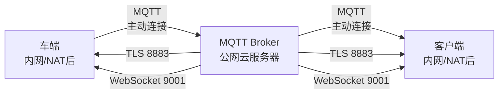
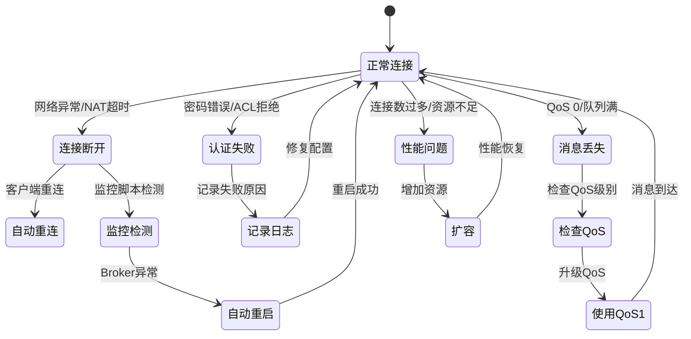

# MQTT Broker 公网部署方案

## Executive Summary

**目标**：按照"车端 → MQTT → Broker (公网) → 客户端"架构，部署公网 MQTT Broker 节点，并处理各种异常情况。

**架构图**：


**关键特性**：
- ✅ 公网部署，支持 NAT 穿透
- ✅ 多协议支持（MQTT/TLS/WebSocket）
- ✅ 完整异常处理（连接断开、消息丢失、认证失败等）
- ✅ 自动监控和重启
- ✅ 安全配置（TLS、认证、ACL）

---

## 1. 架构设计

### 1.1 数据流

```
┌─────────────┐                    ┌──────────────┐                    ┌─────────────┐
│   车端      │                    │ MQTT Broker  │                    │   客户端    │
│ (内网/NAT)  │                    │   (公网)     │                    │ (内网/NAT)  │
└──────┬──────┘                    └──────┬───────┘                    └──────┬──────┘
       │                                   │                                   │
       │ 1. 连接 (TCP/TLS/WebSocket)       │                                   │
       ├──────────────────────────────────>│                                   │
       │                                   │                                   │
       │ 2. 认证 (用户名/密码)              │                                   │
       ├──────────────────────────────────>│                                   │
       │                                   │                                   │
       │ 3. 订阅 vehicle/control           │                                   │
       ├──────────────────────────────────>│                                   │
       │                                   │                                   │
       │                                   │ 4. 连接 (TCP/TLS/WebSocket)       │
       │                                   │<──────────────────────────────────┤
       │                                   │                                   │
       │                                   │ 5. 认证 (用户名/密码)              │
       │                                   │<──────────────────────────────────┤
       │                                   │                                   │
       │                                   │ 6. 订阅 vehicle/status             │
       │                                   │<──────────────────────────────────┤
       │                                   │                                   │
       │                                   │ 7. 发布 vehicle/control           │
       │                                   │<──────────────────────────────────┤
       │                                   │                                   │
       │ 8. 接收控制指令                    │                                   │
       │<──────────────────────────────────┤                                   │
       │                                   │                                   │
       │ 9. 发布 vehicle/status            │                                   │
       ├──────────────────────────────────>│                                   │
       │                                   │                                   │
       │                                   │ 10. 接收状态                      │
       │                                   ├──────────────────────────────────>│
       │                                   │                                   │
```

### 1.2 异常处理流程



---

## 2. 异常情况处理

### 2.1 连接异常

**场景**：客户端无法连接到 Broker

**原因**：
- Broker 未运行
- 端口未监听
- 防火墙阻止
- 网络不通

**处理**：
1. **监控脚本自动检测**：
   ```bash
   # monitor-mosquitto.sh 每30秒检查一次
   - 检查进程是否运行
   - 检查端口是否监听
   - 检查日志错误
   ```

2. **自动重启**：
   ```bash
   # 检测到异常后自动重启
   - 限制重启频率（5次/5分钟）
   - 记录重启日志
   - 发送告警（可选）
   ```

3. **健康检查**：
   ```yaml
   # docker-compose.yml
   healthcheck:
     test: ["CMD-SHELL", "mosquitto_sub -h localhost -t '$$SYS/#' -C 1 -W 1"]
     interval: 30s
     timeout: 10s
     retries: 3
   ```

### 2.2 认证失败

**场景**：连接被拒绝，提示认证失败

**原因**：
- 用户名/密码错误
- ACL 权限不足
- 密码文件损坏

**处理**：
1. **记录日志**：
   ```bash
   # mosquitto.log 中记录
   - 失败的用户名
   - 失败时间
   - 失败原因
   ```

2. **告警**：
   ```bash
   # 监控脚本检测到认证失败
   - 记录到日志
   - 发送告警（可选）
   ```

3. **修复**：
   ```bash
   # 检查密码文件
   mosquitto_passwd -U /mosquitto/config/passwd
   
   # 检查 ACL 文件
   cat /mosquitto/config/acl
   ```

### 2.3 消息丢失

**场景**：消息未到达目标客户端

**原因**：
- QoS 0（最多一次）
- 客户端未订阅
- 消息队列满
- 客户端离线

**处理**：
1. **QoS 级别**：
   ```cpp
   // 控制指令使用 QoS 1
   msg->set_qos(1);  // 至少一次
   
   // 状态更新可以使用 QoS 0
   msg->set_qos(0);  // 最多一次
   ```

2. **消息队列**：
   ```conf
   # mosquitto.conf
   max_queued_messages 1000
   max_queued_bytes 100MB
   ```

3. **持久化存储**：
   ```conf
   # mosquitto.conf
   persistence true
   persistence_location /mosquitto/data/
   ```

### 2.4 连接断开

**场景**：连接频繁断开

**原因**：
- NAT 超时
- Keep-Alive 未配置
- 网络不稳定
- Broker 重启

**处理**：
1. **Keep-Alive 配置**：
   ```conf
   # mosquitto.conf
   keepalive_interval 60
   ```

2. **客户端自动重连**：
   ```cpp
   // 已配置
   connOpts.set_automatic_reconnect(true);
   connOpts.set_keep_alive_interval(60);
   ```

3. **监控连接数**：
   ```bash
   # 监控脚本检查连接数
   mosquitto_sub -h localhost -t '$SYS/broker/clients/connected'
   ```

### 2.5 性能问题

**场景**：消息延迟高，连接数过多

**原因**：
- 连接数限制
- 消息队列满
- 资源不足（CPU/内存）

**处理**：
1. **资源限制**：
   ```yaml
   # docker-compose.yml
   deploy:
     resources:
       limits:
         cpus: '1.0'
         memory: 512M
   ```

2. **连接数限制**：
   ```conf
   # mosquitto.conf
   max_connections 1000
   ```

3. **监控资源**：
   ```bash
   # 监控 CPU/内存使用
   docker stats teleop-mosquitto
   ```

### 2.6 磁盘空间不足

**场景**：持久化消息无法保存

**原因**：
- 磁盘空间不足
- 持久化文件过大
- 消息未清理

**处理**：
1. **消息过期**：
   ```conf
   # mosquitto.conf
   message_expiry_interval 3600  # 1小时过期
   ```

2. **监控磁盘**：
   ```bash
   # 监控脚本检查磁盘使用
   df -h /mosquitto/data
   ```

3. **清理旧消息**：
   ```bash
   # 手动清理
   rm /mosquitto/data/mosquitto.db
   # 注意：会丢失未送达的消息
   ```

---

## 3. 监控与告警

### 3.1 监控指标

**连接指标**：
- 活跃连接数
- 连接建立速率
- 连接断开速率

**消息指标**：
- 消息发布速率
- 消息订阅速率
- 消息队列大小

**性能指标**：
- CPU 使用率
- 内存使用率
- 磁盘使用率

**错误指标**：
- 认证失败次数
- 连接错误次数
- 消息丢失次数

### 3.2 监控脚本

**功能**：
- ✅ 自动检测 Broker 运行状态
- ✅ 自动重启（异常时）
- ✅ 检查端口监听
- ✅ 检查磁盘空间
- ✅ 检查错误日志

**使用**：
```bash
# 启动监控
./deploy/mosquitto/monitor-mosquitto.sh &

# 查看日志
tail -f /mosquitto/log/monitor.log
```

### 3.3 Prometheus 集成（可选）

**Mosquitto Exporter**：
```yaml
# 需要单独部署 mosquitto_exporter
# 参考：https://github.com/sapcc/mosquitto-exporter
```

---

## 4. 部署步骤

### 4.1 准备环境

```bash
# 1. 克隆项目
git clone <repo>
cd Remote-Driving

# 2. 配置环境变量
cp deploy/.env.example deploy/.env
# 编辑 deploy/.env，修改 MQTT 密码
```

### 4.2 启动服务

```bash
# 启动 MQTT Broker
docker-compose up -d mosquitto

# 查看日志
docker-compose logs -f mosquitto

# 验证连接
mosquitto_sub -h localhost -t 'test' -u client_user -P <password>
```

### 4.3 配置客户端

**车端配置**：
```bash
# 使用公网 IP 或域名
./run.sh mqtt://your-public-ip:1883
# 或使用 TLS
./run.sh mqtts://your-public-ip:8883
```

**客户端配置**：
```qml
// ConnectionsDialog.qml
mqttController.brokerUrl = "mqtt://your-public-ip:1883"
```

---

## 5. 安全配置

### 5.1 TLS 配置

**开发环境**：
- 使用自签名证书（初始化脚本自动生成）

**生产环境**：
- 使用 CA 签名证书
- 配置 TLS 1.2+
- 禁用旧协议版本

### 5.2 认证配置

**密码策略**：
- 强密码（至少12位）
- 定期更换密码
- 不同用户使用不同密码

**ACL 配置**：
- 最小权限原则
- 按 VIN 隔离主题
- 管理员权限分离

---

## 6. 故障排查

### 6.1 连接问题

```bash
# 1. 检查 Broker 状态
docker-compose ps mosquitto

# 2. 检查端口监听
netstat -tuln | grep 1883

# 3. 测试连接
telnet your-public-ip 1883

# 4. 查看日志
docker-compose logs mosquitto
```

### 6.2 认证问题

```bash
# 1. 验证密码文件
mosquitto_passwd -U /mosquitto/config/passwd

# 2. 检查 ACL
cat /mosquitto/config/acl

# 3. 测试认证
mosquitto_sub -h localhost -t 'test' -u username -P password
```

### 6.3 性能问题

```bash
# 1. 检查连接数
mosquitto_sub -h localhost -t '$SYS/broker/clients/connected' -u admin -P <password>

# 2. 检查资源使用
docker stats teleop-mosquitto

# 3. 检查消息队列
mosquitto_sub -h localhost -t '$SYS/broker/messages/stored' -u admin -P <password>
```

---

## 7. 相关文档

- `deploy/mosquitto/README.md` - 详细部署指南
- `docs/MQTT_NAT_PENETRATION.md` - NAT 穿透能力分析
- `docs/VERIFY_CHASSIS_DATA_FLOW.md` - 数据流验证

---

## 8. 总结

**已实现功能**：
- ✅ MQTT Broker Docker 部署配置
- ✅ 完整异常处理（连接、认证、消息、性能）
- ✅ 自动监控和重启脚本
- ✅ TLS/WebSocket 支持
- ✅ 安全配置（认证、ACL）

**后续优化**：
- [ ] Prometheus 监控集成
- [ ] Grafana 仪表盘
- [ ] 集群部署（高可用）
- [ ] 消息持久化到外部存储
