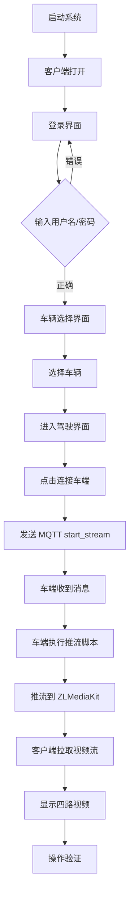

# 远程驾驶系统完整启动指南

## Executive Summary

**目标**：启动整个远程驾驶系统的所有节点，并在客户端界面进行手动操作验证。

**系统架构**：
```
客户端 (client-dev)
    ↓ HTTP/WebRTC
后端 (backend) ← Keycloak (鉴权)
    ↓ MQTT
车端 (vehicle) → 推流 → ZLMediaKit (流媒体)
```

**一键启动命令**：
```bash
make e2e-full
# 或
bash scripts/start-full-chain.sh manual
```

---

## 1. 系统节点清单

### 1.1 核心服务节点

| 节点 | 容器名 | 端口 | 功能 |
|------|--------|------|------|
| **PostgreSQL** | teleop-postgres | 5432 | 数据库（Keycloak/Backend） |
| **Keycloak** | teleop-keycloak | 8080 | 身份认证服务 |
| **Coturn** | teleop-coturn | 3478 | STUN/TURN 服务器（WebRTC） |
| **ZLMediaKit** | teleop-zlmediakit | 80, 1935 | 流媒体服务器 |
| **Backend** | teleop-backend | 8081 | 业务后端（会话/车辆管理） |
| **MQTT Broker** | teleop-mqtt | 1883 | MQTT 消息代理 |
| **Vehicle** | vehicle (动态) | - | 车端控制器（推流） |
| **Client-dev** | teleop-client-dev | - | 客户端开发环境 |

---

## 2. 启动方式

### 2.1 一键启动（推荐）

**方式 1：使用 Makefile**
```bash
make e2e-full
```

**方式 2：使用脚本**
```bash
bash scripts/start-full-chain.sh manual
```

**功能**：
- ✅ 启动所有节点
- ✅ 逐环体验证
- ✅ 启动客户端界面（手动操作）

### 2.2 分步启动

**步骤 1：启动基础服务**
```bash
docker compose -f docker-compose.yml -f docker-compose.vehicle.dev.yml up -d \
  postgres keycloak coturn
```

**步骤 2：启动流媒体和消息服务**
```bash
docker compose -f docker-compose.yml -f docker-compose.vehicle.dev.yml up -d \
  zlmediakit backend mqtt-broker
```

**步骤 3：启动车端和客户端**
```bash
docker compose -f docker-compose.yml -f docker-compose.vehicle.dev.yml up -d \
  vehicle client-dev
```

**步骤 4：启动客户端界面**
```bash
bash scripts/run-e2e.sh client
```

---

## 3. 客户端操作流程

### 3.1 登录界面

1. **打开客户端**：客户端窗口自动打开
2. **输入用户名/密码**：
   - 用户名：`123`
   - 密码：`123`
   - （或使用其他测试账号）
3. **点击「登录」**

**预期结果**：
- ✅ 登录成功
- ✅ 跳转到车辆选择界面

### 3.2 车辆选择界面

1. **查看车辆列表**：显示可用车辆
2. **选择车辆**：点击要连接的车辆
3. **确认并进入驾驶**：点击「确认」或「进入驾驶」

**预期结果**：
- ✅ 跳转到驾驶界面
- ✅ 显示四路视频窗口（初始可能无画面）

### 3.3 驾驶界面操作

1. **点击「连接车端」按钮**
   - 位置：驾驶界面顶部或侧边栏
   - 功能：发送 MQTT `start_stream` 消息

2. **等待视频流连接**
   - 车端收到 `start_stream` 后开始推流
   - 客户端自动拉取四路视频流
   - 等待时间：约 2-5 秒

3. **验证视频显示**
   - **cam_front**：前视摄像头
   - **cam_rear**：后视摄像头
   - **cam_left**：左侧摄像头
   - **cam_right**：右侧摄像头

**预期结果**：
- ✅ 四路视频窗口显示画面
- ✅ 画面流畅，无明显卡顿
- ✅ 无花屏或黑屏

### 3.4 控制操作（可选）

1. **方向盘控制**：使用鼠标或键盘
2. **油门/刹车**：使用键盘按键
3. **档位切换**：使用键盘按键

**注意**：控制功能需要车端 ROS2/CAN 总线支持

---

## 4. 验证检查清单

### 4.1 启动前检查

- [ ] Docker 已安装并运行
- [ ] 数据集路径已配置（如使用 NuScenes）
- [ ] 端口未被占用（5432, 8080, 80, 1883, 8081）
- [ ] 有图形界面（DISPLAY 环境变量）

### 4.2 启动后检查

**检查所有节点状态**：
```bash
docker compose -f docker-compose.yml -f docker-compose.vehicle.dev.yml ps
```

**检查节点日志**：
```bash
# 后端日志
docker logs teleop-backend

# 车端日志
docker logs $(docker ps --format '{{.Names}}' | grep vehicle | head -1)

# ZLMediaKit 日志
docker logs teleop-zlmediakit
```

### 4.3 功能验证

- [ ] **登录功能**：能成功登录
- [ ] **车辆选择**：能选择车辆并进入驾驶界面
- [ ] **连接车端**：点击「连接车端」后车端收到消息
- [ ] **视频推流**：车端开始推流（检查日志）
- [ ] **视频拉流**：客户端显示四路视频画面
- [ ] **视频质量**：画面清晰，无花屏、卡顿

---

## 5. 故障排查

### 5.1 节点启动失败

**问题**：部分节点未启动

**排查**：
```bash
# 查看节点状态
docker compose -f docker-compose.yml -f docker-compose.vehicle.dev.yml ps

# 查看错误日志
docker compose -f docker-compose.yml -f docker-compose.vehicle.dev.yml logs [服务名]

# 检查端口占用
netstat -tulpn | grep -E '5432|8080|80|1883|8081'
```

**解决**：
- 停止占用端口的进程
- 检查 Docker 资源（内存、磁盘）
- 重新构建镜像（如需要）

### 5.2 客户端无法启动

**问题**：客户端窗口未打开

**排查**：
```bash
# 检查 DISPLAY 环境变量
echo $DISPLAY

# 检查 X11 权限
xhost +local:docker

# 检查客户端容器状态
docker ps | grep client-dev
```

**解决**：
```bash
# 设置 DISPLAY
export DISPLAY=:0

# 允许 Docker 访问 X11
xhost +local:docker

# 重新启动客户端
bash scripts/run-e2e.sh client
```

### 5.3 登录失败

**问题**：无法登录或提示错误

**排查**：
```bash
# 检查 Keycloak 状态
curl http://127.0.0.1:8080/health/ready

# 检查后端状态
curl http://127.0.0.1:8081/health

# 查看后端日志
docker logs teleop-backend
```

**解决**：
- 等待 Keycloak 完全启动（首次启动需 30-60 秒）
- 检查用户名/密码是否正确
- 检查网络连接

### 5.4 视频无画面

**问题**：点击「连接车端」后视频窗口无画面

**排查**：
```bash
# 检查车端是否收到 start_stream
docker logs $(docker ps --format '{{.Names}}' | grep vehicle | head -1) | grep start_stream

# 检查推流进程
docker exec $(docker ps --format '{{.Names}}' | grep vehicle | head -1) ps aux | grep ffmpeg

# 检查 ZLMediaKit 流列表
curl "http://127.0.0.1:80/index/api/getMediaList?app=teleop"
```

**解决**：
- 等待车端推流启动（约 2-5 秒）
- 检查数据集路径（如使用 NuScenes）
- 检查网络连接
- 查看客户端日志（终端输出）

### 5.5 视频花屏/卡顿

**问题**：视频画面有花屏或卡顿

**排查**：
```bash
# 检查推流码率
docker exec $(docker ps --format '{{.Names}}' | grep vehicle | head -1) ps aux | grep ffmpeg

# 检查网络延迟
ping zlmediakit

# 检查客户端日志
# 查看终端输出的 [H264] 日志
```

**解决**：
- 检查推流脚本 GOP 配置（应为 1 秒）
- 检查网络带宽
- 降低码率（如需要）
- 查看 `docs/CLIENT_VIDEO_ERROR_FIX.md`

---

## 6. 常用命令

### 6.1 启动/停止

```bash
# 启动全链路（含客户端）
make e2e-full

# 仅启动节点（不含客户端）
make e2e-start-no-client

# 停止所有节点
make e2e-stop

# 查看节点状态
make e2e-status
```

### 6.2 日志查看

```bash
# 查看所有节点日志
docker compose -f docker-compose.yml -f docker-compose.vehicle.dev.yml logs -f

# 查看特定节点日志
docker logs -f teleop-backend
docker logs -f teleop-zlmediakit
docker logs -f $(docker ps --format '{{.Names}}' | grep vehicle | head -1)
```

### 6.3 进入容器

```bash
# 进入客户端容器
docker exec -it teleop-client-dev bash

# 进入车端容器
docker exec -it $(docker ps --format '{{.Names}}' | grep vehicle | head -1) bash

# 进入后端容器
docker exec -it teleop-backend bash
```

---

## 7. 配置说明

### 7.1 环境变量

**客户端环境变量**（在 client-dev 容器内）：
```bash
ZLM_VIDEO_URL=http://zlmediakit:80
MQTT_BROKER_URL=mqtt://teleop-mqtt:1883
CLIENT_RESET_LOGIN=1  # 重置登录状态
```

**车端环境变量**（在 vehicle 容器内）：
```bash
MQTT_BROKER_URL=mqtt://mqtt-broker:1883
ZLM_HOST=zlmediakit
ZLM_RTMP_PORT=1935
ZLM_APP=teleop
VEHICLE_PUSH_SCRIPT=/app/scripts/push-nuscenes-cameras-to-zlm.sh
SWEEPS_PATH=/data/sweeps
NUSCENES_BITRATE=200k
NUSCENES_MAXRATE=250k
NUSCENES_BUFSIZE=100k
```

### 7.2 数据集配置

**使用 NuScenes 数据集**：
1. 修改 `docker-compose.vehicle.dev.yml`：
   ```yaml
   volumes:
     - /实际路径/nuscenes-mini/sweeps:/data/sweeps:ro
   ```

2. 设置环境变量：
   ```yaml
   environment:
     - VEHICLE_PUSH_SCRIPT=/app/scripts/push-nuscenes-cameras-to-zlm.sh
     - SWEEPS_PATH=/data/sweeps
   ```

**使用测试图案**：
```yaml
environment:
  - VEHICLE_PUSH_SCRIPT=/app/scripts/push-testpattern-to-zlm.sh
```

---

## 8. 操作流程图



---

## 9. 预期结果

### 9.1 正常流程

1. **所有节点启动成功**
   - 8 个容器全部运行
   - 无错误日志

2. **客户端界面正常**
   - 登录界面显示
   - 车辆选择界面显示
   - 驾驶界面显示

3. **视频流正常**
   - 四路视频窗口显示画面
   - 画面流畅，无卡顿
   - 无花屏或黑屏

4. **控制功能正常**（如已实现）
   - 方向盘响应
   - 油门/刹车响应
   - 档位切换响应

### 9.2 性能指标

- **启动时间**：< 60 秒（首次需编译）
- **登录响应**：< 2 秒
- **视频连接**：< 5 秒
- **视频延迟**：< 500ms
- **帧率**：10fps（可配置）

---

## 10. 后续操作

### 10.1 停止系统

```bash
# 停止所有节点
make e2e-stop

# 或
docker compose -f docker-compose.yml -f docker-compose.vehicle.dev.yml down
```

### 10.2 清理数据

```bash
# 清理 Docker 卷（谨慎操作）
docker compose -f docker-compose.yml -f docker-compose.vehicle.dev.yml down -v

# 清理构建文件
make clean-all
```

### 10.3 重新构建

```bash
# 重新构建车端镜像
docker compose -f docker-compose.yml -f docker-compose.vehicle.dev.yml build vehicle

# 重新构建客户端镜像
make build-client-dev-image
```

---

## 11. 相关文档

- `docs/VERIFY_FULL_CHAIN.md` - 全链路验证说明
- `docs/NUSCENES_STREAMING_OPTIMIZATION.md` - NuScenes 推流优化
- `docs/CLIENT_VIDEO_ERROR_FIX.md` - 客户端视频错误修复
- `scripts/start-full-chain.sh` - 启动脚本
- `scripts/run-e2e.sh` - E2E 运行脚本

---

## 12. 总结

**一键启动命令**：
```bash
make e2e-full
```

**客户端操作步骤**：
1. 登录（123/123）
2. 选择车辆
3. 进入驾驶界面
4. 点击「连接车端」
5. 等待视频流显示
6. 验证四路视频画面

**故障排查**：
- 检查节点状态：`make e2e-status`
- 查看日志：`docker logs [容器名]`
- 参考故障排查章节

**下一步**：按照操作流程进行界面操作验证。
