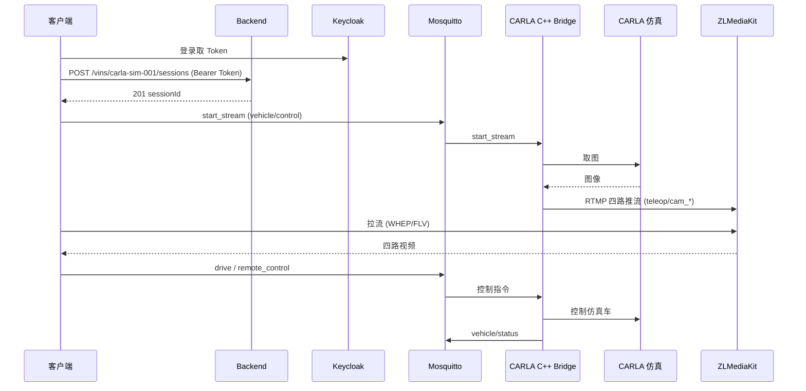
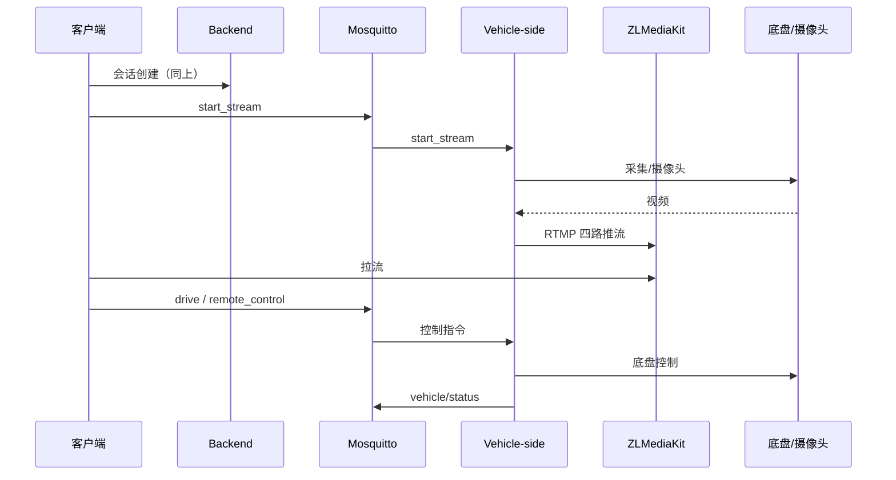

# 远驾客户端到 CARLA 仿真整链逐项验证

## 1. 目的与角色说明

### 1.1 实车部署 vs 仿真验证

| 场景 | 部署组件 | 「流媒体与车辆」的桥梁 |
|------|----------|------------------------|
| **实车部署** | 仅部署 **Vehicle-side** | **Vehicle-side**：订阅 MQTT start_stream → 从摄像头/采集推流到 ZLM；订阅 drive/remote_control → 控制底盘并上报 vehicle/status |
| **CARLA 仿真验证** | 部署 CARLA 容器（内建 C++ Bridge） | **CARLA C++ Bridge**：订阅 MQTT start_stream → 从 CARLA 取图推流到 ZLM；订阅 drive/remote_control → 控制仿真车辆 |

**CARLA 仅用于验证远驾链路**：用 CARLA 仿真替代「实车 + 摄像头」，验证同一套 Client → Backend → MQTT → [桥梁] → ZLM → Client 的流程。实车时把「CARLA C++ Bridge」换成「Vehicle-side」即可。

### 1.2 链路对应关系

```
仿真验证链路：
  客户端 → Backend 会话 → MQTT (vehicle/control) → CARLA C++ Bridge → ZLM (四路流) → 客户端拉流
                              ↓
                        drive/remote_control → CARLA 仿真车 → vehicle/status

实车部署链路：
  客户端 → Backend 会话 → MQTT (vehicle/control) → Vehicle-side → ZLM (四路流) → 客户端拉流
                              ↓
                        drive/remote_control → Vehicle-side → 底盘执行 → vehicle/status
```

---

## 2. 逐项验证脚本

### 2.1 一键执行

```bash
./scripts/verify-client-to-carla-step-by-step.sh
```

**前提**：已执行 `./scripts/build-carla-image.sh` 且 `./scripts/start-all-nodes.sh` 已启动全部节点（含 CARLA）。

### 2.2 验证项与实车对应

| 序号 | 验证项 | 仿真验证内容 | 实车对应 |
|------|--------|--------------|----------|
| 1/7 | 基础设施 | Postgres / Keycloak / Backend / ZLM / Mosquitto 运行 | 实车同样依赖中心侧服务 |
| 2/7 | 仿真端桥梁 | CARLA 容器 + C++ Bridge 运行 | 实车时为 **Vehicle-side** 运行 |
| 3/7 | 鉴权与会话 | Keycloak Token、Backend 创建会话 (POST /api/v1/vins/{vin}/sessions) | 客户端同样通过 Backend 创建会话 |
| 4/7 | 控制通道 | MQTT 发布 start_stream (topic=vehicle/control) | **Vehicle-side** 订阅 vehicle/control，收到 start_stream 后推流 |
| 5/7 | 桥梁响应 | ZLM 上 app=teleop 四路流就绪 (cam_front/cam_rear/cam_left/cam_right) | **Vehicle-side** 推流到 ZLM 后客户端拉流 |
| 6/7 | 控制指令 | MQTT remote_control + drive，可选 vehicle/status 反馈 | **Vehicle-side** 收 drive/remote_control，控制底盘并上报 status |
| 7/7 | 停止推流 | MQTT stop_stream，验证按需推流闭环 | **Vehicle-side** 收到 stop_stream 后停止推流 |

### 2.3 控制 CARLA 仿真车（逐项 + 依据日志判断）

专门验证「远驾客户端能否通过操作控制 CARLA 仿真车」的自动化脚本（逐项测试、增加日志、根据日志判断功能是否正常）：

```bash
./scripts/verify-client-control-carla.sh
```

**前提**：`carla-server` 与 MQTT 已运行（如已执行 `./scripts/start-all-nodes.sh`）。

**验证项**（共 5 项，均依据 `docker logs carla-server` 中的 `[Control]` 日志判断）：

| 步骤 | 内容 | 通过条件（日志） |
|------|------|------------------|
| 0/5 | 前置 | carla-server 容器在运行 |
| 1/5 | 发送 remote_control enable=true | 日志出现 `[Control] 收到 type=remote_control` 与 `[Control] remote_control enable=true` |
| 2/5 | 发送 drive（steering/throttle/brake） | 日志出现 `[Control] 收到 type=drive` |
| 3/5 | vehicle/status 反馈 | 若本机有 mosquitto_sub：4s 内收到一条 vehicle/status 且含 steering/throttle/ack/speed |
| 4/5 | 再次发送 drive | 日志中「收到 type=drive」累计 ≥ 2 次 |
| 5/5 | 发送 remote_control enable=false | 日志出现 `[Control] remote_control enable=false` |

该脚本亦被 `./scripts/verify-all-client-to-carla.sh` 调用（步骤 7/9）。

---

## 3. 架构示意（Mermaid）

### 3.1 仿真验证链路（本脚本验证范围）



### 3.2 实车部署链路（Vehicle-side 为桥梁）



---

## 4. 相关脚本与文档

| 脚本/文档 | 说明 |
|-----------|------|
| `./scripts/verify-all-client-to-carla.sh` | **全面功能验证**（10 项：镜像能力 + 基础设施 + Backend/ZLM/MQTT + Bridge 功能 + **CARLA 视频源** + 整链逐项等） |
| `./scripts/verify-client-to-carla-step-by-step.sh` | **本链逐项验证**（7 项，含实车对应说明） |
| `./scripts/verify-full-chain-client-to-carla.sh` | 远驾→CARLA 整链一次性验证（5 步） |
| `./scripts/verify-carla-bridge-cpp-features.sh` | 仅验证 CARLA 容器内 Bridge 功能（start_stream/stop_stream/四路流/控制） |
| `./scripts/verify-carla-video-source.sh` | **验证视频流来源为 CARLA 相机（Python Bridge）**，非 C++ Bridge 的 testsrc |
| `./scripts/verify-carla-by-logs.sh` | **依据日志自动化验证**：发 start_stream/remote_control/drive 后抓 carla-server 日志，按关键字判断 Bridge 是否收包、推流、发布 status |
| `./scripts/verify-carla-stream-chain.sh` | **分步验证推流链路**（5 步：容器→Bridge 进程→收 start_stream→推流已启动→ZLM 有流），任一步失败即停并给出修复建议 |
| `./scripts/verify-carla-ui-only.sh` | **仅验证 CARLA 仿真界面**：单独启动 CARLA、检查窗口显示（DISPLAY/X11/无头模式），不启动 Backend/Client |
| `./scripts/verify-full-chain-with-carla.sh` | 先验证车端路径 (E2ETESTVIN0000001)，再验证 CARLA 路径 (carla-sim-001) |
| [VERIFY_FULL_CHAIN.md](VERIFY_FULL_CHAIN.md) | 全链路验证总览 |

---

## 5. 手动测试排障（不能接管/推流时）

客户端与 CARLA Bridge 已增加**关键路径日志**，按下列顺序对照日志可精确定位问题。

### 5.1 客户端日志（Qt 控制台 / 终端）

| 关键字 | 含义 | 若缺失说明 |
|--------|------|------------|
| `[CLIENT][连接车端] 点击连接 当前VIN=` | 点击「连接车端」时的 VIN | 若 VIN 为空，需先选车（如 carla-sim-001）再连接 |
| `[CLIENT][MQTT] 已连接 m_currentVin=` | MQTT 连接成功时的 VIN 与 topic | 若 m_currentVin 为空，车端会忽略 start_stream（VIN 不匹配） |
| `[CLIENT][MQTT] 发送控制指令 topic= ... type= start_stream` | 实际发出的 start_stream 及 payload | 若没有「✓ Paho 发布成功」或「✓ mosquitto_pub 发布成功」，说明发布失败 |
| `[CLIENT][MQTT] ⚠ 控制指令 VIN 为空` | 发送时 payload 中无 vin | 选车后应自动带 VIN；若仍空请确认选车流程并重启或重选车 |
| `[REMOTE_CONTROL] enable= true ... m_currentVin=` | 点击「远驾接管」时的参数与 VIN | 若 m_currentVin 为空，车端可能不响应 |
| `[CLIENT][MQTT] ✗ mosquitto_pub 失败` / `✗ Paho 发布失败` | 发布到 MQTT 失败 | 检查 broker 地址、端口、网络与 ACL |

### 5.2 车端/CARLA 容器日志

```bash
docker logs carla-server 2>&1 | tail -100
```

| 关键字 | 含义 | 若缺失说明 |
|--------|------|------------|
| `[Control] 收到原始消息 topic= vehicle/control` | Bridge 收到任意 control 消息 | 若无，说明消息未到 Bridge（MQTT 未连、主题错误、ACL 或网络） |
| `[Control] ✗ 解析失败` | payload 解析失败 | 检查客户端发送的 JSON 格式（type、enable 等） |
| `[Control] ✗ 忽略 start_stream：VIN 不匹配` | 消息 VIN 与桥 VIN 不一致 | 客户端发 vin=carla-sim-001，桥环境变量 VEHICLE_VIN 需一致（默认 carla-sim-001） |
| `[Control] 已置 streaming=true` | 已接受 start_stream 并启动推流 | 若无，多为 VIN 不匹配或未收到 start_stream |
| `[Control] remote_control enable= true` | 已接受远驾接管 | 若无，检查客户端是否发出且发布成功 |
| `[CARLA] applyControl 已更新状态 remote_enabled= true` | 车端状态已更新为远驾 | 有则说明 Bridge→CarlaRunner 链路正常；若客户端仍收 false，多为订阅或多车混用 |

### 5.3 精确定位流程（不能接管时）

按顺序在两端 grep，可精确卡在某一环：

| 步骤 | 位置 | 命令/关键字 | 若缺失说明 |
|------|------|-------------|------------|
| 1 | 客户端控制台 | 点击「远驾接管」后立即搜 `[REMOTE_CONTROL][CLICK]` | 无则未进入点击逻辑（按钮被禁用或未点中） |
| 2 | 客户端控制台 | 同上，确认 `isConnected=true` 且 `调用 requestRemoteControl(true)` | 若 isConnected=false 则 MQTT 未连 |
| 3 | 客户端控制台 | 搜 `[REMOTE_CONTROL][SEND] >>> 即将发送` 和 `✓ 发布成功` 或 `✓ mosquitto_pub 发布成功` | 无「即将发送」则未调到 C++；无「发布成功」则发布失败（broker/端口/ACL） |
| 4 | 车端容器 | `docker logs carla-server 2>&1 \| grep -E "REMOTE_RECV|收到原始消息.*remote_control"` | 无则 Bridge 未收到（网络/主题/ACL 或未用新镜像） |
| 5 | 车端容器 | 搜 `[REMOTE_RECV] 已处理 remote_control 解析得到 enable=true` | 无则未收到或解析为 false（看「收到原始消息」的 payload 是否含 "enable":true） |
| 6 | 车端容器 | 搜 `[Bridge] 当前发布 vehicle/status remote_enabled=true`（约 5 秒一次） | 有 REMOTE_RECV 但无此项说明 applyControl/主循环未生效 |
| 7 | 客户端控制台 | 搜 `[REMOTE_CONTROL][RECV] >>> 收到车端确认 远驾已启用 <<<` | 有则车端已发 true，客户端已正确解析；无则车端一直在发 false 或客户端未收到 |

**结论**：若 1–3 有、4 无 → 消息未到 Bridge（检查 MQTT 地址/端口/ACL）。若 4–5 有、6 无 → Bridge 状态未写入或主循环未用上。若 6 有、7 无 → 客户端未订阅到或解析错误。

### 5.4 stream not found 时 CARLA 仿真侧精准定位（按顺序 grep）

客户端拉流报 `stream not found` 时，在 **carla-server** 日志中按下列顺序搜，可精确定位卡在哪一环：

```bash
docker logs carla-server 2>&1 | grep -E "视频源|环节|Bridge|Control|ZLM|MQTT_RAW|主循环|spawn|推流|ffmpeg"
```

| 顺序 | 关键字（C++ Bridge） | 关键字（Python Bridge） | 若缺失说明 |
|------|----------------------|--------------------------|------------|
| 0 | `视频源: testsrc` | `视频源: CARLA 仿真相机` | 先确认当前是 CARLA 还是 testsrc；默认应为 CARLA（USE_PYTHON_BRIDGE=1） |
| 1 | `[Bridge] CARLA= ... MQTT= ... ZLM=` | `[Bridge] Python Bridge 主流程` / `启动配置` | Bridge 未正常启动或未打到该行 |
| 2 | `[MQTT] 已连接，已订阅 topic=vehicle/control` | `[MQTT] 已连接 broker=` | MQTT 未连上（broker 地址/端口/网络） |
| 3 | `[Control] 收到原始消息 topic= vehicle/control` | `[MQTT_RAW] 收到消息 topic=` | 未收到任何 control 消息（主题/ACL） |
| 4 | `[Control] 已置 streaming=true` | `已置 streaming=True` / `收到 start_stream.*vin_ok=True` | 未收到 start_stream 或 VIN 不匹配 |
| 5 | `[Bridge] 主循环: 检测到 streaming 由 false->true` | `[主循环] 检测到 streaming=True` | 主循环未看到 streaming 变化（仅 C++ 需此步） |
| 6 | `[ZLM] startPushers 开始` / `启动第 1/4 路` | `[ZLM] spawn_cameras_and_start_pushers 进入` | 未进入推流启动逻辑 |
| 7 | `[ZLM][cam_front] 启动 testsrc 推流` | `相机 cam_front 已 spawn 并 listen` | 未真正启动推流线程/进程 |
| 8 | （无 `ffmpeg 未找到或启动失败`） | `ffmpeg 推流已启动 pid=` | ffmpeg 未找到或启动异常（容器内装 ffmpeg、路径） |

**结论**：若 1–2 缺 → Bridge 未跑或 MQTT 未连。若 3–4 缺 → 未收 start_stream（或 VIN 不对）。若 5–6 缺 → 主循环未调用推流。若 7–8 缺或出现「ffmpeg 未找到」→ 推流进程未起来，检查容器内 ffmpeg 与 ZLM 地址（Bridge 推 rtmp://zlmediakit:1935/teleop/...）。

### 5.5 stream not found 精确分析原因（一键诊断）

**可能原因**：① 修改后未重新编译/未重启容器（仍用旧 Bridge 或旧 USE_PYTHON_BRIDGE）；② Bridge 未收到 start_stream（MQTT/主题/VIN）；③ Bridge 未启动推流或推流晚于客户端拉流；④ 客户端拉流早于推流就绪（可增加延迟或重试）。

**一键诊断命令**（在宿主机执行）：

```bash
docker logs carla-server 2>&1 | grep -E "视频源|start_stream|已置 streaming|startPushers|spawn_cameras|推流目标"
```

| 若日志中出现 | 说明 |
|--------------|------|
| `视频源: testsrc` | 当前为 C++ Bridge（testsrc）；若期望 CARLA 画面，需设 USE_PYTHON_BRIDGE=1 并**重启 carla 容器**。 |
| `视频源: CARLA 仿真相机` | 当前为 Python Bridge；若仍 stream not found，继续看是否收到 start_stream 与推流。 |
| 无 `环节: 收到 type=start_stream` / `已置 streaming` | Bridge 未收到 start_stream（检查 MQTT 地址、topic=vehicle/control、VIN=carla-sim-001）。 |
| 有 `已置 streaming` 但无 `startPushers`/`spawn_cameras` | 主循环未调用推流（看是否有「主循环: 检测到 streaming 由 false->true」）。 |
| 有 `推流目标 rtmp://...` 但 ZLM 无流 | Bridge 与 ZLM 网络或 app/stream 不一致；确认 carla-server 与 zlmediakit 同网、app=teleop。 |

**客户端**：若控制台仍显示「最多 8 次重试」，说明运行的是旧编译；需在 client 目录重新编译或重建 client-dev 镜像后再启动客户端。

---

## 6. 常见问题

- **CARLA 未启动**：先 `./scripts/build-carla-image.sh`，再 `./scripts/start-all-nodes.sh`。
- **四路流超时 / 客户端「stream not found」**：见下方 **§6.1 stream not found 彻底解决**。
- **远驾接管按钮一直灰的**：只有「视频流已连接」后按钮才可用。若视频一直是 stream not found，先按 §6.1 排障；并确认未在拉流前因「视频流断开」逻辑重复发送 remote_control false（已改为仅当「曾连接过视频再断开」时才发 false）。
- **实车如何接驳**：在实车环境部署 **Vehicle-side**，配置同一 Backend / ZLM / MQTT；车辆端 VIN 在后端注册后，客户端选该 VIN 即可走同一套链路。

### 6.1 stream not found 彻底解决

客户端拉流时 ZLM 返回 `-400 stream not found` 表示 **Bridge 尚未向 ZLM 推流** 或 **推流未就绪**。按下列顺序排查并保证一次通过后再用客户端。

| 步骤 | 操作 | 说明 |
|------|------|------|
| 1 | 确认 CARLA 容器运行 | `docker ps \| grep carla-server` 应为 Up。 |
| 2 | **先跑验证脚本（推荐）** | `./scripts/verify-carla-bridge-cpp-features.sh` 会发 start_stream 并等待四路流就绪（最多约 45s）。**若该脚本通过，说明 Bridge 能推流**，再用客户端时只需等够时间。 |
| 3 | 确认 Bridge 收到 start_stream | `docker logs carla-server 2>&1 \| grep -E "start_stream|streaming=true|已置 streaming"` 应有「已置 streaming=true」或等价日志。若无，检查 MQTT 主题、VIN（carla-sim-001）、网络。 |
| 4 | 确认 Bridge 已推流 | Python Bridge：`docker logs carla-server 2>&1 \| grep "推流已启动"`。C++ Bridge：日志中应有推流/startPushers 相关输出。 |
| 5 | 客户端等待时间 | 点击「连接车端」后 **18s** 才开始拉流，且 **stream not found 时会重试 12 次、每次间隔 3s**（共约 36s）。若 verify 脚本通过而客户端仍失败，多为客户端在 18s 内就断开或未等重试完成。 |

**建议**：每次启动 CARLA 后**先做分步验证**，通过后再打开客户端，避免反复排查：
1. **推流链路分步验证**（推荐）：`./scripts/verify-carla-stream-chain.sh` — 依次检查：容器运行 → Bridge 进程 → 收到 start_stream → 推流已启动 → ZLM 四路流；任一步失败会打印修复建议并退出。
2. **确认视频源**：`docker logs carla-server 2>&1 | grep 视频源` — 应出现「视频源: CARLA 仿真相机」；若为「视频源: testsrc」则当前为测试源，需设 `USE_PYTHON_BRIDGE=1` 并重启容器以使用 CARLA 画面。
3. 若步骤 2 失败（Bridge 进程不存在）：默认为 **Python Bridge**（`USE_PYTHON_BRIDGE=1`）；若 CARLA Python 异常可临时设 `USE_PYTHON_BRIDGE=0` 用 C++ Bridge（testsrc）保证有流。
4. 其他：`./scripts/verify-carla-by-logs.sh`（依据日志）、`./scripts/verify-carla-bridge-cpp-features.sh`（完整 Bridge 功能）、`./scripts/verify-carla-video-source.sh`（验证是否为 CARLA 视频源）。
