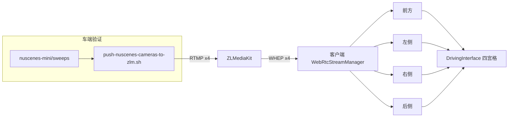

# WebRTC 四路相机：车端推流 + 客户端拉流与 UI 展示

## 0) Executive Summary

- **目标**：车端四路相机（前/后/左/右）经 ZLMediaKit 以 WebRTC 在客户端 UI 四宫格展示；车端验证使用 nuscenes-mini/sweeps 数据集。
- **收益**：端到端链路打通（数据集 → RTMP 推流 → ZLM → WHEP 拉流 → 客户端四路连接与状态展示）；为后续真实视频帧渲染预留接口。
- **当前范围**：四路连接与状态展示已实现；**视频帧解码与 QML 内渲染**列为后续迭代（需 H264 解码 + QVideoSink/VideoOutput 集成）。

---

## 1) 架构与数据流



- **流 ID 约定**：`app=teleop`，`stream=cam_front` | `cam_rear` | `cam_left` | `cam_right`（与推流脚本一致）。
- **车端**：从 `~/bigdata/data/nuscenes-mini/sweeps` 的 CAM_FRONT / CAM_BACK / CAM_FRONT_LEFT / CAM_FRONT_RIGHT 读图，FFmpeg 编码后 RTMP 推送到 ZLMediaKit。
- **客户端**：主驾驶界面仅保留一个「连接车端」按钮。创建会话后，后端在 `control` 中返回该 VIN 的 `mqtt_broker_url`（及可选 `mqtt_client_id`）；点击「连接车端」时用该配置自动连接 MQTT 并触发车端推流 + 四路 WHEP 拉流。无配置时可打开连接设置对话框手动填 Broker。

---

## 2) 车端：四路推流脚本

### 2.1 脚本路径与用法

- **脚本**：`scripts/push-nuscenes-cameras-to-zlm.sh`
- **依赖**：`ffmpeg`、nuscenes-mini sweeps 目录。

```bash
# 默认：SWEEPS_PATH=~/bigdata/data/nuscenes-mini/sweeps, ZLM_HOST=127.0.0.1, ZLM_RTMP_PORT=1935
./scripts/push-nuscenes-cameras-to-zlm.sh

# 自定义 ZLM 与帧率
ZLM_HOST=192.168.1.100 ZLM_RTMP_PORT=1935 NUSCENES_PUSH_FPS=15 ./scripts/push-nuscenes-cameras-to-zlm.sh
```

### 2.2 环境变量

| 变量 | 含义 | 默认 |
|------|------|------|
| `SWEEPS_PATH` | nuscenes-mini sweeps 目录 | `$HOME/bigdata/data/nuscenes-mini/sweeps` |
| `ZLM_HOST` | ZLMediaKit 主机 | `127.0.0.1` |
| `ZLM_RTMP_PORT` | RTMP 端口 | `1935` |
| `ZLM_APP` | 应用名 | `teleop` |
| `NUSCENES_PUSH_FPS` | 推流帧率 | `10` |

### 2.3 推流地址

- 四路 RTMP：`rtmp://<ZLM_HOST>:<ZLM_RTMP_PORT>/teleop/cam_front`、`cam_rear`、`cam_left`、`cam_right`。

---

## 3) 客户端：四路 WHEP 与 UI

### 3.1 连接逻辑

- **WebRtcStreamManager**：管理 4 个 `WebRtcClient`（front/rear/left/right），对应流 ID：`cam_front`、`cam_rear`、`cam_left`、`cam_right`。
- **触发时机**：用户点击主驾驶界面顶栏「连接车端」时，用当前 VIN 的会话配置 `lastControlConfig.mqtt_broker_url` 设置 MQTT 并连接（若尚未连接）；MQTT 连上后调用 `requestStreamStart()` 与 `connectFourStreams(whepUrl)`。若会话未带 `mqtt_broker_url`，则打开连接设置对话框由用户填写。
- **URL 来源**：
  - 若传入 `whepUrl` 非空：从中解析 `http(s)://host:port` 与 `app`，再连接上述四路。
  - 若 `whepUrl` 为空：使用环境变量 **`ZLM_VIDEO_URL`**（默认 `http://127.0.0.1:80`），`app=teleop`。

### 3.2 UI 绑定

- **左视图**：`webrtcStreamManager.leftClient`
- **后视图**：`webrtcStreamManager.rearClient`
- **前方摄像头（主视图）**：`webrtcStreamManager.frontClient`
- **右视图**：`webrtcStreamManager.rightClient`
- 各视图显示对应连接的 **状态文案**（如「视频已连接」「连接中…」），真实画面渲染为后续迭代。

### 3.3 环境变量（客户端）

| 变量 | 含义 | 默认 |
|------|------|------|
| `ZLM_VIDEO_URL` | ZLMediaKit HTTP base（用于四路 WHEP） | `http://127.0.0.1:80` |
| `MQTT_BROKER_URL` | 客户端：预填 Broker。后端：创建会话时在 `control.mqtt_broker_url` 中返回，供「连接车端」使用 | 无 |
| `MQTT_CLIENT_ID` | 后端：创建会话时在 `control.mqtt_client_id` 中返回（可选） | 无 |

---

## 4) 编译 / 部署 / 运行

### 4.1 环境要求

- 车端/本机：ffmpeg、bash；nuscenes-mini 已解压到 `~/bigdata/data/nuscenes-mini/sweeps`（含 CAM_FRONT、CAM_BACK、CAM_FRONT_LEFT、CAM_FRONT_RIGHT）。
- 客户端：Qt 6、CMake、可选 libdatachannel（WebRTC）；与现有客户端构建一致。

### 4.2 启动 ZLMediaKit

```bash
docker compose up -d zlmediakit
# 确保 80、1935 等端口可用
```

### 4.3 车端推流（验证用）

```bash
# 在宿主机或能访问 ZLM 的机器上
export SWEEPS_PATH=~/bigdata/data/nuscenes-mini/sweeps
./scripts/push-nuscenes-cameras-to-zlm.sh
# Ctrl+C 停止
```

### 4.4 客户端编译与运行

```bash
# 与现有客户端一致（例如在 client-dev 容器内）
mkdir -p build && cd build
cmake .. -DCMAKE_PREFIX_PATH=/opt/Qt/6.8.0/gcc_64 -DCMAKE_BUILD_TYPE=Debug
make -j4
./RemoteDrivingClient
```

- 登录并选择车辆后进入主驾驶界面，四路会自动连接（未配置会话时使用 `ZLM_VIDEO_URL`）。
- 若 ZLM 与推流脚本均在本机：`ZLM_VIDEO_URL=http://127.0.0.1:80`（或省略，使用默认）即可。

### 4.5 验证步骤

1. 启动 ZLMediaKit，确认 1935/80 正常。
2. 运行 `push-nuscenes-cameras-to-zlm.sh`，确认无报错、四路 FFmpeg 在跑。
3. 启动客户端，登录并进入主驾驶界面，**点击顶栏「连接」按钮**；观察左/前/右/后四个视图状态是否变为「视频已连接」或对应 statusText。
4. 可选：用 ZLM 控制台或 API 查看 `teleop/cam_*` 流是否存在。

### 4.6 自动化测试（连接按钮与四路拉流）

- **连接功能自动化验证**：`scripts/verify-connect-feature.sh`  
  - 设置 `CLIENT_AUTO_CONNECT_VIDEO=1`，客户端在测试模式下跳过登录、进入主界面并自动执行「连接」逻辑（`requestStreamStart` + `connectFourStreams`），运行约 12 秒无崩溃即通过。
- **客户端 UI 验证**：`scripts/verify-client-ui.sh`  
  - 编译 + 从登录界面启动 6 秒无崩溃。
- 建议 CI 中顺序执行：`verify-client-ui.sh` 与 `verify-connect-feature.sh`。

---

## 5) 风险与回滚

- **推流脚本**：若 sweeps 目录缺失或无 jpg，脚本会跳过对应相机并提示；可单独停掉脚本（Ctrl+C）不影响客户端。
- **客户端**：四路连接失败时仅状态文案不同，不阻塞主界面；可随时调用 `webrtcStreamManager.disconnectAll()` 或关闭主界面。
- **回滚**：移除对 `webrtcStreamManager` 的注册与 `connectFourStreams` 调用即可恢复为单路/占位逻辑。

---

## 6) 后续演进（视频帧显示）

- **MVP（当前）**：四路 WHEP 连接 + 状态展示。
- **V1**：在客户端对每路 WebRTC 视频轨进行 RTP/H264 解码，输出到 `QVideoSink`，在 QML 中用 `VideoOutput` 或等价组件显示（需引入解码器，如 FFmpeg/libav 或 GStreamer）。
- **V2**：车端从真实相机/ROS 采集替代 nuscenes 图像；客户端可增加码率/分辨率切换与延迟统计。

---

## 7) 变更清单（文件）

| 路径 | 变更 |
|------|------|
| `scripts/push-nuscenes-cameras-to-zlm.sh` | 新增：nuscenes sweeps 四路 RTMP 推流 |
| `client/src/webrtcstreammanager.h/cpp` | 新增：四路 WebRtcClient 管理、connectFourStreams/disconnectAll |
| `client/src/main.cpp` | 注册 webrtcStreamManager |
| `client/CMakeLists.txt` | 加入 webrtcstreammanager 源与头文件 |
| `client/qml/DrivingInterface.qml` | VideoPanel 增加 streamClient 绑定；四视图绑定 left/rear/front/right Client |
| `client/qml/main.qml` | 进入主界面时调用 connectFourStreams(lastWhepUrl) |
| `docs/WEBRTC_FOUR_CAMERAS.md` | 本文档 |
